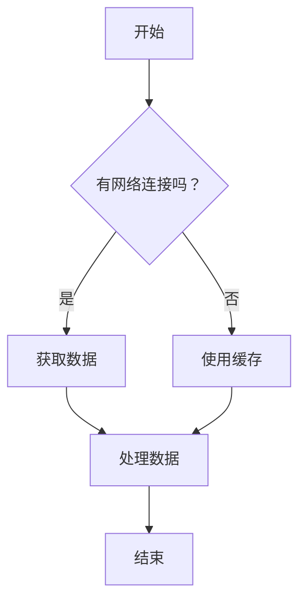
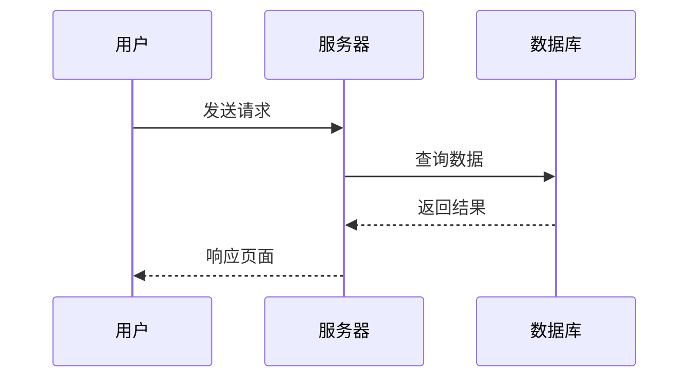
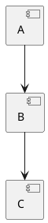

# 第14章 Markdown 的极限 —— 知道刀能切什么、不能切什么

## 学习目标

1. 理解 Markdown 语法能力的边界
2. 掌握在 Markdown 极限之外使用的扩展方案
3. 能在数学公式、图表、自定义 HTML 之间做选择

## 生活类比

Markdown 的极限就像一把瑞士军刀——切水果、开瓶盖、拧螺丝都很好用。但如果你需要锯木头、钻洞、焊接，那就得换工具了。Mermaid、KaTeX、PlantUML 就是那把"锯木头"的电动工具，而 HTML 是你工具箱里的电焊枪——万能但别随便用。

## Markdown 的能力边界

### Markdown 能做什么

| 能力 | 语法 | 覆盖率 |
|------|------|--------|
| 标题 | `# H1` | 100% |
| 段落 | 空行分隔 | 100% |
| 粗体/斜体 | `**` / `*` | 100% |
| 链接/图片 | `[text](url)` / `` | 100% |
| 列表 | `- item` / `1. item` | 100% |
| 引用 | `> quote` | 100% |
| 代码块 | ``` 代码 ``` | 100% |
| 表格 | `| a | b |` | GFM 95% |

### Markdown 不能做什么

| 能力 | 原因 | 替代方案 |
|------|------|----------|
| 合并单元格 | 纯文本无法表达二维结构 | HTML `<table>` |
| 居中对齐 | 规范未定义 | HTML `<div align="center">` |
| 上标/下标 | 规范未定义 | `<sup>` / `<sub>` |
| 数学公式 | 规范未定义 | KaTeX / MathJax |
| 流程图 | 规范未定义 | Mermaid / PlantUML |
| 音频/视频 | 规范未定义 | HTML `<video>` / `<audio>` |
| 自定义样式 | 规范未定义 | HTML + CSS |

## 数学公式：KaTeX 与 MathJax

### KaTeX

KaTeX 是由 Khan Academy 开发的数学公式渲染库，特点是**速度快**：

````markdown
行内公式：$E = mc^2$

块级公式：
$$
\int_{0}^{\infty} e^{-x^2} dx = \frac{\sqrt{\pi}}{2}
$$
````

渲染效果：

- 行内公式：$E = mc^2$
- 块级公式：

$$
\int_{0}^{\infty} e^{-x^2} dx = \frac{\sqrt{\pi}}{2}
$$

### MathJax

MathJax 是另一个成熟的数学公式渲染库，特点是**兼容性更好**：

| 维度 | KaTeX | MathJax |
|------|-------|---------|
| 速度 | 快（DOM 渲染） | 慢（SVG/Canvas 渲染） |
| 兼容性 | 现代浏览器 | 所有浏览器（含 IE） |
| 大小 | ~600KB | ~2MB |
| 功能 | 基础 LaTeX 语法 | 完整 LaTeX 语法 |

### 在 Markdown 中使用

大多数静态站点生成器内置了 KaTeX 支持：

```yaml
# VitePress 配置
themeConfig:
  math:
    engine: 'katex'
```

```yaml
# Hugo 配置
params:
  katex: true
```

### LaTeX 语法速查

| 功能 | 语法 | 渲染 |
|------|------|------|
| 上标 | `x^2` | x² |
| 下标 | `x_2` | x₂ |
| 分数 | `\frac{a}{b}` | a/b 分数形式 |
| 积分 | `\int_{a}^{b}` | ∫ |
| 求和 | `\sum_{i=0}^{n}` | Σ |
| 希腊字母 | `\alpha`, `\beta`, `\gamma` | α β γ |
| 括号 | `\left( \right)` | 自适应大小括号 |

## 流程图：Mermaid

### Mermaid 语法

Mermaid 是一种用文本描述图表的语法：

````markdown

````

渲染为：


### Mermaid 的图表类型

| 类型 | 用途 | 示例 |
|------|------|------|
| `graph` | 流程图 | `graph TD` |
| `sequenceDiagram` | 时序图 | `sequenceDiagram` |
| `classDiagram` | 类图 | `classDiagram` |
| `stateDiagram` | 状态图 | `stateDiagram` |
| `pie` | 饼图 | `pie` |
| `gantt` | 甘特图 | `gantt` |
| `erDiagram` | ER 图 | `erDiagram` |

### 时序图示例

````markdown

````

渲染为：


### 为什么 Mermaid 适合 Markdown？

1. **纯文本**——可以版本控制、可以 diff
2. **自解释**——`A --> B` 直观地表示"A 流向 B"
3. **不需要图形工具**——写完就能看到效果
4. **与 Markdown 天然兼容**——代码块语法，直接嵌入

## PlantUML：另一个图表方案

### 基本语法

````markdown

````

### Mermaid vs PlantUML

| 维度 | Mermaid | PlantUML |
|------|---------|----------|
| 语言 | JavaScript（浏览器渲染） | Java（服务端渲染） |
| 安装 | 零配置（前端库） | 需要 Java / 服务端 |
| 图表类型 | 7 种 | 30+ 种 |
| 样式定制 | CSS 控制 | 内置主题 |
| 社区活跃度 | 高（GitHub 原生支持） | 中 |
| 适用场景 | 大多数文档站 | 复杂 UML / 架构图 |

### 选择指南

- **简单流程图/时序图** → Mermaid（零配置，GitHub 原生支持）
- **复杂 UML / 企业架构图** → PlantUML（更多图表类型，样式更精细）

## HTML 兜底：最后的工具箱

当 Markdown 的扩展语法都不够用时，HTML 是终极方案：

````markdown
<!-- 视频嵌入 -->
<video controls>
  <source src="demo.mp4" type="video/mp4">
  你的浏览器不支持视频标签
</video>

<!-- 音频嵌入 -->
<audio controls>
  <source src="audio.mp3" type="audio/mpeg">
</audio>

<!-- 自定义样式 -->
<div style="background: #f0f0f0; padding: 1em; border-left: 4px solid #007bff;">
  <strong>提示：</strong>这是自定义样式的提示框。
</div>

<!-- 内嵌 iframe -->
<iframe src="https://example.com" width="100%" height="400"></iframe>
````

### 何时使用 HTML 兜底？

使用 HTML 兜底的**唯一条件**：没有更好的方案。

| 场景 | 推荐方案 |
|------|----------|
| 流程图 | Mermaid |
| 数学公式 | KaTeX |
| UML 图 | PlantUML |
| 视频/音频 | HTML `<video>` / `<audio>` |
| 自定义样式 | HTML + CSS（仅当无替代方案时） |

### 为什么"少用 HTML"？

1. **可读性**——HTML 标签混在 Markdown 中，源码变丑
2. **可移植性**——不是所有渲染器都支持内联 HTML
3. **可维护性**——HTML 没有版本控制的语义，diff 不可读

## 设计取舍

**为什么 Markdown 不直接支持数学公式？**

数学公式的语法太复杂，与 Markdown 的"简单"哲学冲突。LaTeX 语法的 `$$\int_{0}^{\infty}$$` 对于"只是想写点文字"的用户来说太沉重了。所以 Markdown 选择不内置公式——让 KaTeX 等工具在需要时提供。

**为什么 Mermaid 比 PlantUML 更流行？**

因为**零配置**。Mermaid 是纯 JavaScript 库，浏览器直接加载就能用。PlantUML 需要 Java 环境或服务端支持。对于大多数文档站来说，零配置意味着更低的门槛和更好的体验。

**HTML 兜底的原则是什么？**

"少用"。HTML 是工具箱里的电焊枪——关键时刻救命，但别天天用。每次在 Markdown 中混写 HTML，都要问自己："有没有更简洁的方案？"

## 动手练习

1. 用 KaTeX 在 Markdown 中写一个二次方程求根公式
2. 用 Mermaid 画一个产品流程图（至少 5 个节点）
3. 思考题：为什么 Markdown 不直接支持流程图？（提示：从规范简洁性和工具兼容性角度思考）

## 本章小结

这一章中我们讨论了 Markdown 的能力边界。首先列举了 Markdown 能做什么、不能做什么，然后介绍了数学公式（KaTeX / MathJax）和流程图（Mermaid / PlantUML）两种主流扩展方案，最后讨论了 HTML 兜底的原则和使用场景。

本章我们一起学习了以下概念：

| 概念 | 解释 |
|------|------|
| KaTeX | 数学公式渲染库，速度快，适合 Web |
| Mermaid | 文本描述图表的语法，零配置，GitHub 原生支持 |
| PlantUML | Java 编写的图表工具，30+ 种图表类型 |
| HTML 兜底 | Markdown 不擅长的场景用 HTML 补充 |
| 设计原则 | "少用 HTML"——每次混写 HTML 都要问"有没有更简洁的方案？" |

下一篇是最后一篇——生产级 Markdown 规范的制定。
