# 第1章 为什么是 Markdown？—— 给文字穿上"隐形西装"

## 学习目标

1. 理解 Markdown 诞生的历史背景和设计哲学
2. 掌握 Markdown 相对于 HTML 和纯文本的核心优势
3. 能说出 CommonMark 规范的意义

## 生活类比

想象一下，你要写一篇文章发表在网站上。你有三个选择：

**纯文本**就像穿棉袄——保暖，到哪都能穿，但就是没造型。**HTML**像定制西装——精致但每颗纽扣都要手工缝，换个场合可能就不合身了。**Markdown**像穿优衣库的基础款——干净、得体、去哪都不违和，而且便宜。


这就是 Markdown 的定位。它不是要你取代 HTML，也不是要回到纯文本时代，而是在两者之间找到一条中间道路。

## Markdown 的诞生

2004年，John Gruber 发布了第一个 Markdown 语法定义。

Gruber 是谁？他是著名博客 [Daring Fireblog](https://daringfireblog) 的创始人。他的痛点非常真实：

> 我想发明一种标记语言，它的源代码看起来就像一篇干净的信件，渲染后却拥有漂亮的、正确的 HTML 输出。

你看，"源代码看起来就像一篇干净的信件"——这就是 Markdown 的核心哲学。

我们来看看 CommonMark 规范（`spec.md`）的 Preamble 部分：

```
# CommonMark Spec
# version 0.31.0
#
# This is a reference manual for the CommonMark spec,
# which defines a precise specification of the markup syntax
# and parsing rules for the exchange of structured text via the Internet.
# It is also useful as a guide for other implementations.
```

这一段前言告诉我们三件事：

1. **它是参考手册**——不是某个人的"最佳实践"，而是社区共识
2. **精确定义**——每一行语法规则都有明确的边界，不是"大概这么写就行"
3. **交换格式**——目的是跨平台、跨工具互通

### 为什么需要规范？

在 CommonMark 出现之前，Markdown 是一场"各玩各的"的混乱局面：

- 有人用 `**` 表示粗体，有人用 `_` 表示粗体
- 有人列表缩进两个空格，有人缩进四个
- 有人把 `~~` 变成删除线，有人当普通字符

同一份 `.md` 文件，在不同的渲染器里可能长得不一样。这就像你写好的一封信，寄到 A 地址是横版，寄到 B 地址变成竖版——谁看了都头疼。

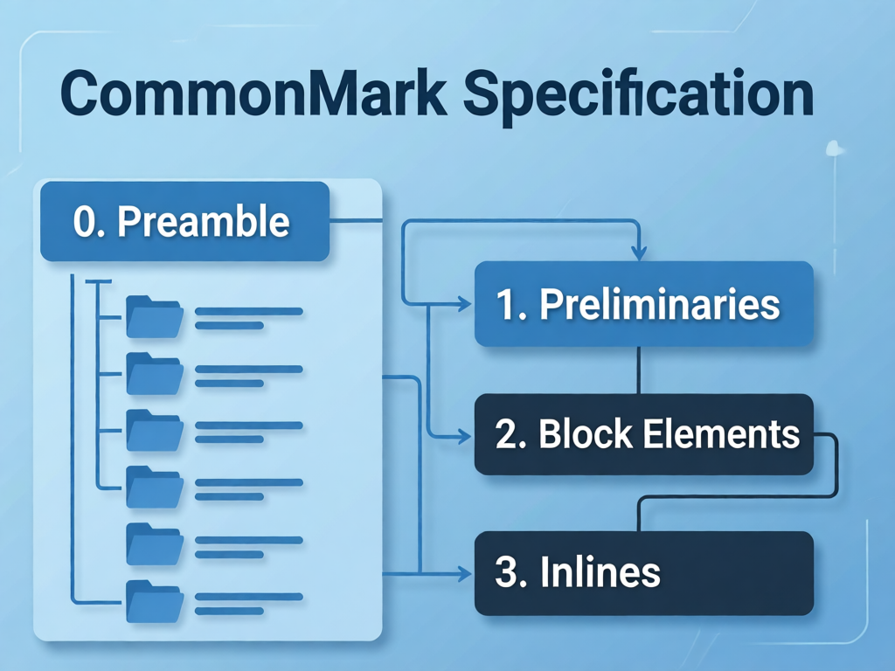

CommonMark 的出现，就是给这个"各玩各的"的局面画上句号。从此，一份 Markdown 文档在 GitHub、VS Code、 Hugo、Jupyter 里的样子，应该是一致的。

## Markdown vs HTML：一场不对等的战斗

我们直接上代码对比。

假设你想写一段文字：一个二级标题、一段正文、一行代码和一个链接。

**用 HTML 怎么写？**

```html
<!-- HTML版本 —— 标签嵌套地狱 -->
<h2>欢迎使用</h2>       <!-- 1. 开始标签 -->
<p>                    <!-- 2. 开始标签 -->
  这是 <code>一行代码</code> 和 <a href="https://example.com">一个链接</a>。 <!-- 3. 行内标签嵌套 -->
</p>                   <!-- 4. 闭合标签 -->
                      <!-- 5. 空行（可选但推荐）-->
```

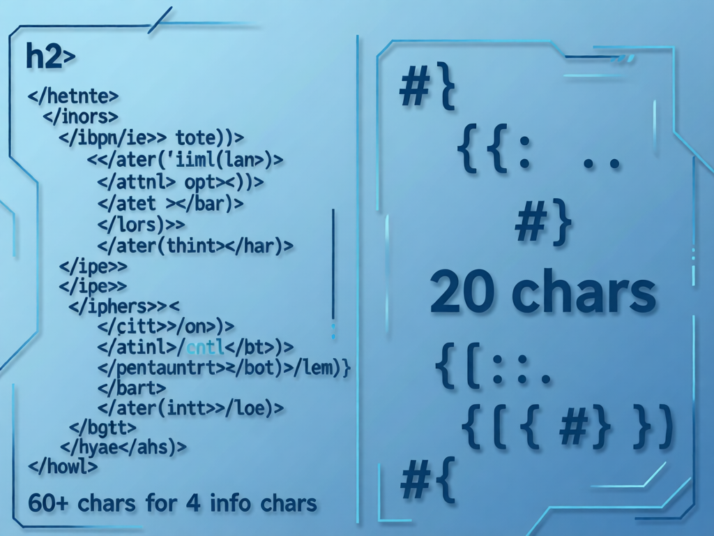

数一下：6 个标签、1 个自闭合标签（如果 `br` 也算的话），大约 **4 个字符的信息量**（"欢迎使用"）对应 **60+ 个字符的标记符号**。

**用 Markdown 怎么写？**

```markdown
## 欢迎使用

这是 `一行代码` 和 [一个链接](https://example.com)。
```

同样表达同样的意思，只需要 **20 个字符的标记符号**。

这就是 Markdown 的"压缩率"优势——它把 HTML 的"仪式感"（开始、闭合、层级）压缩成了"直觉"（# 表示标题，** 表示粗体）。

## Markdown vs 纯文本：甜蜜点的寻找

那为什么不直接用纯文本？

纯文本确实是最安全的格式。你的 `.txt` 文件在 1970 年能用，2070 年照样能用。但纯文本有一个致命缺陷：**没有格式**。

你想表达一段代码？纯文本只能靠缩进：

```
    这段代码是缩进表示的
    但缩进几个空格？2个？4个？无限制？
    不同工具理解不同
```

你想表达一个引用？

```
    这是引用？
    还是只是段文字开头有空格？
    读者不知道
```

Markdown 的甜蜜点就在于此：**保留纯文本的可读性，同时增加轻量级的格式标识**。

一份 Markdown 文件，即使用不支持 Markdown 的编辑器打开，你也能读懂大概——粗体是 `**文字**`，链接是 `[文字](URL)`，标题是 `# 文字`。这些语法标记在纯文本中不会破坏阅读。

这就是 John Gruber 说的"源代码看起来就像一篇干净的信件"——即使没有渲染器，你的 Markdown 文件本身也是一篇可读的文档。

## CommonMark 规范揭秘

CommonMark 规范当前版本是 **0.31.0**，它的文件结构是这样的：

```
spec.md（整个规范的主体）
├── 0. Preamble —— 前言和设计动机
├── 1. Preliminaries —— 前置处理（换行、制表符）
├── 2. Block Elements —— 块级元素（标题、段落、列表...）
├── 3. Inlines —— 行内元素（粗体、链接、代码...）
└── 4. ASTs —— 参考 AST 树结构
```

解析 Markdown 的过程，就像翻译一本书：

```
Markdown 源码 → [Tokenizer 分词] → [Parser 组句] → AST（抽象语法树）→ [Renderer 翻译] → HTML
```

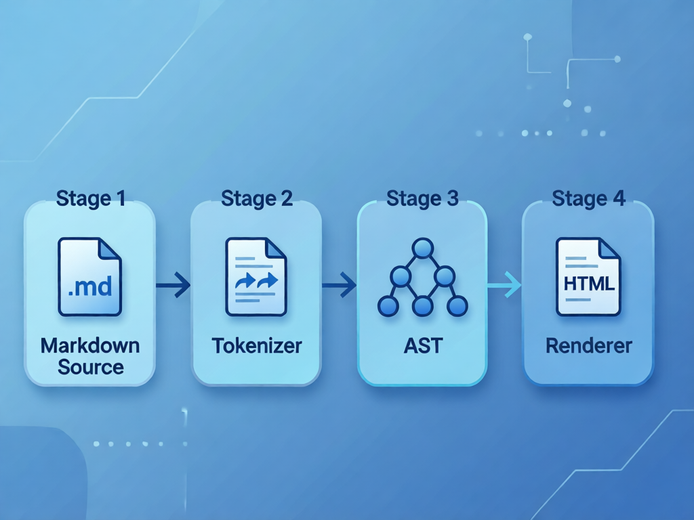

### Tokenizer（分词器）

Tokenizer 把原始文本切割成"块"（blocks）和"行内元素"（inlines）。它做的事情很朴素：

```javascript
// 伪代码：Tokenizer 的核心逻辑
// 源码路径：marked/src/Tokenizer.js（示意）
function tokenize(src) {
  // 逐行扫描
  while (src.length > 0) {
    // 遇到 # 开头？→ 标题块
    // 遇到 - 开头？→ 列表项
    // 遇到 > 开头？→ 引用块
    // 遇到空行？→ 段落结束
    // 否则 → 段落内容
  }
}
```

这段代码的逻辑很直白：它就像一个识字的人读文章，看到"这行有#"就标记为标题，看到"这行有>"就标记为引用。

### Parser（解析器）

Parser 把 Tokenizer 分好的"词"组合成句子——也就是 **AST（抽象语法树）**。

AST 是什么？你可以把它想象成文章的"骨架"：

```
Document
├── Heading (level=2, text="欢迎使用")
├── Paragraph
│   └── Inline
│       ├── Text("这是 ")
│       ├── Code("一行代码")
│       ├── Text(" 和 ")
│       └── Link(text="一个链接", url="https://example.com")
```

每一行 Markdown 被翻译成了结构化的节点树。渲染器只需要遍历这棵树，逐个节点输出 HTML 即可。

### Renderer（渲染器）

Renderer 是最灵活的一环——同样的 AST，不同的 Renderer 可以输出不同的格式：

| Renderer | 输出 | 适用场景 |
|----------|------|----------|
| HTML Renderer | `.html` | 网页、博客 |
| PDF Renderer | `.pdf` | 论文、报告 |
| EPUB Renderer | `.epub` | 电子书 |
| ASCII Renderer | `.txt` | 终端预览 |

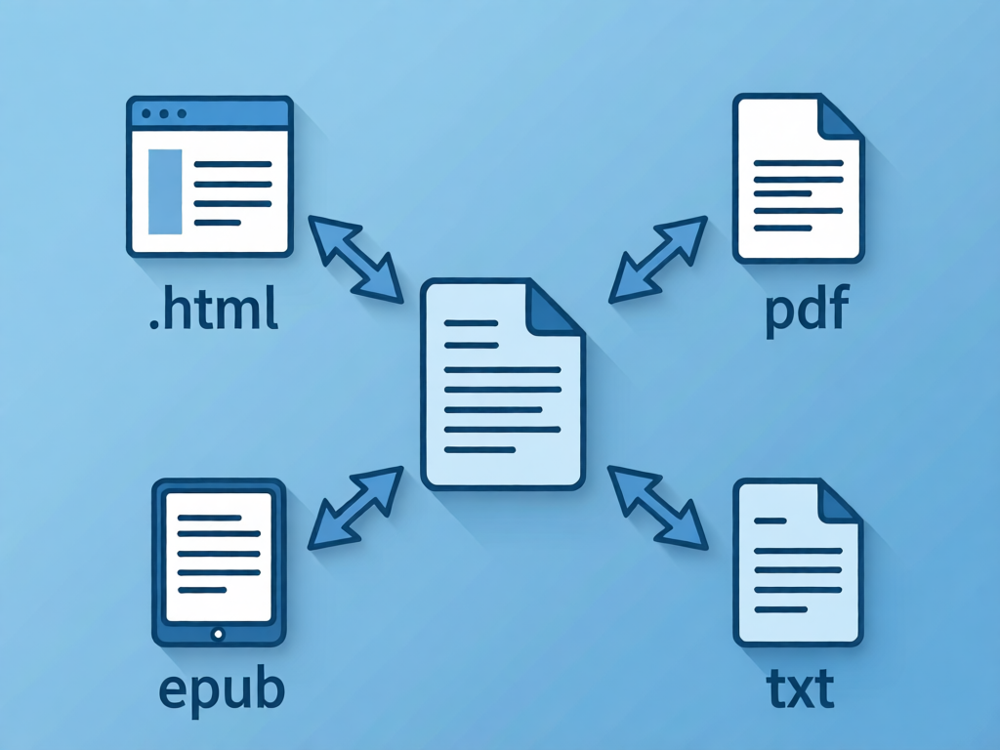

这就是为什么同样的 Markdown 源码，可以用在 GitHub（HTML）、Jupyter（HTML）、Hugo（HTML）、MkDocs（HTML）里——因为它们共享的是同一个 AST，只是换了不同的 Renderer。

## 设计取舍

**为什么不直接用 HTML？**

HTML 的学习曲线陡峭。你要理解标签的层级、属性、嵌套规则，还要记一堆闭合标签。对于"只是想写点文字"的用户来说，HTML 就像要考驾驶证才能骑自行车。

Markdown 把门槛降到了"会打字就行"。

**为什么不用更多扩展语法？**

CommonMark 选择做减法。它只定义了最基本的语法——标题、段落、列表、链接、粗体、斜体、代码、引用。没有表格（由 GFM 扩展）、没有数学公式（由 KaTeX 扩展）、没有流程图（由 Mermaid 扩展）。

这种"少即是多"的设计哲学，恰恰是 Markdown 能够普及的原因。语法越少，互操作性越强，工具链越简单。

**为什么需要 CommonMark 规范？**

在规范出现之前，同一个 Markdown 文件在不同的渲染器里可能"长得不一样"。比如一段代码：

```
This is a paragraph
with two lines.
```

没有规范约束时，有的渲染器把它当成两个段落（中间空行），有的当成一个段落（保留换行）。规范出现后，所有渲染器必须按照同一套规则处理——这就叫**互操作性**。

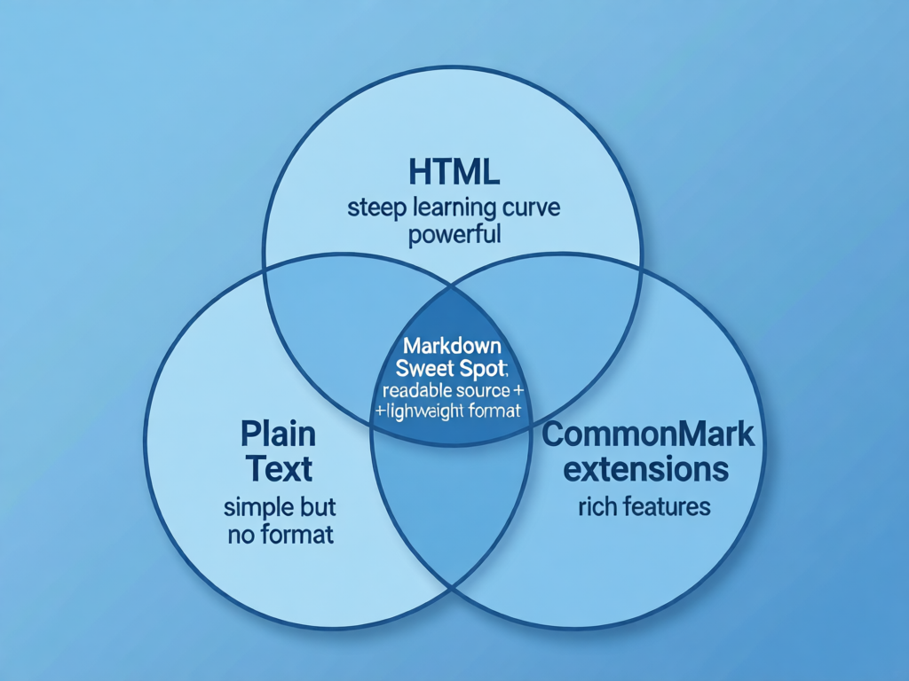

## 动手练习

1. 用纯 HTML 写一段带标题和段落的文字，再用 Markdown 重写，数一数少打了多少字符
2. 阅读 CommonMark spec.md 的 Preamble 部分，总结其设计动机
3. 思考题：如果 Markdown 只能保留3个语法特性，你会保留哪3个？

## 本章小结

这一章中我们学习了 Markdown 为什么会出现。首先介绍了它的诞生背景——John Gruber 对 HTML 排版痛苦的反击，然后我们用 HTML 和纯文本做对照，找出了 Markdown 的甜蜜点：纯文本兼容 + 轻量级格式，接着我们了解了 CommonMark 规范及其解析流程（Tokenizer → AST → Renderer），最后讨论了为什么选择"少即是多"的设计哲学。

本章我们一起学习了以下概念：

| 概念 | 解释 |
|------|------|
| John Gruber | Markdown 创建者，Daring Fireblog 创始人 |
| CommonMark | Markdown 的统一规范，解决互操作性 |
| Tokenizer → AST → Renderer | Markdown 解析的三件套 |
| 甜蜜点 | 纯文本兼容 + 轻量格式，在两者之间取平衡 |

下一章中，我们将学习 Markdown 的行内语法——那些让文字变"漂亮"的小技巧。


============================================================

# 第2章 行内语法全解 —— 给文字戴上"首饰盒"

## 学习目标

1. 掌握所有行内格式化语法（粗体、斜体、代码、链接等）
2. 理解转义字符的使用场景
3. 能识别并避免行内语法中的常见陷阱

## 生活类比

行内语法就像给文字戴首饰。粗体是钻戒——最醒目，别全身上下都戴；斜体是项链——低调的修饰；删除线是划痕——展示历史痕迹；代码标记是标签——标识物品的身份；链接是名片——连接外部世界。

但有个原则：首饰戴多了会显俗气。同理，如果你每句话都用粗体和斜体，那它们就不再强调了。


## 代码标记：行内代码的精确表达

Markdown 中最简单也最容易被忽视的行内语法，就是代码标记。

用一对反引号（backtick）包裹文本：

```
使用 `git commit` 命令提交更改
```

渲染后变成：使用 `git commit` 命令提交更改。

### 嵌套反引号的技巧

如果你的代码本身就包含反引号怎么办？

```
使用 ``git add .`` 暂存所有文件
```

渲染后变成：使用 ``git add .`` 暂存所有文件。

规则很简单：**用 N 个反引号包裹内容，内容中最多出现 N-1 个连续的反引号**。

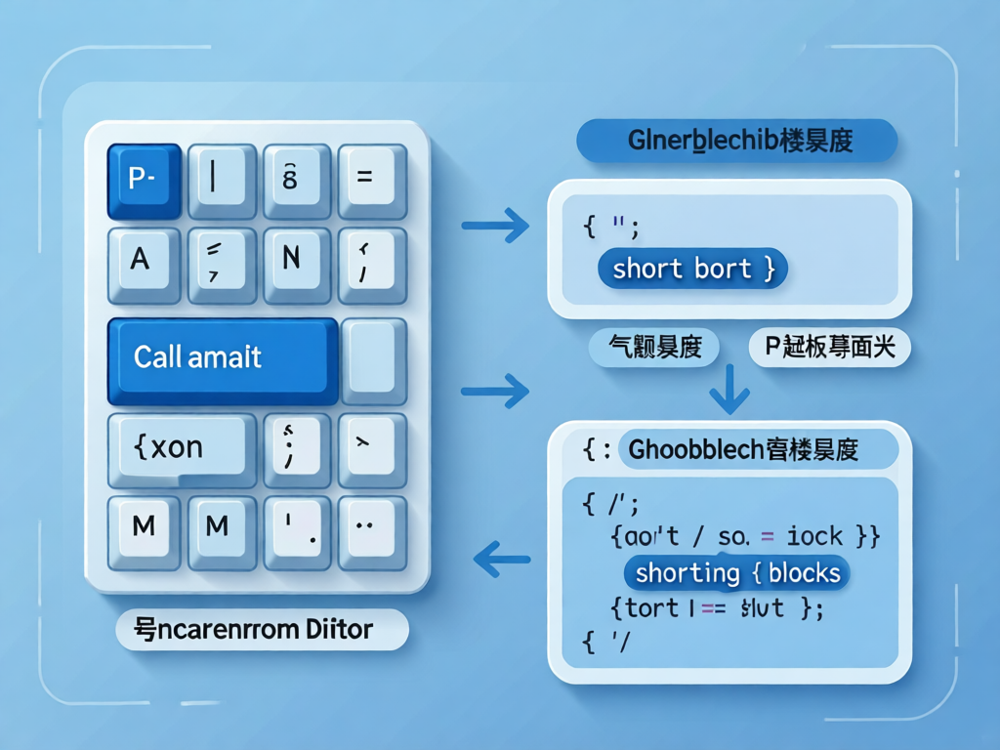

### 代码标记 vs 代码块

行内代码标记和代码块（第4章详述）的区别：

| 特性 | 行内代码 `code` | 代码块（三反引号） |
|------|----------------|-------------------|
| 语法 | 单对反引号 | 三反引号包裹 |
| 换行 | 不支持 | 支持 |
| 语言标识 | 不支持 | 支持（如 ```javascript） |
| 缩进保留 | 不保留 | 保留 |
| 适用场景 | 短代码片段 | 多行代码块 |

## 粗体和斜体：强调的艺术

粗体和斜体是 Markdown 中最常用的强调方式。它们有两套语法：

### 星号版本

```markdown
**粗体** 或 __粗体__
*斜体* 或 _斜体_
***粗斜体*** 或 ___粗斜体___
```

### 星号 vs 下划线：两套语法为什么并存？

星号版本（`**text**`）是 John Gruber 最初定义的。下划线版本（`__text__`）后来加入，原因是：

> 在某些编辑器中，反斜杠转义（`\*`）会破坏文本的可读性。下划线版本提供了不需要转义的替代方案。

### 陷阱：下划线在变量名中的歧义

这是下划线版本最大的坑：

```markdown
我的_variable_name_是Python变量
```

渲染器可能会把 `_variable_name_` 当成斜体，也可能不会——这取决于具体实现。

**建议：在代码或变量名中，始终使用星号版本或代码标记**。

### 嵌套语法

```markdown
**粗体里的*斜体*粗体**
```

渲染后：**粗体里的*斜体*粗体**。

规则：外层用 `**`，内层用 `*`，反之亦可。关键是成对出现。

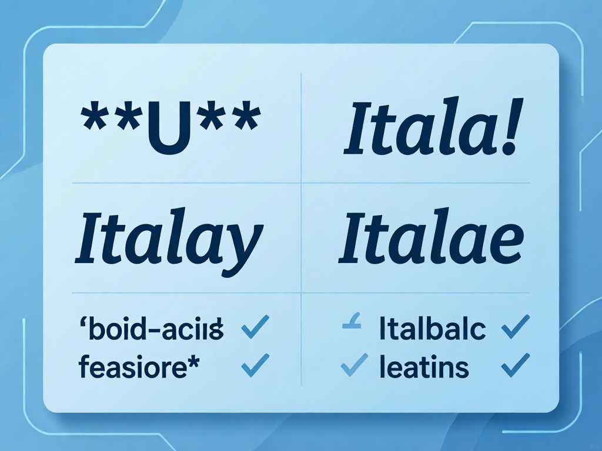

## 链接：连接世界的桥梁

### 行内链接

```markdown
[GitHub](https://github.com "GitHub官网")
```

渲染后：[GitHub](https://github.com "GitHub官网")。

`"GitHub官网"` 是可选的标题（title），鼠标悬停时显示。

### 引用链接

当同一个 URL 需要多次引用时，引用链接更简洁：

```markdown
这是[GitHub][gh]的介绍。

[gh]: https://github.com "GitHub"
```

渲染后：这是[GitHub][gh]的介绍。

### 自动链接

```markdown
<https://github.com>
```

渲染后：`<https://github.com>`（自动变成可点击链接）。

### 陷阱：URL 中的括号

```markdown
[文档](https://example.com/page(section))
```

这会导致链接断裂！因为渲染器认为 `(` 到 `)` 是 URL 的一部分，但括号内的内容让解析器困惑。

**解决方法：用尖括号包裹 URL**：

```markdown
[文档](<https://example.com/page(section)>)
```

渲染后：[文档](<https://example.com/page(section)>)。

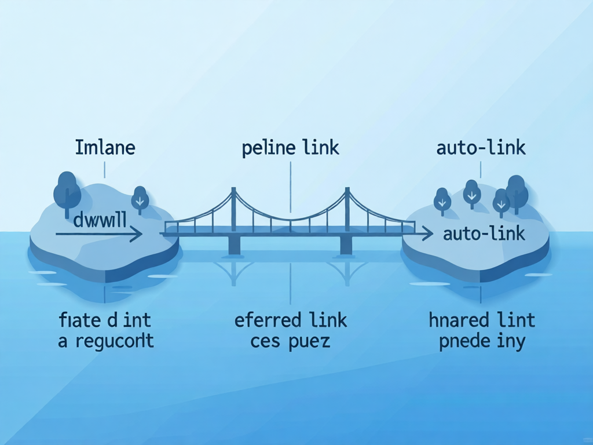

## 图片：不止于显示

### 基础语法

```markdown

```

`替代文字`（alt text）有两个重要作用：

1. **无障碍**：屏幕阅读器为视障用户朗读 alt 文本
2. **加载失败时的回退**：图片加载失败时显示 alt 文本

### 图片链接

```markdown
[](https://example.com)
```

渲染后：点击图片可跳转到链接。

这本质上是一个嵌套——图片语法 `[](url)` 中，`` 本身就是一个图片，外面包裹了链接语法。

### 陷阱：绝对路径 vs 相对路径

```markdown
<!-- 相对路径——可移植 -->


<!-- 绝对路径——固定，不可移植 -->

```

**永远使用相对路径**。绝对路径在你的电脑上显示正常，但发到 GitHub 或其他平台后，图片就"消失"了。

## 删除线：展示历史的痕迹

```markdown
原价 ~~$100~~ 现价 $50
```

渲染后：原价 ~~$100~~ 现价 $50。

删除线（`~~text~~`）是 **GFM（GitHub Flavored Markdown）的扩展**，不在 CommonMark 核心规范中。

### 适用场景

- 修订记录：`该功能 ~~已废弃~~ 已重构`
- 价格变化：`原价 ~~$100~~ 现价 $50`
- 纠正笔误：`应为 ~~"数据"~~ "资料"`

### 不适用场景

- 正式文档中删除内容——应用修订模式或脚注
- 需要精确追踪的编辑记录——请使用 Git diff

## 转义与 HTML：最后的工具箱

### 转义字符

反引号、星号、下划线、方括号、数字符号、连字符、加号、下划线、花括号、圆括号、感叹号、井号、和斜杠——这些特殊字符前加上 `\` 即可输出文字本身：

```markdown
\*这不是斜体\*
\#这不是标题\#
\[这不是链接\[
```

### HTML 标签混写

Markdown 允许在源码中直接使用 HTML 标签：

```markdown
这是一段含有 <del>删除</del> 和 <sub>下标</sub> 的文字
```

渲染后：这是一段含有 `<del>删除</del>` 和 `<sub>下标</sub>` 的文字。

### 实体引用

当需要输出 HTML 保留字符时，可以使用实体引用：

```markdown
&lt;div&gt; 表示文字 div
&amp; 表示符号 &
```

渲染后：`&lt;div&gt;` 表示文字 div，`&amp;` 表示符号 `&`。

## 设计取舍

**为什么有 `**` 和 `__` 两套语法？**

兼容性。星号版本在早期编辑器中表现最好，而下划线版本在变量名和文件名等场景下避免了歧义。共存是为了服务不同场景。

**为什么删除线不在核心规范？**

CommonMark 选择做减法。删除线是 GFM 扩展，GitHub 等平台支持它，但 CommonMark 不纳入核心——这样保证了核心规范的极简性和互操作性。

**为什么下划线语法有歧义？**

Markdown 无法完美兼容编程变量名，因为 `_variable_name_` 既可以看作文本（变量名），也可以看作斜体标记（`_variable_name_`）。这是语法歧义的经典问题，没有完美解决方案。

**建议：代码和变量名一律用反引号**。

## 动手练习

1. 尝试在一个词上同时应用粗体和斜体，观察渲染效果
2. 写一个链接，URL 中包含括号 `#section(a)`，看看会发生什么，然后用尖括号解决
3. 思考题：Markdown 没有"上标"语法，如何用 HTML 实现？

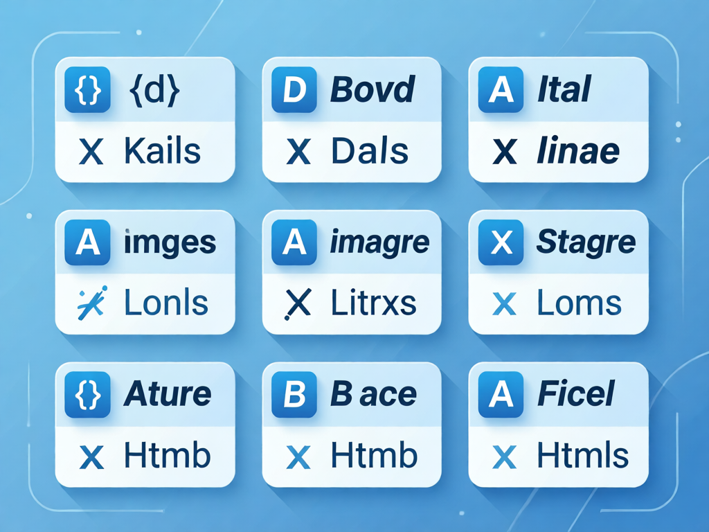

## 本章小结

这一章中我们学习了 Markdown 的行内语法——那些让文字变"漂亮"的小技巧。从代码标记到粗斜体，从链接到图片，再到删除线、转义和 HTML 混写。我们特别关注了常见陷阱：URL 中的括号、下划线歧义、相对路径选择。

本章我们一起学习了以下概念：

| 概念 | 解释 |
|------|------|
| 行内代码 | 用反引号包裹的代码标记，不支持换行 |
| 粗体/斜体 | `**text**` 和 `*text*`，星号和下划线两套语法 |
| 行内链接 | `[文字](URL)`，可带可选标题 |
| 引用链接 | `[文字][ref]` + `[ref]: URL`，适合复用 URL |
| 删除线 | `~~text~~`，GFM 扩展，不在 CommonMark 核心 |
| 转义字符 | `\` 开头输出特殊字符的文字本身 |

下一章中，我们将学习 Markdown 的块级元素——标题、段落、列表、引用、分割线，构建文章的骨架。


============================================================

# 第3章 块级元素全解 —— 搭建文章的"骨架"

## 学习目标

1. 掌握6级标题的语法和层级规则
2. 理解有序列表和无序列表的嵌套规则
3. 能正确使用引用块和水平分割线
4. 理解段落之间的空白行规则

## 生活类比

块级元素就像盖房子。标题是楼层标识——一楼、二楼、地下一层；段落是房间——卧室、厨房、客厅；列表是抽屉——分类收纳；引用是玻璃墙——透明的外部视野；分割线是承重墙——分隔不同的功能区。

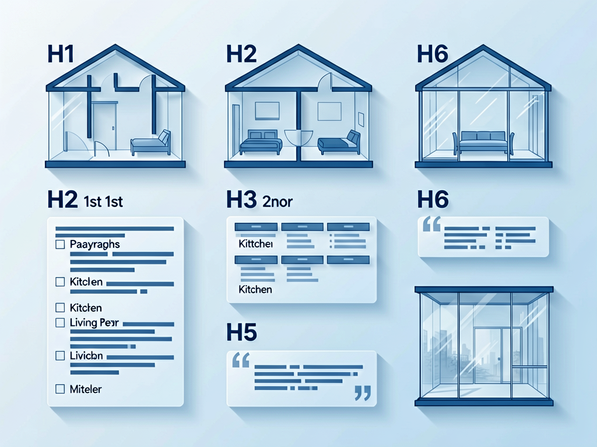

一个好设计的房子，住起来舒服；一个好结构的 Markdown 文档，读起来顺畅。

## 前置处理：换行与制表符

在解析任何块级元素之前，CommonMark 规范的第一步是**前置处理（Preliminaries）**。

```markdown
// 前置处理做了什么？
// 1. 将制表符（Tab）转换为空格（每个Tab = 4个空格）
// 2. 移除行尾的空白和换行符（\t → 4 spaces）
// 3. 移除文件末尾的空行
```

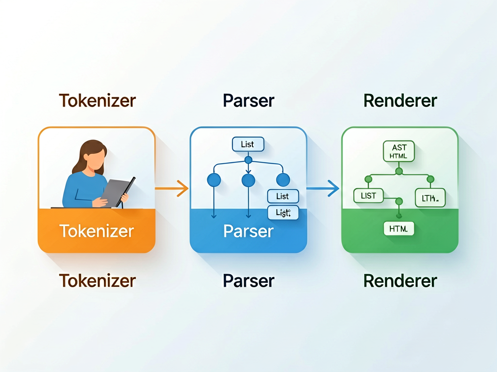

这一步很不起眼，但决定了后续解析的边界。如果你的 Markdown 文件里有 Tab 字符，不同编辑器缩进宽度不同，前置处理把它统一成 4 个空格——这就是互操作性。

## 标题：楼层的标识

### ATX 标题

ATX（Asynchronous Text eXchange）是 Markdown 最常见的标题语法：

```markdown
# H1 —— 主标题
## H2 —— 章节
### H3 —— 子节
#### H4 —— 小节
##### H5 —— 子小节
###### H6 —— 最小标题
```

### Setext 标题

Setext 是另一种标题语法，用下划线标记：

```markdown
H1 —— 主标题
===

H2 —— 章节
---
```

上划线对应 H1，下划线对应 H2。**Setext 只能表示 H1 和 H2**，无法表示 H3-H6。

### 陷阱：尾部 # 匹配

```markdown
## 标题 ##
```

渲染后：## 标题 ##（注意尾部 `##` 被匹配了）。

但如果尾部的 # 前后有空格：

```markdown
## 标题 ##
```

渲染后：## 标题 ##（尾部 ` ##` 包含前导空格，不匹配）。

**规则：尾部 # 必须至少有一个前导空格，且全部由 # 组成，才能被识别为标记而非内容**。

### 陷阱：# 后必须有空格

```markdown
#这不是标题，这是文字
# 这是标题
```

`#` 和文字之间**必须至少有一个空格**，否则只是普通文本。这是为了防止 `#hashtag` 和标题语法冲突——虽然早期的 Markdown 不支持 hashtags，但后来的实现选择了兼容。

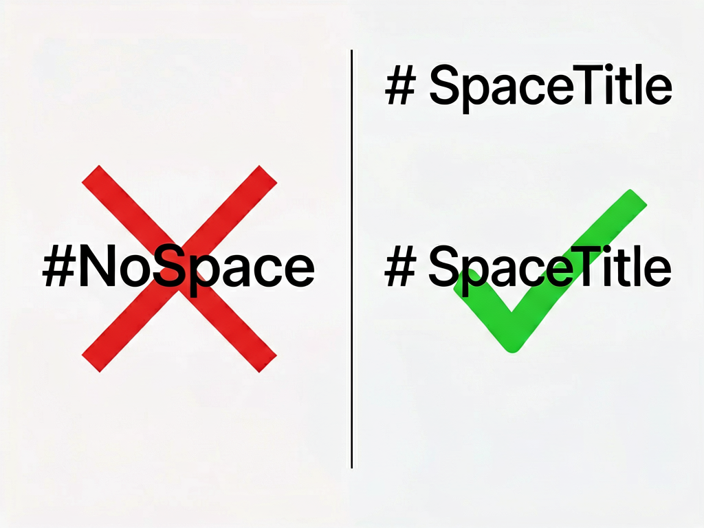

## 段落：居住的空间

段落是 Markdown 中最基本的块级元素。它的规则简单但微妙：

### 段落之间的空行

```markdown
这是第一段。

这是第二段。
```

两段之间**必须有一个空行**。没有空行，它们会被渲染成一个段落。

### 段落内的换行

```markdown
这是第一行。
这是第二行。
```

一段内，两个换行符之间没有空行——渲染成一个段落，换行被"吃掉"（变成空格）。

如果想要**段落内换行**（软换行），有两种方式：

```markdown
方式一：行尾加两个空格
第一行  
第二行

方式二：行尾加 \ 转义
第一行\
第二行
```

渲染后：第一行 换行 第二行。

### 软换行 vs 硬换行

| 类型 | 语法 | 渲染 |
|------|------|------|
| 段落（硬换行） | 空行分隔 | 分段，换行消失 |
| 软换行 | 行尾双空格 | 同一段内换行 |
| 软换行 | 行尾 `\` | 同一段内换行 |

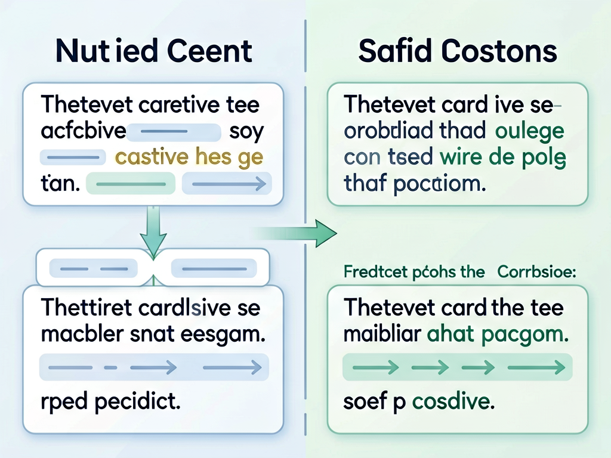

## 列表：分类的抽屉

### 无序列表

```markdown
- 苹果
- 香蕉
- 橙子
```

三种标记符号等价：

```markdown
* 星号
- 减号
+ 加号
```

三种符号混用也可以渲染为同一列表：

```markdown
* 苹果
- 香蕉
+ 橙子
```

渲染为：苹果、香蕉、橙子（同一列表）。

**建议：团队中统一使用一种符号**（推荐 `-`，最易识别）。

### 有序列表

```markdown
1. 第一步
2. 第二步
3. 第三步
```

注意：`1.` 后面的**空格是必须的**。没有空格，它不是有序列表。

### 有序列表的编号

有序列表的编号可以不连续：

```markdown
3. 第三
1. 第一
7. 第七
```

渲染后通常仍按 1、2、3 显示——编号是"语义"而非"视觉"。

### 列表嵌套

列表嵌套有两种缩进方式：

```markdown
方式一：4个空格
- 父项
    - 子项
    - 子项

方式二：2个空格（推荐，更紧凑）
- 父项
  - 子项
  - 子项
```

两种方式都可以，但**同一文档中必须统一**。

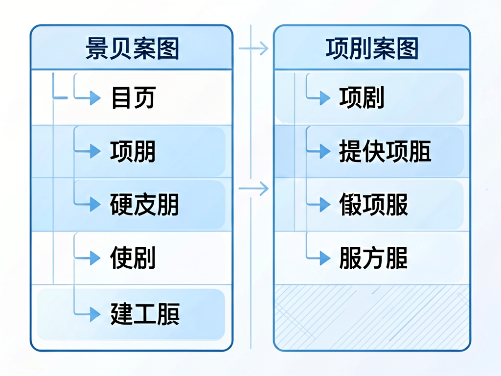

### 陷阱：列表项之间的空行

```markdown
- 第一项

- 第二项
```

列表项之间的空行——有的渲染器会将其识别为两个独立列表，有的识别为一个列表的两个项。**建议：列表项之间不要有空行**，除非你确实想中断列表。

### 列表中的子段落

```markdown
- 列表项的第一段

  列表项的第二段（缩进两个空格）
```

第二段需要比列表标记**多缩进两个空格**，否则会被识别为列表项本身的内容而非子段落。

## 引用块：透明的玻璃墙

### 基础引用

```markdown
> 这是一段引用文字
> 跨行继续
```

渲染后（通常在右侧显示一条竖线）：这是一段引用文字，跨行继续。


### 嵌套引用

```markdown
> 第一层引用
>> 第二层引用
>>> 第三层引用
```

渲染后：第一层引用 > 第二层引用 > 第三层引用。

### 引用中的其他元素

引用中可以包含标题、列表、代码块：

```markdown
> ## 引用中的标题
>
> - 引用中的列表项
> - 第二项
>
> ```python
> # 引用中的代码块
> print("hello")
> ```
```

## 水平分割线：承重墙

### 基础语法

```markdown
---
```

渲染为一条水平线。

### 变体

```markdown
***
___
- - -
* * *
_ _ _
--- ---
```

至少需要 **3个** `-`、`*` 或 `_`。可以包含空格。

### 陷阱：尾部内容

```markdown
--- 这不是分割线，这是文字
```

如果 `-` 后面紧跟文字（没有空行或只有文字），它不是分割线。

**规则：分割线行只能是 `-`、`*`、`_`（至少3个）和可选的空格**。

## 设计取舍

**为什么列表需要缩进？**

缩进是为了区分"这是列表的一部分"还是"这是列表之后的段落"。4个空格或2个空格是历史约定——早期打字机和等宽字体中，一个缩进大约是一个 Tab 的宽度。

**为什么段落之间需要空行？**

空行是**块级元素的分隔符**。如果没有空行，渲染器无法区分"这是新段落"和"这是代码块"或"这是标题"。空行的存在让 Markdown 在纯文本中保持了结构化的边界。

**为什么三种无序列表符号等价？**

灵活性。不同用户习惯不同——有人习惯用 `-`，有人习惯用 `*`，有人习惯用 `+`。统一它们的语义，让团队可以选择最顺手的符号。

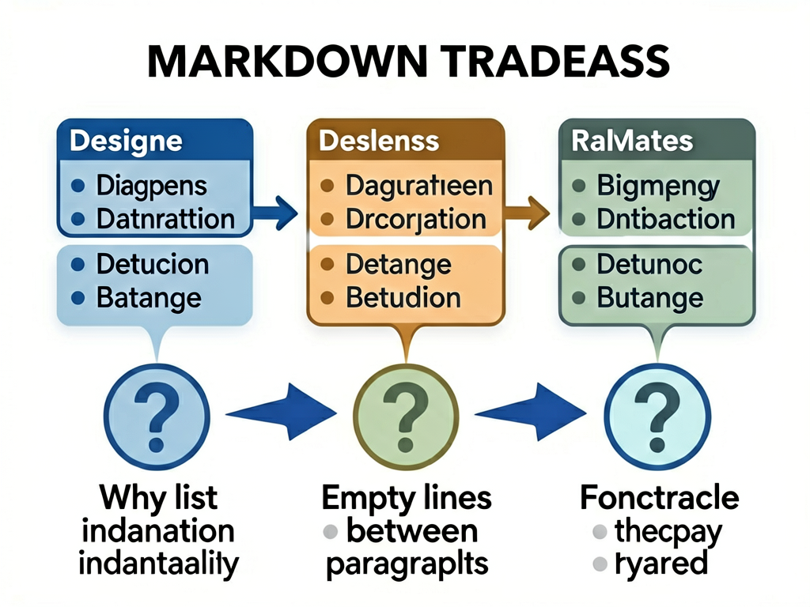

## 动手练习

1. 尝试在 `#` 后不加空格，观察渲染结果
2. 写一个嵌套了3层的有序列表，看看渲染效果
3. 思考题：为什么 Markdown 没有定义"居中对齐"？

## 本章小结

这一章中我们学习了 Markdown 的块级元素——文章的结构骨架。首先介绍了前置处理（Tab 规范化、换行清理），然后逐一讲解了标题（ATX 和 Setext）、段落（空行分隔、软换行技巧）、列表（无序/有序、嵌套规则、陷阱）、引用块（单层/嵌套/嵌套其他元素）和水平分割线（基础语法和陷阱）。

本章我们一起学习了以下概念：

| 概念 | 解释 |
|------|------|
| ATX 标题 | `# H1` ~ `###### H6`，6级标题 |
| Setext 标题 | `===` / `---` 下划线标记，仅 H1/H2 |
| 软换行 | 行尾双空格或 `\`，段内换行 |
| 列表嵌套 | 2空格或4空格缩进 |
| 引用块 | `>` 符号，支持嵌套和其他元素 |
| 水平分割线 | `---` / `***` / `___`，至少3个 |

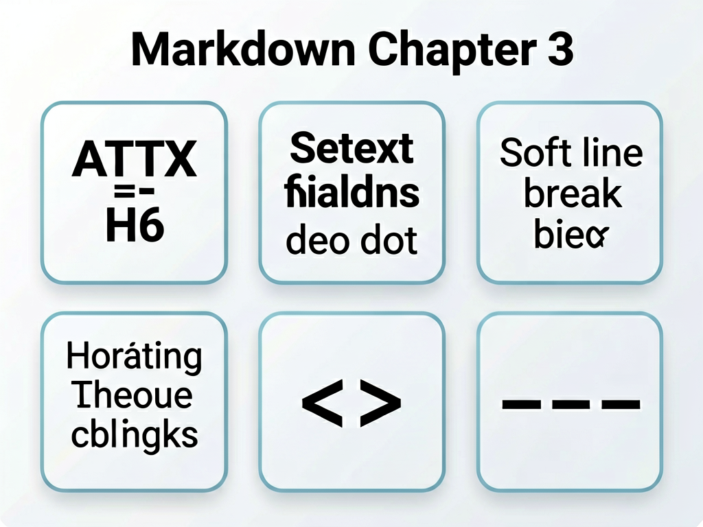

第一篇（基础篇）到此结束。下一章开始第二篇——Markdown 的进阶语法：代码块、表格、图片和脚注。这些语法大多属于 GFM（GitHub Flavored Markdown）扩展，是 GitHub 和现代工具链中的标准配置。


============================================================

# 第4章 代码块与语法高亮 —— 给代码穿上"防护服"

## 学习目标

1. 掌握三种代码块语法（三反引号、三波浪线、缩进代码块）
2. 理解语言标识的作用和语法高亮的渲染流程
3. 能使用 GFM 的代码行号和高亮功能

## 生活类比

第2章我们学了行内代码，像给短句裹一层"保鲜膜"。代码块则像"保险箱"——厚实的容器，保护多行代码不受格式解析的干扰。语法高亮就像给保险箱贴上标签（"这是 Python 的保险箱"），让渲染器知道用什么配色方案去打开它。

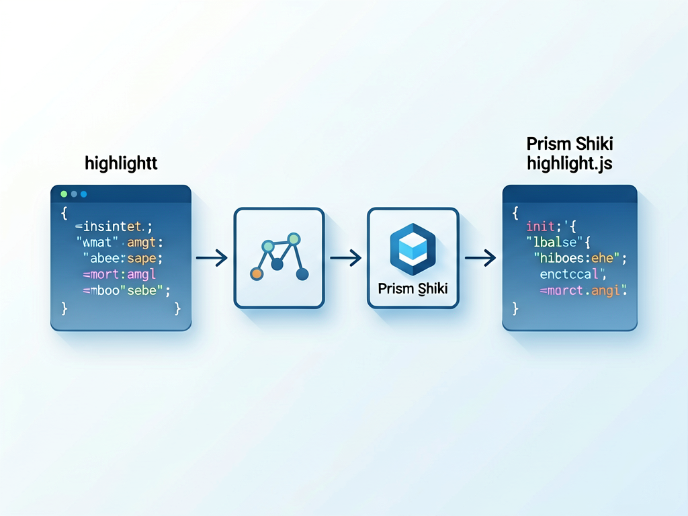

## 栅栏代码块：三反引号

### 基础语法

```python
def hello():
    print("Hello, World!")

hello()
```

用三对反引号（backtick）包裹：

````markdown
```python
def hello():
    print("Hello, World!")

hello()
```
````

`python` 是**语言标识**（info string），告诉渲染器"这是一段 Python 代码"。

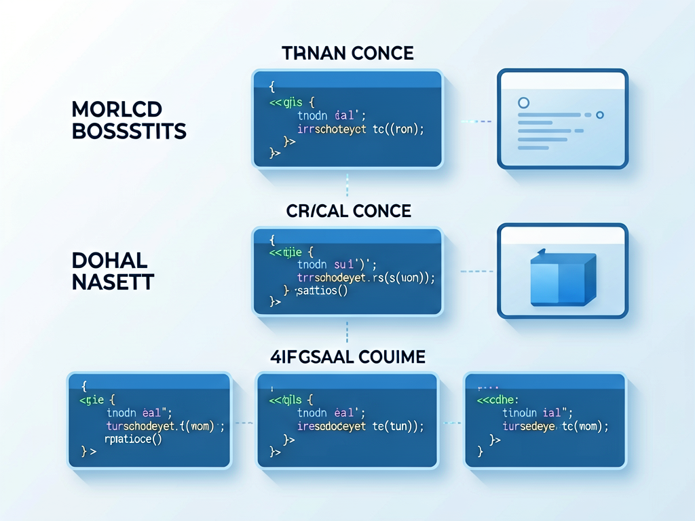

### 语言标识的作用

语言标识不直接产生高亮效果。Markdown 解析器的工作只是提取这个标识，存入 AST：

```
CodeBlock
├── language: "python"
├── content: "def hello():\n    print(...)\n\nhello()\n"
└── meta: ""  // 可选的额外元数据
```

实际的颜色高亮，是由**后处理工具**完成的——通常是 Prism.js、highlight.js 或 Shiki。这些工具扫描渲染后的 HTML，找到带有语言标记的代码块，然后用对应的语法高亮规则上色。

### 语言别名

大多数解析器支持语言别名：

| 全称 | 别名 |
|------|------|
| `javascript` | `js` |
| `python` | `py` |
| `typescript` | `ts` |
| `bash` | `sh` |
| `css` | `scss`（SCSS 也算 CSS） |

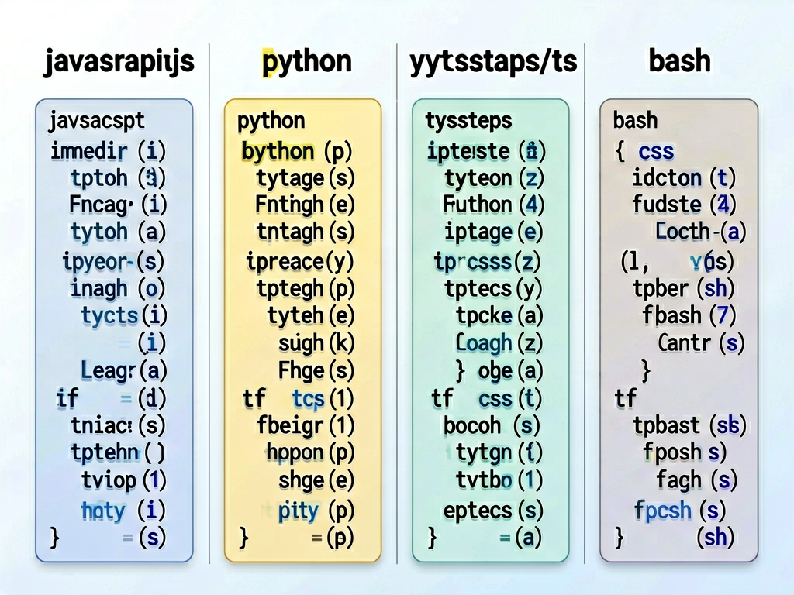

### 不带语言标识的代码块

如果省略语言标识：

````markdown
```
这是一个纯文本代码块
没有语法高亮
```
````

渲染后依然是一个代码块，只是没有语法高亮——代码以等宽字体显示，但颜色是默认的灰黑。

## 三波浪线：反引号的救星

当你的代码中**包含反引号**时，三反引号就失效了：

`````markdown
`````
// 这个代码块里有反引号
function code() { return "`"; }
`````
`````

渲染器会把第一个 ` ```` ` 作为开始，把第二个 ` ```` ` 作为结束，但代码中间还有一个 ` ``` `，导致代码块提前关闭——渲染错误。

**解决方案：用三对波浪线**：

`````markdown
~~~
// 代码里可以有任意多个反引号
function code() { return "```"; }
~~~
`````

波浪线和反引号的效果完全一样，只是"容器"不同。

### 嵌套规则

规则很简单：**容器的分隔符（反引号或波浪线的数量）必须多于内容中的最大连续数量**。

- 内容中有 1 个反引号 → 用 3 个反引号或 3 个波浪线
- 内容中有 3 个连续反引号 → 用 4 个或更多反引号

`````markdown
`````
// 内容中有 ``` 嵌套
function code() {
  return "```";
}
`````
`````

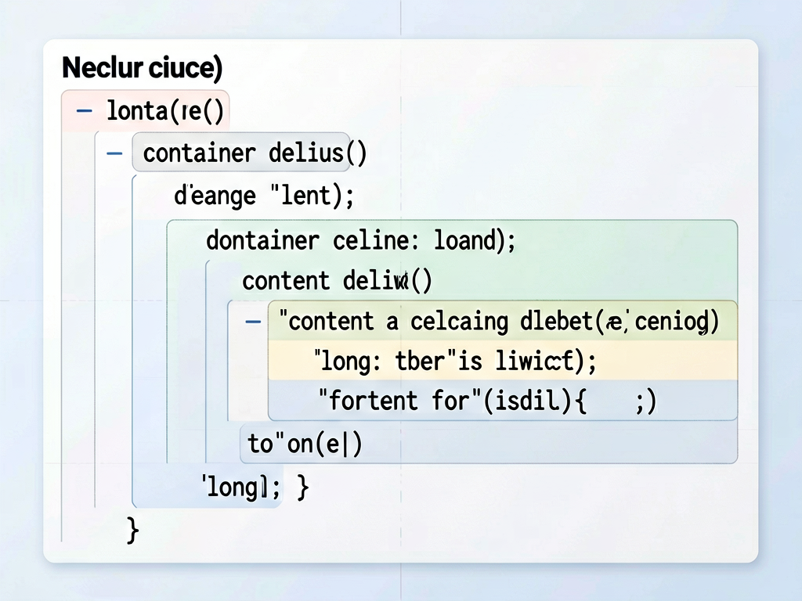

## 缩进代码块：古老的方案

在栅栏代码块出现之前，Markdown 使用**缩进**来标记代码块：

`````
    def hello():
        print("Hello, World!")

    hello()
`````

行首缩进 **4 个空格**或 **1 个 Tab**，即被识别为代码块。

### 为什么不推荐？

1. **肉眼不可见**：缩进代码块在源码中不容易识别，尤其是缩进不一致时
2. **难以嵌套**：嵌套代码块需要 8 空格、12 空格……很快变得混乱
3. **编辑器冲突**：现代编辑器的自动缩进功能经常和代码块缩进冲突

### 什么时候还会遇到？

缩进代码块在 CommonMark 规范中仍然存在，所以几乎所有渲染器都支持它。但在日常使用中，**栅栏代码块几乎是唯一选择**。

## 语法高亮的渲染流程

理解 Markdown 和语法高亮的关系很重要：**Markdown 不执行高亮，它只标注语言**。

```
Markdown 源码 → Markdown 解析器 → AST（含语言标记） → HTML
                                                        ↓
                                              语法高亮库（Prism / Shiki / highlight.js）
                                                        ↓
                                              HTML + <code class="language-python">
```

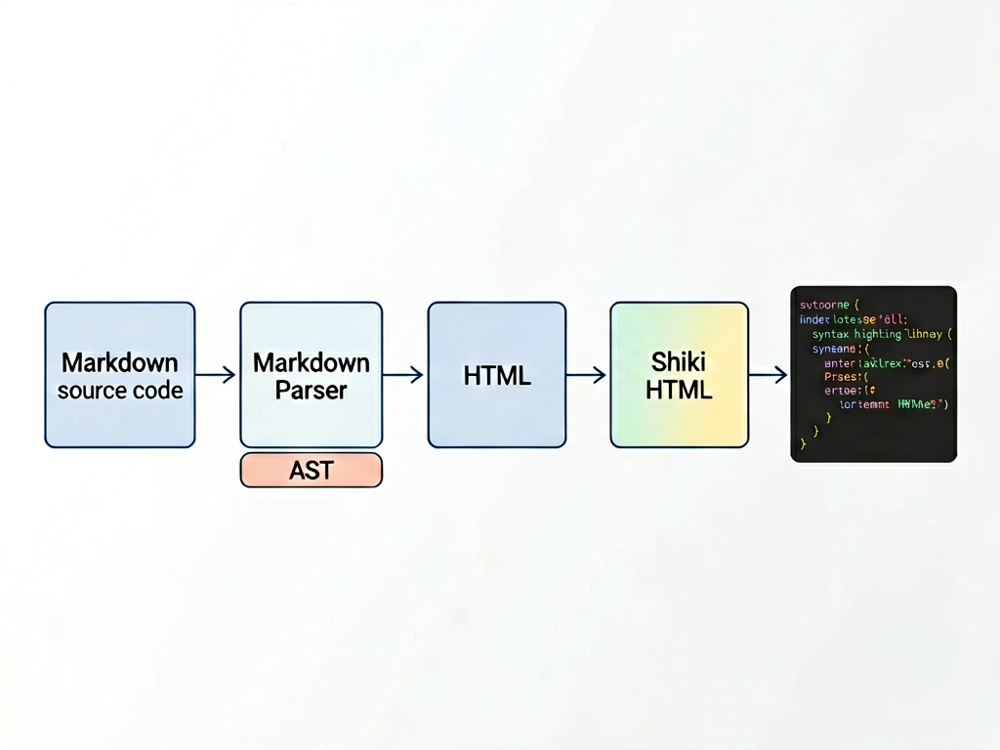

### 常见的高亮库

| 库 | 特点 | 适用场景 |
|-----|------|----------|
| **Shiki** | 基于 TextMate 语法，VS Code 同款，色彩精确 | 现代 Web 站点 |
| **Prism.js** | 轻量、插件丰富、主题多 | 轻量级站点 |
| **highlight.js** | 自动检测语言、免配置 | 快速集成 |

### 以 Shiki 为例的解析流程

```javascript
// 伪代码：Shiki 的高亮流程
// 源码路径：shiki/dist/index.js（示意）
async function highlight(code, language) {
  // ① 加载对应语言的语法（如 Python.tmLanguage.json）
  const grammar = await loadGrammar(language)
  // ② 将代码逐行分词
  const tokens = tokenize(code, grammar)
  // ③ 为每个 token 分配颜色（基于主题）
  const coloredTokens = applyTheme(tokens, theme)
  // ④ 生成带 class 的 HTML
  return generateHTML(coloredTokens)
}
```

这段代码的每一步都有明确的职责：

1. **加载语法**：每种语言对应一个 TextMate 语法文件（`.tmLanguage.json`），定义了什么字符序列匹配什么 token
2. **分词**：把代码字符串切分成 token（关键字、字符串、注释、标识符……）
3. **着色**：根据用户选择的主题（如 `vscode-dark`），给每个 token 分配 CSS class
4. **生成 HTML**：输出 `<span class="tok-keyword">def</span>` 这样的 HTML

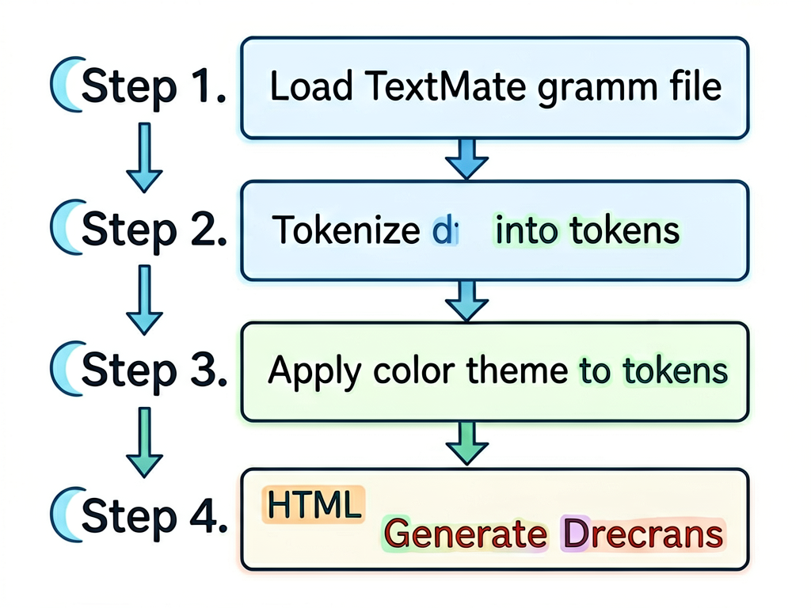

## 代码行号与行高亮

### 代码行号

GitHub 默认在代码块中**自动显示行号**——这是 GitHub 平台的扩展功能，不是 Markdown 规范的一部分。

````markdown
```python
def hello():  # 第1行
    print("hello")  # 第2行

hello()  # 第3行
```
````

在 GitHub 渲染时，行号会显示在代码块的左侧，方便引用特定行（"看第3行"）。

### 行高亮（Line Highlighting）

GFM 扩展了**行高亮**语法，通过 `meta` 字符串指定：

`````markdown
```python {3,5-7}
def greet(name):
    greeting = f"Hello, {name}!"  # 第3行，高亮
    print(greeting)  # 第4行，不高亮
    return greeting  # 第5行，高亮
    # 第6-7行也会高亮
```
`````

`{3,5-7}` 是 meta 字符串，告诉高亮库高亮第 3 行和第 5-7 行。

**注意**：这需要渲染器（如 VitePress、Docusaurus）和高亮库（如 Shiki）都支持该扩展。

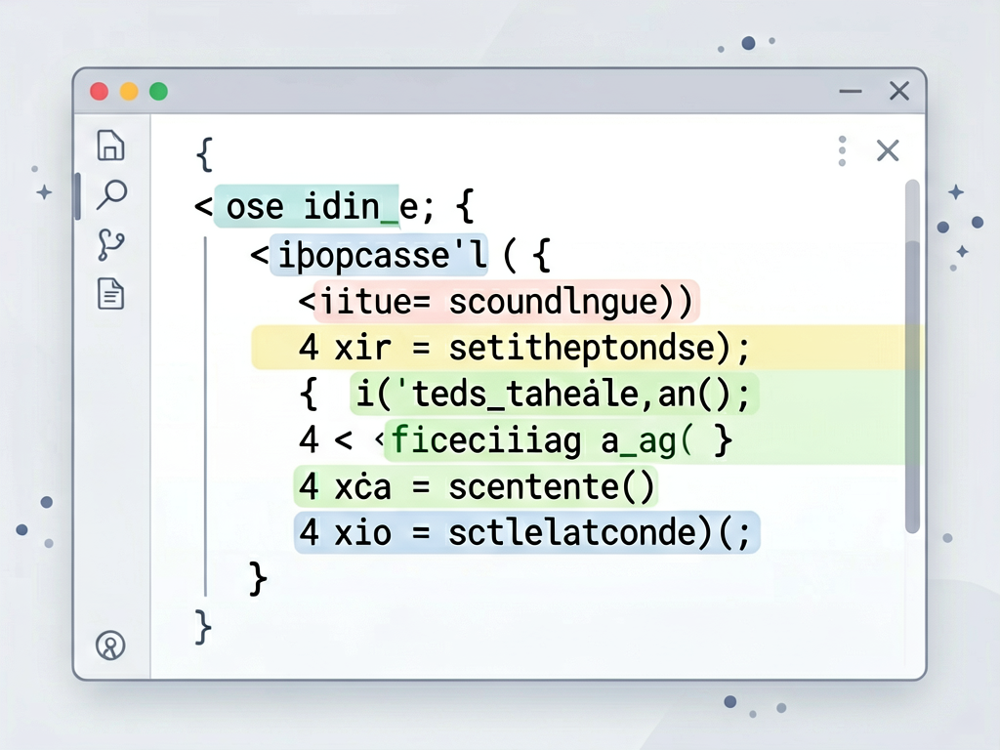

## 设计取舍

**为什么语法高亮不集成在 Markdown 规范中？**

因为高亮是**展示层**的事，而 Markdown 规范关注的是**语义层**。同样的 Python 代码，在深色主题下应该用浅色文字，在浅色主题下应该用深色文字——主题变化不应该改变 Markdown 源码。把高亮交给生态库，让 Markdown 保持语言无关性。

**三反引号 vs 三波浪线？**

反引号更常见（键盘上直接有），所以是默认选择。波浪线是"逃生舱口"——当反引号不够用时启用。

**为什么缩进代码块不推荐？**

可读性差。缩进代码块在源码中"隐身"，不像栅栏代码块有明显的开始和结束标记。在团队协作中，这会导致大量的格式混淆。

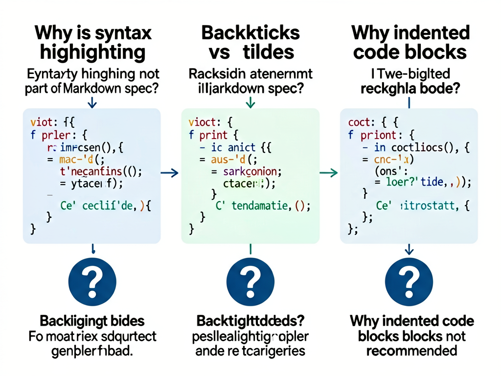

## 动手练习

1. 用三种不同的代码块语法（三反引号、三波浪线、4空格缩进）写同一个代码片段，比较渲染结果
2. 尝试用不存在的语言标识（如 ````xyz`），看看渲染器如何处理
3. 思考题：为什么 Markdown 不直接支持行号？（提示：行号是展示层的概念，和语义无关）

## 本章小结

这一章中我们学习了 Markdown 的代码块语法。首先介绍了栅栏代码块的两种形式（三反引号、三波浪线），解释了语言标识的作用和语法高亮的完整渲染流程（Markdown → AST → 高亮库 → HTML），然后了解了缩进代码块为何不推荐使用，最后介绍了 GFM 的行号和行高亮扩展。

本章我们一起学习了以下概念：

| 概念 | 解释 |
|------|------|
| 栅栏代码块 | 三反引号或三波浪号包裹的多行代码 |
| 语言标识 | 代码块后的语言名，如 `python`，供高亮库使用 |
| 缩进代码块 | 4空格缩进，已不推荐 |
| Shiki | 基于 TextMate 语法的现代高亮库，VS Code 同款 |
| 行高亮 | `{3,5-7}` 语法，GFM 扩展 |

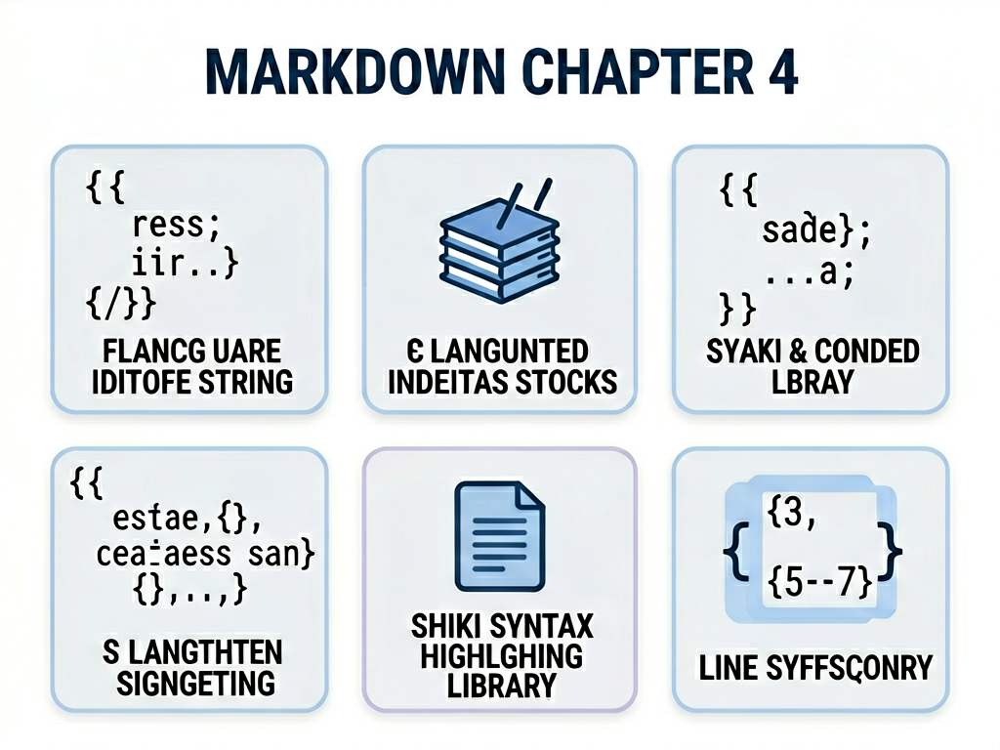

下一章中，我们将学习 Markdown 的表格语法——如何在纯文本中构建结构化的数据。


============================================================

# 第5章 表格的艺术 —— 给数据建"网格"

## 学习目标

1. 掌握 GFM 表格的基础语法和三种对齐方式
2. 理解表格中常见的陷阱和规避方法
3. 能使用 HTML 表格处理复杂场景

## 生活类比

Markdown 表格就像在草地上画网格——用 `-` 画横线、用 `|` 画竖线，网格画好后就可以在每个格子里放东西了。对齐方式就像给格子贴标签："这列是数字，应该左对齐还是右对齐？"

画网格比写 HTML `<table>` 快得多，但网格的灵活性有限——想合并两个格子？那就得换用 HTML 了。


## 基础表格

### 最小表格

```markdown
| 列A | 列B | 列C |
|---|---|---|
| 1 | 2 | 3 |
| 4 | 5 | 6 |
```

渲染为：

| 列A | 列B | 列C |
|---|---|---|
| 1 | 2 | 3 |
| 4 | 5 | 6 |

结构分为三部分：

1. **表头行**：`| 列A | 列B | 列C |`
2. **分隔线**：`|---|---|---|`（定义列数和基本样式）
3. **数据行**：每行格式与表头行一致

### 分隔线的规则

分隔线中的 `-` 至少需要一个：

```markdown
| 列A | 列B |
|---|---|
```

渲染为：

| 列A | 列B |
|---|---|

但通常我们会多写几个 `-` 让表格看起来整齐：

```markdown
| 列A | 列B |
|-----|-----|
```

渲染效果相同，但源码更易读。

### 列数必须一致

每一行的 `|` 分隔符数量必须相同。少一个多一个都会导致渲染错误：

````markdown
<!-- 错误：最后一行少了一列 -->
| 列A | 列B |
|---|---|
| 1 |
````

渲染器可能把它当做一个只有 A 列的表格，B 列消失。

## 对齐方式

GFM 支持三种对齐方式，通过分隔线中的 `:` 控制：

```markdown
| 左对齐 | 居中对齐 | 右对齐 |
|:---|:---:|---:|
| 文字 | 文字 | 文字 |
```

渲染为：

| 左对齐 | 居中对齐 | 右对齐 |
|:---|:---:|---:|
| 文字 | 文字 | 文字 |

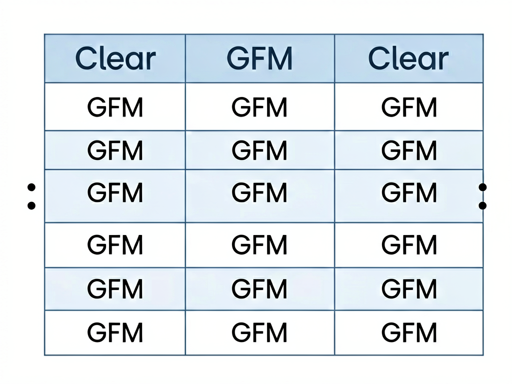

### 对齐规则速记

```
:---    左边有冒号 → 左对齐（默认）
:---:   两边都有冒号 → 居中对齐
---:    右边有冒号 → 右对齐（数字推荐）
---     没有冒号 → 默认左对齐
```

### 什么时候用右对齐？

数字列建议右对齐：

```markdown
| 项目 | 数量 | 金额 |
|:---|---:|---:|
| 苹果 | 10 | 30.00 |
| 香蕉 | 5 | 15.00 |
| 橙子 | 8 | 24.00 |
```

渲染为：

| 项目 | 数量 | 金额 |
|:---|---:|---:|
| 苹果 | 10 | 30.00 |
| 香蕉 | 5 | 15.00 |
| 橙子 | 8 | 24.00 |

数字右对齐后，每一位对齐了，方便对比大小。左对齐的数字"10"和"5"的个位不对齐，视觉上很难比较。

## 陷阱与注意事项

### 单元格中的 `|` 字符

表格用 `|` 作为列分隔符，所以单元格中如果出现 `|`，会被误识别为列分隔：

````markdown
<!-- 错误：| 被识别为列分隔符 -->
| 内容 |
|---|
| a | b | c |
````

**解决方法：用 `\` 转义**：

````markdown
| 说明 | 示例 |
|---|---|
| 管道符 | a \| b |
````

渲染为：

| 说明 | 示例 |
|---|---|
| 管道符 | a | b |

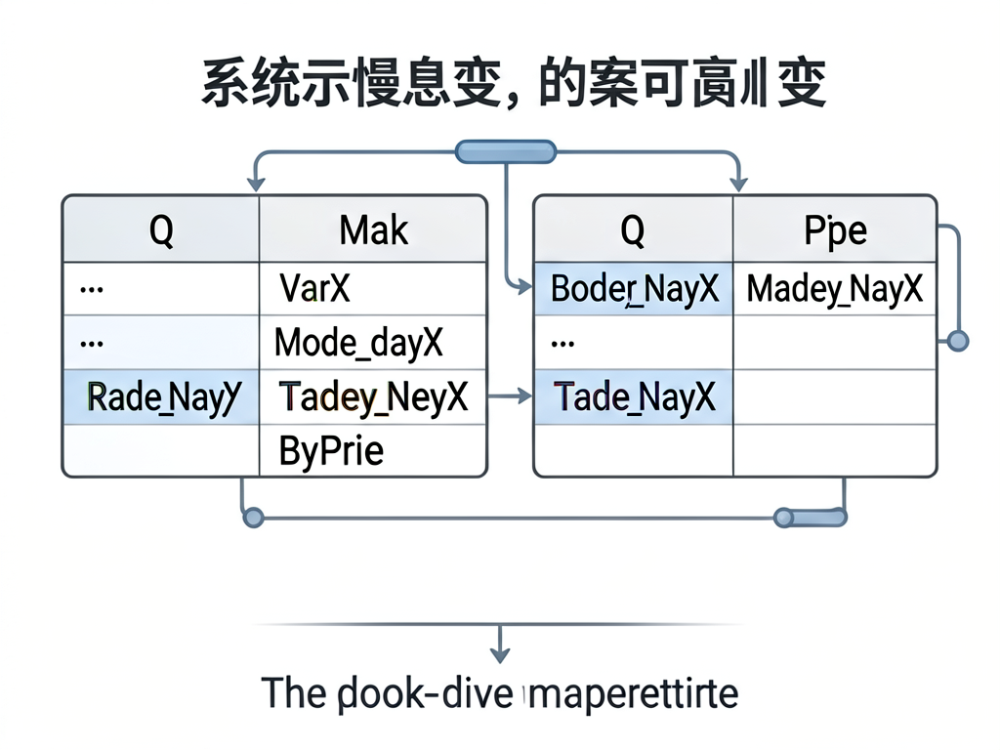

### 空单元格

空单元格完全没问题：

````markdown
| A | B | C |
|---|---|---|
| 1 | | 3 |
````

渲染为：

| A | B | C |
|---|---|---|
| 1 | | 3 |

B 列的第二行是空单元格，渲染器会正确处理。

### 表格前后必须有空白行

这是最常见的陷阱之一：

````markdown
<!-- 错误：表格前面没有空行 -->
前一段文字
| A | B |
|---|---|
| 1 | 2 |
````

渲染器可能把表格识别为普通段落中的管道符，而不是表格。

**解决方法：表格前后各留一个空行**：

````markdown
这是前一段文字。

| A | B |
|---|---|
| 1 | 2 |

这是后一段文字。
````

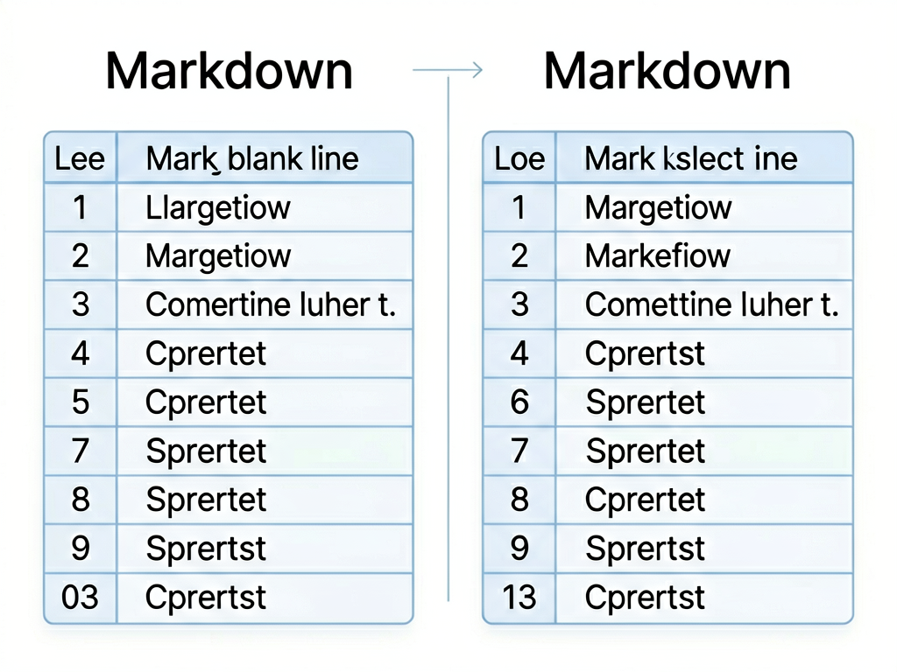

### 表格中的行内语法

表格单元格中可以正常使用粗体、链接、代码等行内语法：

````markdown
| 功能 | 语法 | 说明 |
|:---|:---|:---|
| **粗体** | `**text**` | 加粗显示 |
| [链接](https://example.com) | `[文字](URL)` | 可点击链接 |
````

渲染为：

| 功能 | 语法 | 说明 |
|:---|:---|:---|
| **粗体** | `**text**` | 加粗显示 |
| [链接](https://example.com) | `[文字](URL)` | 可点击链接 |

## 复杂表格：HTML 兜底

### Markdown 表格的局限

Markdown 表格无法支持：

- **合并单元格**（colspan / rowspan）
- **表头分组**（多层表头）
- **表尾**（tfoot）
- **表体分段**（tbody / thead / tfoot 精细控制）
- **单元格样式**（边框颜色、背景色、字号）

当遇到这些场景时，直接使用 HTML `<table>`：

````markdown
<!-- 合并列的表格 -->
<table>
  <thead>
    <tr>
      <th colspan="2">产品信息</th>
      <th>价格</th>
    </tr>
  </thead>
  <tbody>
    <tr>
      <td>苹果</td>
      <td>红色</td>
      <td>¥5.00</td>
    </tr>
  </tbody>
</table>
````

渲染为：

<table>
  <thead>
    <tr>
      <th colspan="2">产品信息</th>
      <th>价格</th>
    </tr>
  </thead>
  <tbody>
    <tr>
      <td>苹果</td>
      <td>红色</td>
      <td>¥5.00</td>
    </tr>
  </tbody>
</table>

### Markdown 表格 vs HTML 表格：选择指南

| 场景 | 推荐方案 |
|------|----------|
| 简单数据展示 | Markdown 表格 |
| 需要对齐控制 | Markdown 表格（带 `:`） |
| 合并单元格 | HTML `<table>` |
| 多层表头 | HTML `<table>` |
| 复杂样式（颜色、边框） | HTML `<table>` |
| 动态数据（由代码生成） | HTML 生成 |

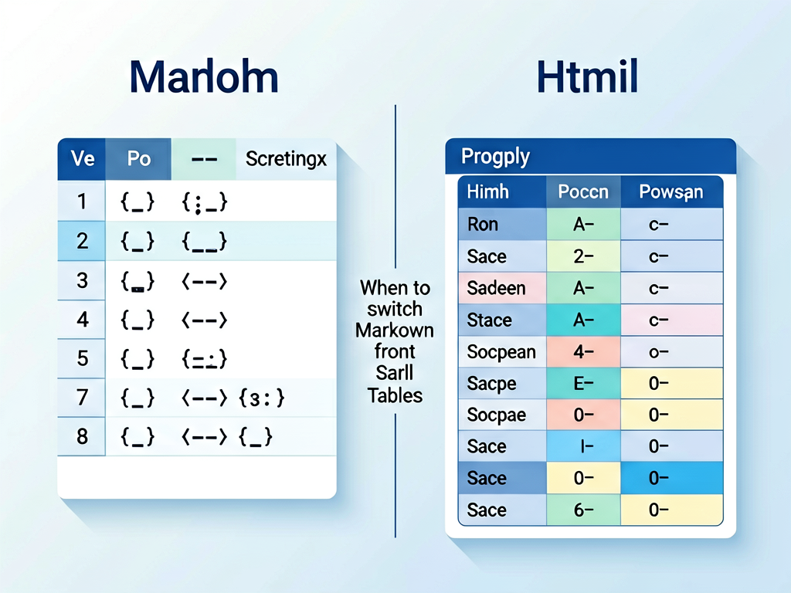

### 何时切换到 HTML？

一个简单的经验法则：

> **如果你的表格需要"合并"两个格子，或者"给格子染色"，立刻切换到 HTML。**

Markdown 表格的设计目标是**简单**——写起来快，读起来也快。一旦复杂度超过了这个目标，HTML 就是你的兜底方案。

## 设计取舍

**为什么表格是 GFM 扩展而非 CommonMark 核心？**

因为表格的语法歧义太多了。同一份表格源码，不同的解析器可能有不同的理解：

- 空格处理：`| a | b |` 和 `|a|b|` 是否等价？
- 空单元格：`||` 和 `| |` 是否等价？
- 转义：`a \| b` 在单元格中表示管道符还是列分隔符？

CommonMark 选择了不纳入表格——让 GFM（GitHub 等平台的扩展规范）来处理这些"边缘情况"。

**为什么不支持合并单元格？**

合并单元格（colspan / rowspan）需要**二维语义**，而 Markdown 的本质是**线性文本**。在纯文本中，没有一种直观的方式来表达"这个格子跨越两列"——不像 HTML 有 `colspan="2"` 属性。

**为什么用 `|` 分隔？**

`|` 是最直观的列分隔符。它在 ASCII 字符集中存在，视觉上像"栅栏"，和代码块的栅栏语法（```` ``` ````）风格一致。早期 Markdown 实现就选择了它，后来成为事实标准。

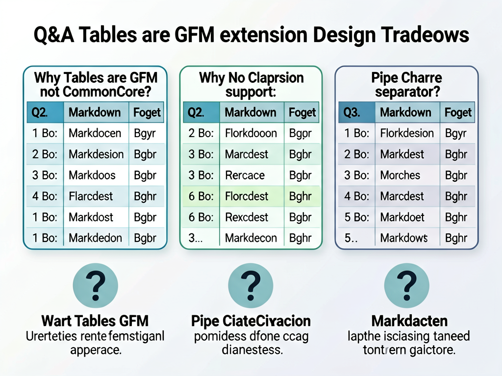

## 动手练习

1. 尝试在表格单元格中使用 `|` 字符，观察渲染结果，然后用 `\|` 转义
2. 写一个三种对齐方式都有的表格，对比渲染效果
3. 思考题：为什么 Markdown 表格要求每行列数一致？（提示：从解析器设计角度思考）

## 本章小结

这一章中我们学习了 Markdown 的表格语法。首先介绍了基础表格的结构（表头行 + 分隔线 + 数据行），然后讲解了三种对齐方式及其适用场景（文字左对齐、数字右对齐、中性居中），接着讨论了常见陷阱（`|` 转义、空单元格、空白行要求），最后介绍了 HTML 表格作为复杂场景的兜底方案。

本章我们一起学习了以下概念：

| 概念 | 解释 |
|------|------|
| 分隔线 | `|---|` 定义列数和基本样式 |
| 对齐方式 | `:---` 左对齐、`:---:` 居中、`---:` 右对齐 |
| 转义管道符 | `\|` 在单元格中表示文字管道符 |
| HTML 兜底 | 合并单元格等复杂场景用 `<table>` |
| GFM 扩展 | 表格不是 CommonMark 核心，是 GFM 扩展 |

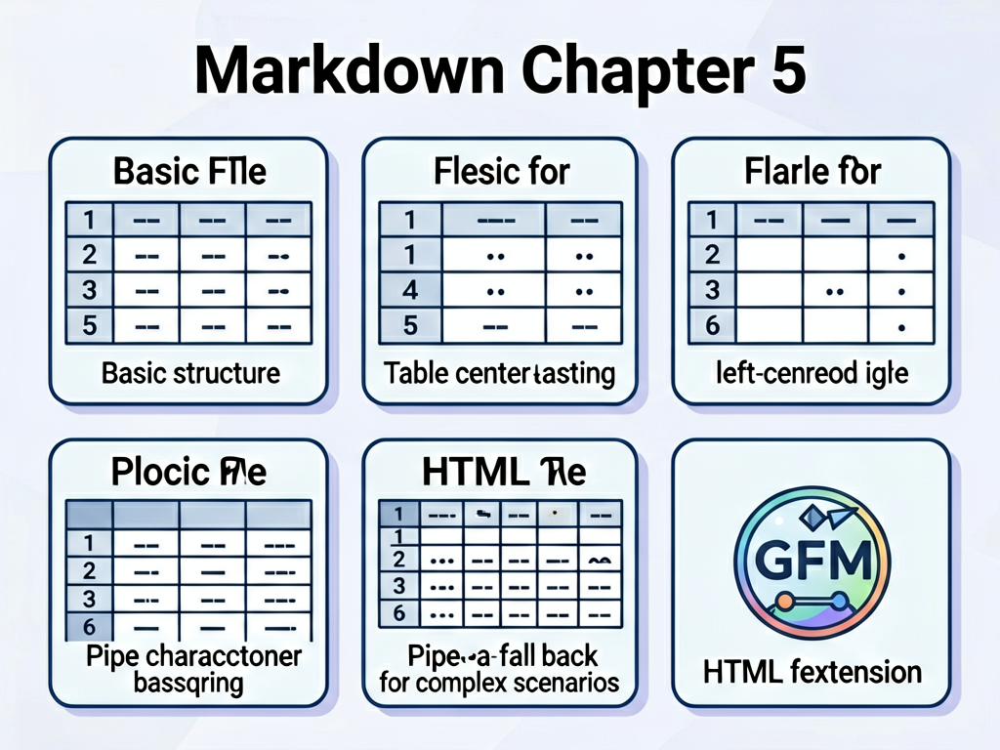

下一章中，我们将学习图片与嵌入——如何把视觉内容融入 Markdown 文档。


============================================================

# 第6章 图片与嵌入 —— 给文章贴"照片墙"

## 学习目标

1. 掌握图片语法、alt 文本最佳实践
2. 理解相对路径与绝对路径的选择
3. 了解图片嵌入的扩展语法（尺寸控制、图注）

## 生活类比

图片就像照片墙上的照片。**alt 文本**是照片背面的标签——告诉盲人手摸这张照片的人，照片里是什么。**路径**是挂照片的方式——用图钉固定在墙上（相对路径），还是用胶带粘在别处（绝对路径）。图注是照片下方的说明文字，让读者知道为什么要挂这张照片。

挂得好，照片墙赏心悦目；挂得乱，看着都累。


## 基础图片语法

### 最小语法

```markdown

```

渲染为一个图片，alt 文本为"一只猫"。

语法结构：`!` + `[alt 文本]` + `(图片路径 "可选标题")`

### alt 文本的最佳实践

alt 文本有两个关键用途：

1. **无障碍**：屏幕阅读器朗读 alt 文本，帮助视障用户"看"图片
2. **加载失败回退**：图片加载失败时显示 alt 文本

**最佳实践**：

- 有信息的图片：alt 文本应描述图片内容
- 装饰性图片：alt 文本留空 ``（不朗读、不显示）
- 功能性图片（如图标）：alt 文本应描述功能而非内容

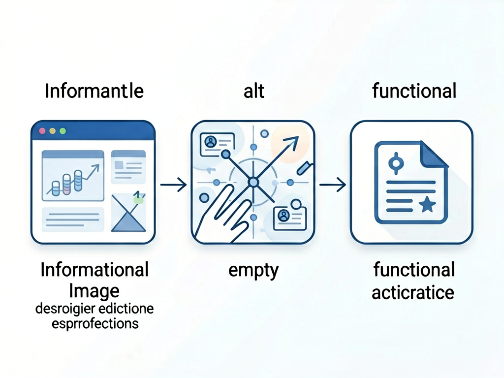

### 标题属性

```markdown

```

`"可爱的小猫咪"` 是鼠标悬停时显示的标题。现代网页中不太常用（tooltip 有可访问性问题），但 Markdown 支持它。

## 图片链接

### 点击图片跳转

```markdown
[](https://example.com)
```

渲染为一个可点击的图片，点击图片跳转到 `https://example.com`。

### 嵌套解析

这本质上是**语法嵌套**——图片语法 `[](url)` 中，`` 是一个完整的图片语法，外面包裹了链接语法 `[]()`。

解析器的处理流程：

```
[](https://example.com)
 │││││││││││││││││ ││││││││││││││││││││││
 │└───────────┬───────────────────┘│
 │    图片语法识别        │
 │                        │
 └─── 整体包裹为链接 ─────┘
```

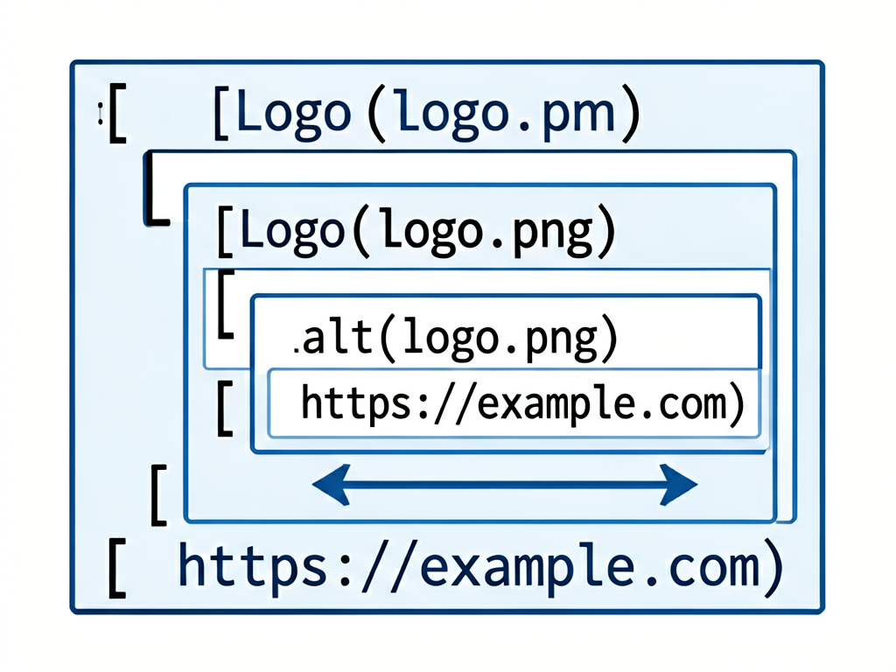

类似行内语法中的 `[链接](URL)` 和 `**粗体**` 的嵌套。

## 路径策略：三种路径，三种命运

### 相对路径：最安全的选择

```markdown

```

**相对路径**从当前 `.md` 文件的位置出发计算图片位置。

这是**最推荐的方案**，因为：

1. **可移植**：整个项目复制到其他位置，图片路径不需要修改
2. **版本控制友好**：Git 仓库中路径始终正确
3. **本地开发**：在本地打开 HTML 也能看到图片

### 绝对路径（站根）

```markdown

```

**站根路径**从站点的根目录出发。在 Hugo、VitePress 等静态站点生成器中，`/assets/` 通常映射到项目的 `assets/` 目录。

适用场景：

- 静态站点生成器（Hugo、VitePress、Docusaurus）
- 路径由构建工具统一管理

不适用于：

- GitHub 仓库中直接渲染的 Markdown（站根路径在 GitHub 中不存在）

### 完整 URL（CDN）

```markdown

```

**完整 URL**是最明确的引用方式——从任何地方打开都能加载。

适用场景：

- 图片存储在 CDN 上
- 团队协作时不想处理路径问题
- 图片来自第三方服务（如图床）

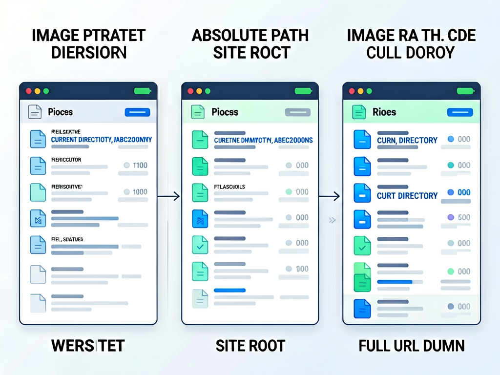

### 路径陷阱：Git 仓库中的图片

假设你的项目结构如下：

```
project/
├── docs/
│   ├── guide.md
│   └── images/
│       └── screenshot.png
└── README.md
```

`guide.md` 引用图片的方式：

```markdown
<!-- guide.md 中：相对路径 -->

```

`README.md` 引用图片的方式：

```markdown
<!-- README.md 中：相对路径 -->

```

两个文件都使用相对路径，各自指向正确的图片位置。不管项目复制到哪里，GitHub 上渲染还是本地打开，路径都正确。

## 图片尺寸控制

### GFM 扩展的等号语法

GitHub Flavored Markdown 扩展了**尺寸控制**语法，通过等号指定宽高：

````markdown
<!-- 指定宽度和高度 -->


<!-- 只指定宽度 -->


<!-- 只指定高度 -->

````

### 工作原理

尺寸信息作为**元数据**附加在 AST 的图片节点上：

```
Image
├── alt: "图片"
├── url: "cat.jpg"
└── meta: "=200x300"  // GFM 扩展
```

渲染器解析 meta 后，输出 HTML 时添加 `width` 和 `height` 属性：

```html

```

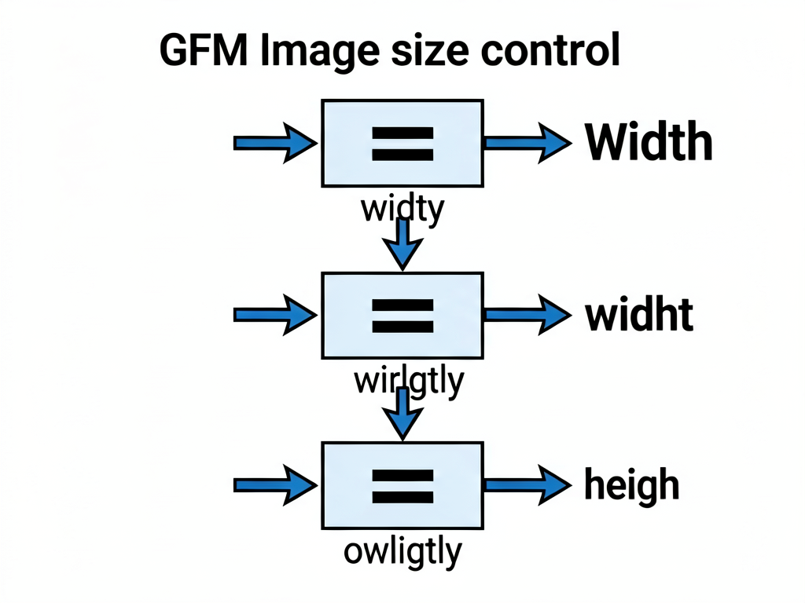

### 适用场景

- **图片列表**：统一尺寸让列表整齐
- **响应式设计**：固定宽度防止布局跳动（layout shift）
- **避免重绘**：提前声明尺寸，浏览器无需等待图片加载后才计算

### 不支持的场景

不同渲染器对尺寸语法的支持程度不同：

| 渲染器 | 支持 | 说明 |
|--------|------|------|
| GitHub | 是 | 原生支持 |
| VS Code | 部分 | 依赖编辑器设置 |
| VitePress | 否 | 需用 CSS |
| Docusaurus | 否 | 需用组件 |
| 普通 HTML 渲染 | 否 | 忽略 meta |

**建议：如果需要在多种渲染器中统一尺寸，使用 CSS 而非 GFM 扩展**。

## 图注：照片墙下的说明文字

### Markdown 原生不支持图注

Markdown 没有原生的"图注"（caption）语法——即图片下方的小字说明。

### 替代方案 1：图片 + 段落

```markdown


*图1：2024年Q1销售数据，显示各产品线的增长趋势。*
```

渲染为一个图片和一段斜体文字。虽然不算真正的"图注"（没有语义关联），但视觉上接近。

### 替代方案 2：HTML `<figure>` + `<figcaption>`

````markdown
<figure>
  
  <figcaption>图1：2024年Q1销售数据，显示各产品线的增长趋势。</figcaption>
</figure>
````

这是**语义上最正确**的方案——`<figure>` 和 `<figcaption>` 是 HTML 标准，浏览器和屏幕阅读器都能正确理解。

### 替代方案 3：CSS 伪元素

````markdown
<!-- markdown 中 -->
 {#fig-sales}

<!-- CSS 中 -->
<style>
#fig-sales::after {
  content: "图1：2024年Q1销售数据";
  display: block;
  font-size: 0.85em;
  color: #666;
}
</style>
````

这种方式最灵活，但依赖 CSS——在没有样式支持的环境中不工作。


## 懒加载

现代浏览器支持 `loading="lazy"` 属性，延迟加载视口外的图片：

````markdown


<!-- HTML 方式 -->

````

**适用场景**：

- 长文档（如技术书、博客文章）
- 图片数量多的页面
- 移动设备（节省流量）

**不适用场景**：

- 首屏关键图片（如 Logo、Banner）
- 小图片（懒加载反而增加网络请求）


## 设计取舍

**为什么 Markdown 没有原生图注？**

图注是**语义层**的概念（图片和说明文字的关联），而 Markdown 的设计哲学是**尽可能保持简单**。添加图注语法会增加规范的复杂度，且不同工具的实现差异很大（有的用 `<figure>`，有的用 `<div>`）。保持简单，让 HTML 和 CSS 处理。

**相对路径 vs CDN？**

相对路径是**可移植**的——整个项目复制到哪里都行。CDN 是**性能**的——全球加速、缓存命中。两者不冲突——本地开发用相对路径，部署时由构建工具转换为 CDN URL。

**为什么 alt 文本这么重要？**

因为它是**无障碍（Accessibility）**的核心。屏幕阅读器用户通过朗读 alt 文本"看到"图片。没有 alt 文本，视障用户就错过了图片传递的信息。同时，搜索引擎也依赖 alt 文本理解图片内容——这对 SEO 很重要。


## 动手练习

1. 用三种不同的路径方式（相对路径、站根路径、CDN URL）引用同一张图片，对比渲染结果
2. 尝试给 alt 文本留空 ``，观察无障碍渲染效果（屏幕阅读器会跳过）
3. 思考题：为什么 Markdown 不直接支持图片宽度属性？（提示：宽度是展示层的概念，和语义无关）

## 本章小结

这一章中我们学习了 Markdown 的图片与嵌入语法。首先介绍了基础图片语法和 alt 文本的最佳实践（有信息的图片描述内容、装饰性图片留空），然后讲解了三种路径策略（相对路径可移植、站根路径适用于静态站、CDN URL 适用于全球加速），接着介绍了 GFM 的尺寸控制扩展和三种图注替代方案（段落、HTML figure、CSS 伪元素），最后讨论了懒加载的适用场景。

本章我们一起学习了以下概念：

| 概念 | 解释 |
|------|------|
| alt 文本 | 图片的无障碍描述，屏幕阅读器朗读 |
| 相对路径 | 从文件位置出发的路径，可移植性最佳 |
| GFM 尺寸控制 | `=200x300` 语法，指定图片宽高 |
| 图注 | Markdown 原生不支持，用 `<figure>` + `<figcaption>` 实现 |
| 懒加载 | `loading="lazy"`，延迟加载视口外图片 |

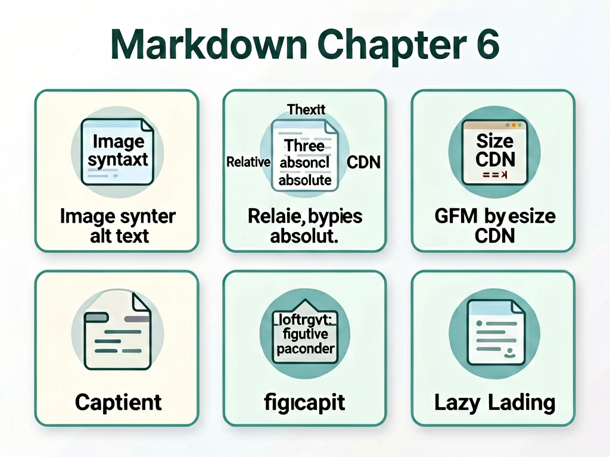

下一篇（进阶篇）到此结束。下一章进入第三篇——Markdown 的生态：引擎揭秘与 JavaScript 生态。我们将不再只关注"怎么写"，而是理解"为什么这么解析"。


============================================================

# 第7章 脚注与自定义属性 —— 给文章加"批注本"

## 学习目标

1. 掌握 GFM 脚注语法
2. 理解 HTML 标签在 Markdown 中的混写技巧
3. 能使用自定义属性为元素添加数据
4. 了解 YAML Front Matter 的用途

## 生活类比

脚注就像书的页脚——正文中用一个上标数字（"见¹"），读者翻到页面底部才能看到完整解释。自定义属性就像给元素贴"便签"——在 HTML 元素上附加额外信息，Markdown 本身不关心，但 CSS 和 JavaScript 可以读取它。


## 脚注：正文之外的注释

### 基础语法

脚注由两部分组成：**正文引用**和**脚注定义**。

```markdown
Markdown 是一种轻量级标记语言[^1]。

[^1]: 轻量级标记语言：不需要写 HTML 标签，用简单的符号表示格式。
```

渲染后：正文中出现一个上标链接"[¹]"，点击后跳转到页面底部的脚注区域。

### 结构解析

脚注语法分为两个位置：

```markdown
<!-- 位置1：正文中的引用 -->
Markdown 是一种轻量级标记语言[^1]。

<!-- 位置2：文档底部的定义 -->
[^1]: 轻量级标记语言：不需要写HTML标签，用简单的符号表示格式。
```

两个位置可以**相距很远**——脚注定义可以放在文档的最末尾，不影响正文的阅读流。

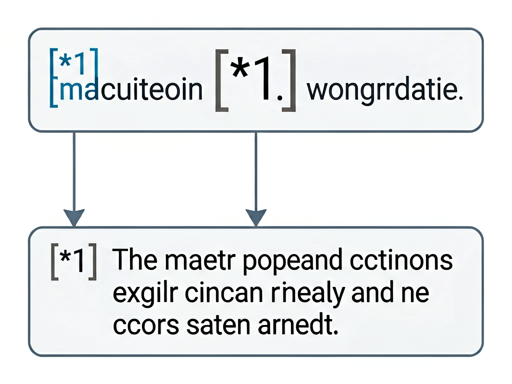

### 脚注中的复杂内容

脚注不限于一句话，可以包含多个段落、列表、代码：

````markdown
[^2]: 这是一个多段落的脚注。

    第二段文字。

    - 脚注中的列表项1
    - 脚注中的列表项2

    ````python
    # 脚注中的代码
    print("hello")
    ````

    [引用链接](https://example.com)
````

### 命名脚注

脚注的标识符不限于数字，可以是任意文本：

```markdown
正文引用[^ref]。

[^ref]: 这是命名脚注的示例。
```

命名脚注在长文档中更有意义——`[^sec1]` 比 `[^1]` 更容易追踪。

![命名脚注 vs 数字脚注：[^ref] 比 [^1] 更易追踪](assets/images/04-chapter7-named-footnotes.png)

### 脚注的位置

脚注定义通常放在**文档末尾**。但 Markdown 解析器不会自动将脚注移到页面底部——它只是在渲染时识别脚注内容，具体"放在哪里"取决于渲染器。

在 GitHub、VitePress 等现代渲染器中，脚注会自动渲染为：
1. 正文中的上标链接
2. 页面底部的脚注列表
3. 点击脚注可回跳正文

## HTML 混写：Markdown 的兜底工具箱

### 为什么允许 HTML？

Markdown 的设计哲学是"简单场景用 Markdown，复杂场景用 HTML"。当 Markdown 的轻量语法无法满足需求时，**直接使用 HTML 标签**是最简单的解决方案。

### 行内 HTML 标签

最常用的行内 HTML 标签：

````markdown
<!-- 删除线 -->
<del>已删除的文字</del>

<!-- 下标 -->
H<sub>2</sub>O

<!-- 上标 -->
E=mc<sup>2</sup>

<!-- 强调 -->
<strong>加粗</strong>
<em>斜体</em>
````

渲染为：

- `<del>已删除的文字</del>` → 已删除的文字（删除线）
- `<sub>` → H₂O
- `<sup>` → E=mc²

### 块级 HTML 标签

块级标签用于更大的结构：

````markdown
<!-- 折叠面板 -->
<details>
<summary>点击查看详细内容</summary>

这是折叠后显示的内容。

- 列表项1
- 列表项2
</details>

<!-- 水平分割 -->
<div style="border-top: 1px solid #ccc; margin: 2em 0;"></div>
````

渲染为：

<details>
<summary>点击查看详细内容</summary>

这是折叠后显示的内容。

- 列表项1
- 列表项2
</details>

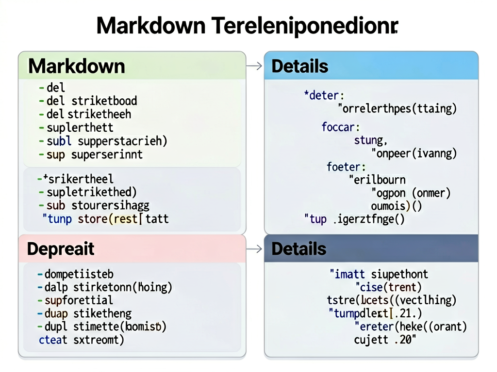

### 为什么 `<details>` 值得单独提？

`<details>` 和 `<summary>` 是**唯一的原生折叠面板**——不需要 JavaScript，浏览器原生支持。在 Markdown 中几乎是唯一需要混写 HTML 的常见场景。

## 自定义属性（GFM）

### 语法

GFM 扩展了自定义属性语法，花括号包裹：

````markdown
这是一个带有自定义属性的段落。{#my-id .my-class data-value="42"}
````

属性应用于**紧随其后的元素**。

### 属性类型

花括号中可以包含三种属性：

```markdown
{#id .class key="value"}
 │    │      │
 │    │      └─ 数据属性（data-key="value"）
 │    └──────── CSS 类名
 └───────────── ID
```

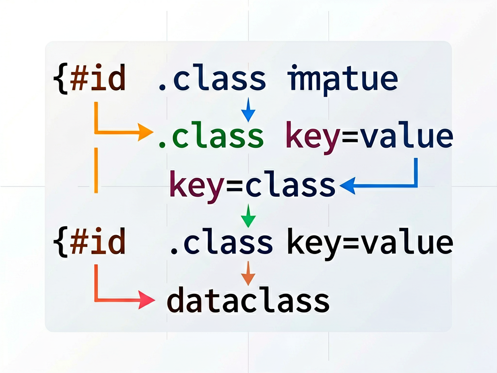

### 工作原理

自定义属性最终输出为 HTML 属性：

```markdown
这是一段文字。{#para-1 .highlight data-note="重要"}
```

渲染为：

```html
<p id="para-1" class="highlight" data-note="重要">这是一段文字。</p>
```

### 适用场景

| 场景 | 示例 |
|------|------|
| CSS 样式 | `{#my-section .custom-style}` |
| JavaScript 交互 | `{#counter data-count="42"}` |
| 语义标识 | `{#warning .alert}` |

### 局限

- 只影响**紧随其后的元素**——不能跨元素
- 不是 CommonMark 核心——部分渲染器不支持

## YAML Front Matter

### 语法

YAML Front Matter 是许多静态站点生成器（Hugo、Jekyll、VitePress）支持的元数据格式：

````markdown
---
title: "Markdown 完全指南"
date: 2026-06-08
tags:
  - markdown
  - 教程
---

正文从这里开始。
````

三行 `---` 包裹 YAML 内容，必须在文档的**最开头**。

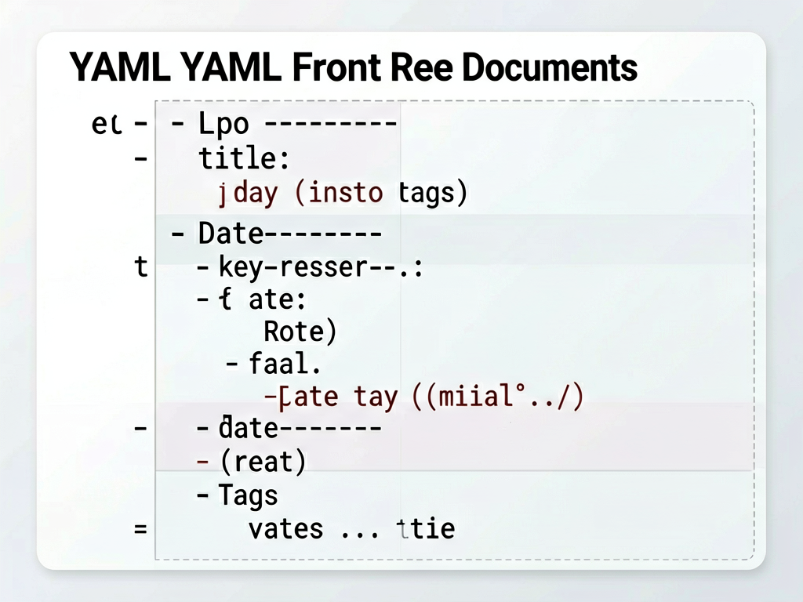

### 常见字段

| 字段 | 说明 |
|------|------|
| `title` | 页面标题 |
| `date` | 发布日期 |
| `tags` | 标签列表 |
| `description` | 页面描述（SEO） |
| `layout` | 布局模板 |
| `cover` | 封面图片 |

### 为什么用 YAML？

YAML 是 Markdown 生态的事实标准元数据格式：

1. **可读性好**：`key: value` 结构清晰
2. **支持嵌套**：`tags: [a, b, c]`
3. **生态广泛**：Hugo、Jekyll、VitePress、Docusaurus 都支持

### 不是 Markdown 的一部分

YAML Front Matter **不是 Markdown 规范的一部分**——它是静态站点生成器的扩展。如果你的渲染器不支持 Front Matter（如 GitHub 直接渲染），Front Matter 会被当作普通文本渲染出来（通常是一条横线）。

## 设计取舍

**为什么脚注不在 CommonMark 核心？**

脚注的语法歧义和实现差异太大。不同渲染器对脚注的定位（放在文档末尾还是页面底部）、样式（上标数字还是方括号链接）理解不同。CommonMark 选择不纳入——让 GFM 扩展处理。

**为什么允许 HTML 混写？**

因为 Markdown 的"简单"是有边界的。当需要 `<details>` 折叠面板、`<sub>` 下标、`<sup>` 上标时，硬要用 Markdown 语法去模拟（如 `~~删除线~~` 不是所有渲染器都支持），只会增加复杂度。HTML 是兜底方案——不常用，但关键时刻救命。

**自定义属性为什么只影响下一个元素？**

简洁性。如果自定义属性可以影响任意元素（"选择器"方式），那就要引入选择器语法（CSS 的选择器），这会大大增加 Markdown 规范的复杂度。"只影响下一个元素"是一个简单而有效的约定。

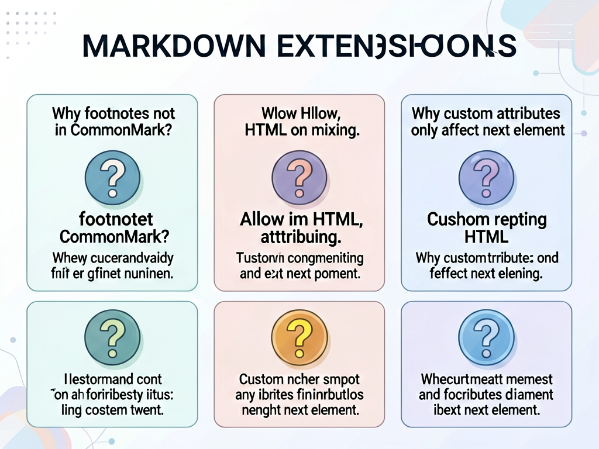

## 动手练习

1. 写一个包含脚注的段落，尝试在脚注中放一个链接
2. 尝试用 `<sup>` 和 `<sub>` 写化学公式（如 H₂SO₄、CaCO₃）
3. 思考题：为什么 YAML Front Matter 需要三条 `---` 包裹？（提示：一条 `---` 是水平分割线，两条 `---` 可能引起歧义）

## 本章小结

这一章中我们学习了 Markdown 的扩展工具箱。首先介绍了 GFM 脚注语法（正文引用 `[^label]` + 脚注定义 `[^label]: 内容`），然后讲解了 HTML 混写技巧（行内 `<del>` `<sub>` `<sup>`、块级 `<details>`），接着介绍了自定义属性语法 `{#id .class key="value"}` 和 YAML Front Matter 的用途。

本章我们一起学习了以下概念：

| 概念 | 解释 |
|------|------|
| 脚注 | `[^label]` 引用 + `[^label]: 内容` 定义 |
| HTML 混写 | 复杂场景用 HTML 标签兜底 |
| 自定义属性 | `{#id .class}` 为元素附加数据 |
| YAML Front Matter | `---\ntitle: ...\n---` 文档元数据 |

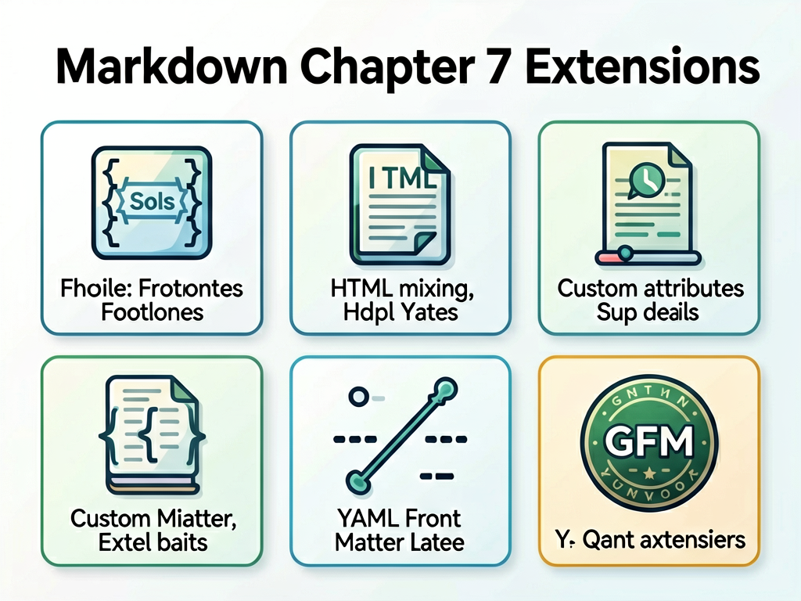

进阶篇到此结束。下一章开始第三篇——Markdown 的生态：引擎揭秘。我们将深入 Markdown 的"黑盒"，看看一个 Markdown 文件是如何被解析、转换、渲染的。


============================================================

# 第8章 Markdown引擎揭秘 —— 翻译三件套

## 学习目标

1. 理解 Markdown 解析的完整流水线（Tokenizer → Parser → Renderer）
2. 掌握 AST（抽象语法树）的结构和意义
3. 能说出不同引擎的架构差异

## 生活类比

Markdown 引擎就像一个翻译三件套。想象你要把一封中文信翻译成英文：

**Tokenizer 是"读题人"**——他读信，把句子拆成"这行是标题"、"这行是段落"、"这行是列表"。他不做翻译，只做分类。

**Parser 是"理解人"**——他把读题人分好的词组合成句子结构。标题是什么标题，段落是什么段落，它们之间是什么关系。

**Renderer 是"作答人"**——他把理解人整理好的结构翻译成目标语言（HTML、PDF、EPUB……）。

不同的引擎就是不同的"翻译团队"——有的团队读题快（marked），有的团队理解深（remark），有的团队作答漂亮（Shiki）。但他们的三件套结构是一样的。


## Tokenizer：读题人

Tokenizer 的职责是**把原始文本切割成"块"（blocks）和"词"（tokens）**。

### 块级分词

块级分词逐行扫描 Markdown 源码，识别每一行属于什么类型的块：

```javascript
// 伪代码：块级分词的核心逻辑
// 源码路径：marked/src/Tokenizer.js（示意）
function blockTokenize(src) {
  const tokens = []
  let i = 0

  while (i < src.length) {
    const line = src[i]

    // 遇到 # 开头？→ 标题
    if (line.match(/^#{1,6}\s/)) {
      tokens.push({ type: 'heading', depth: countHash(line), text: stripHash(line) })
      i += 1
      continue
    }

    // 遇到 ---？→ 水平分割线
    if (line.match(/^(-{3,}|_{3,}|\*{3,})$/)) {
      tokens.push({ type: 'hr' })
      i += 1
      continue
    }

    // 遇到 - 或 * 或 + 开头？→ 列表
    if (line.match(/^[\s]*[-*+]\s/)) {
      tokens.push(...tokenizeList(src, i))
      // 列表可能跨多行，i 跳过多行
      continue
    }

    // 遇到 > 开头？→ 引用
    if (line.match(/^\s*>/)) {
      tokens.push(...tokenizeBlockquote(src, i))
      continue
    }

    // 遇到 ```？→ 栅栏代码块
    if (line.match(/^```/)) {
      tokens.push(...tokenizeFencedCode(src, i))
      continue
    }

    // 否则 → 段落
    tokens.push(...tokenizeParagraph(src, i))
    // 段落可能跨多行
    i += countParagraphLines(src, i)
  }

  return tokens
}
```

这段代码的核心逻辑非常直白：**看到什么模式，就标记为什么类型**。它不做翻译，只做分类。

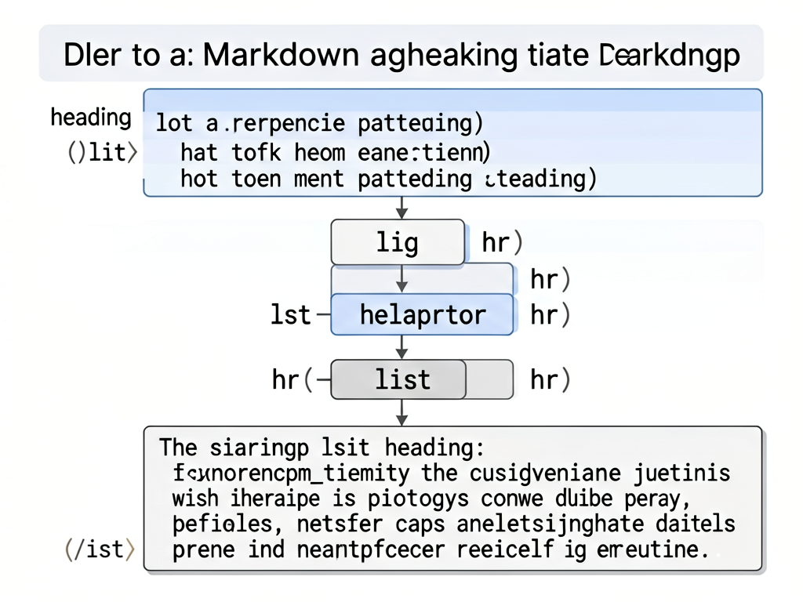

### 行内分词

块级分词完成后，行内分词在**每个块内部**识别行内元素：

```javascript
// 伪代码：行内分词的核心逻辑
function inlineTokenize(text) {
  const tokens = []
  let remaining = text

  while (remaining.length > 0) {
    // 遇到 ** ？→ 粗体
    if (remaining.match(/\*\*/)) {
      tokens.push({ type: 'emphasis', delimiter: '**' })
      // ...
    }

    // 遇到 ` ？→ 代码
    if (remaining.match(/`/)) {
      tokens.push({ type: 'code', content: extractBacktickContent(remaining) })
      // ...
    }

    // 遇到 [ ？→ 链接
    if (remaining.match(/\[/)) {
      tokens.push({ type: 'link', ...extractLink(remaining) })
      // ...
    }

    // 普通文字
    tokens.push({ type: 'text', text: extractText(remaining) })
  }

  return tokens
}
```

行内分词的核心挑战是**匹配闭合**——`**粗体**` 中两个 `**` 如何配对？这涉及到嵌套、转义、奇偶计数等规则，是 Markdown 解析中最复杂的部分。

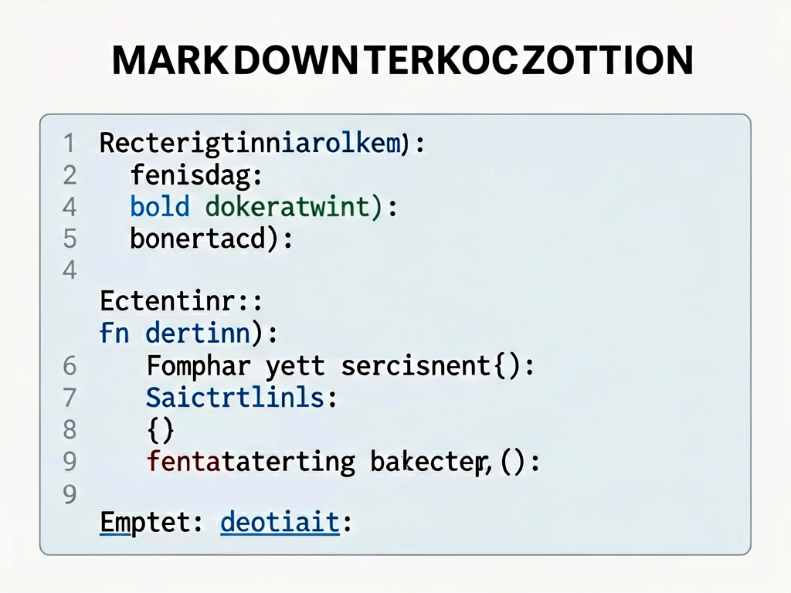

## Parser：理解人

Parser 的职责是**把 Tokenizer 分好的"词"组合成结构化的 AST（抽象语法树）**。

### AST 的结构

```
AST（抽象语法树）
└── root
    ├── heading [depth=2, text="欢迎使用"]
    ├── paragraph
    │   ├── text "这是 "
    │   ├── code "一行代码"
    │   ├── text " 和 "
    │   └── link
    │       ├── text "一个链接"
    │       └── url "https://example.com"
    └── paragraph
        ├── text "第二段文字。"
```

每一层节点都有明确的类型和内容：

| 节点类型 | 属性 | 说明 |
|----------|------|------|
| `root` | `children: []` | 树的根节点 |
| `heading` | `depth: 2` | 二级标题 |
| `paragraph` | `children: []` | 段落 |
| `text` | `value: "文字"` | 纯文本 |
| `code` | `value: "代码"`, `lang: "python"` | 代码块 |
| `link` | `url: "..."` | 链接 |

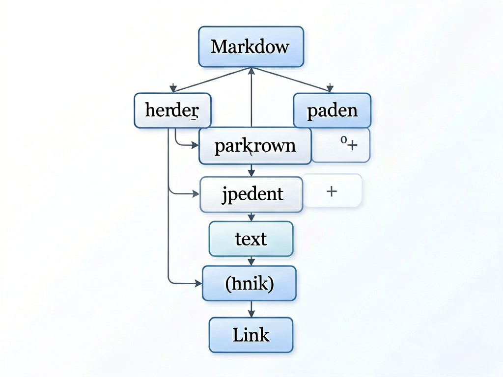

### 块级 AST 与行内 AST 的关系

Markdown 的 AST 是**双层结构**的：

```
Document（块级树）
├── Heading [depth=2]
│   └── children: [Inline 节点]  ← 行内 AST 嵌入在块级节点中
├── Paragraph
│   └── children: [Inline 节点]
└── CodeBlock
    └── value: "代码内容"  ← 代码块不需要行内 AST
```

块级 AST 管理"大结构"（标题、段落、列表），行内 AST 管理"小结构"（粗体、链接、代码）。代码块是例外——它不需要行内解析，内容原样保留。

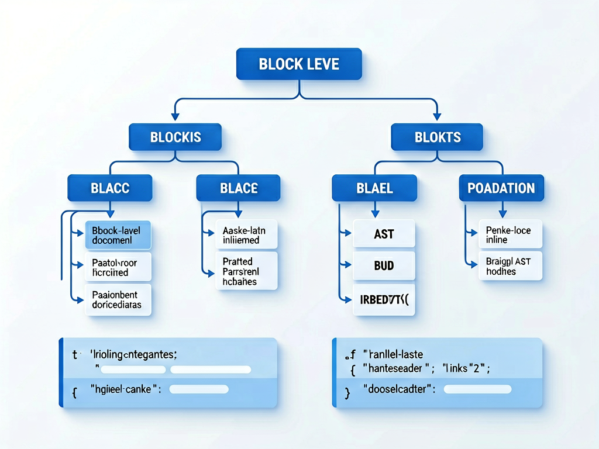

## Renderer：作答人

Renderer 的职责是**遍历 AST，逐个节点输出目标格式**。

### HTML 渲染器

```javascript
// 伪代码：HTML 渲染器的核心逻辑
// 源码路径：marked/src/Renderer.js（示意）
function render(ast) {
  let html = ''

  for (const node of ast.children) {
    switch (node.type) {
      case 'heading':
        html += `<h${node.depth}>${renderInline(node.children)}</h${node.depth}>`
        break
      case 'paragraph':
        html += `<p>${renderInline(node.children)}</p>`
        break
      case 'link':
        html += `<a href="${node.url}">${renderInline(node.children)}</a>`
        break
      case 'text':
        html += escapeHtml(node.value)
        break
      case 'code':
        html += `<code>${escapeHtml(node.value)}</code>`
        break
    }
  }

  return html
}

function renderInline(children) {
  let html = ''
  for (const child of children) {
    // 递归处理行内节点
    // 粗体、斜体、代码、链接...
  }
  return html
}
```

渲染器的核心逻辑：**遍历 AST → 匹配类型 → 输出对应的 HTML 标签**。

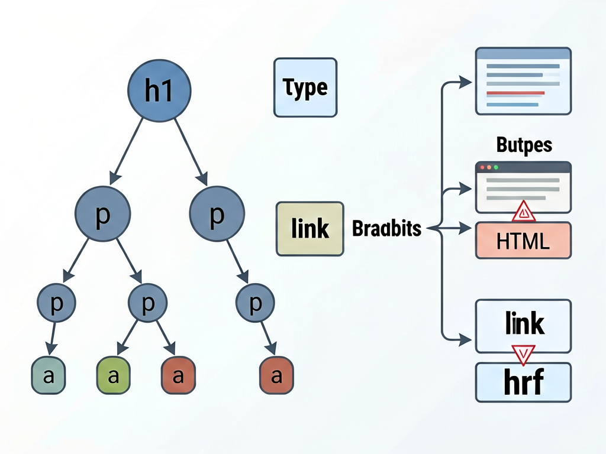

### 其他格式渲染

同样的 AST，不同的 Renderer 可以输出不同的格式：

| Renderer | 输入 | 输出 |
|----------|------|------|
| HTML Renderer | AST | `.html` |
| PDF Renderer | AST | `.pdf` |
| EPUB Renderer | AST | `.epub` |
| ASCII Renderer | AST | `.txt`（终端预览） |

这就是为什么同一个 Markdown 文件可以用在 GitHub（HTML）、Jupyter（HTML）、Hugo（HTML）里——它们共享**同一份 AST**，只是换了不同的 Renderer。

### Remark 和 Rehype 的 AST 转换链

remark 生态的特别之处在于：**AST 是中间格式，可以链式转换**。

```
Markdown → [remark-parse] → Remark AST → [remark-rehype] → Rehype AST → [rehype-stringify] → HTML
```

每一步都是 AST → AST 的转换：

```
remark-parse: Markdown → Remark AST
remark-rehype: Remark AST → Rehype AST
rehype-stringify: Rehype AST → HTML
```

这种链式架构允许在中间插入**任意数量的转换步骤**：

```
Markdown → remark-parse → Remark AST → [插件1] → [插件2] → [插件3] → rehype-stringify → HTML
```

每个插件只做一件事：插件1可能把 `::warning::` 变成 HTML 警告框，插件2可能把图片路径替换为 CDN URL，插件3可能统计字数。

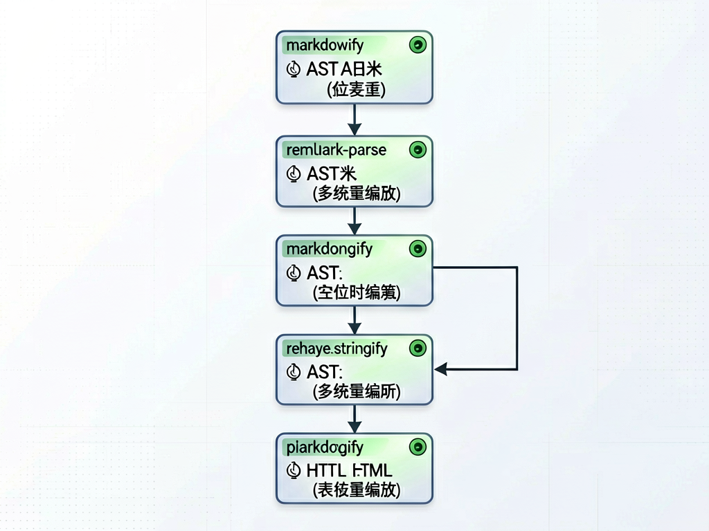

## 插件系统

### Remark 插件

```javascript
import { unified } from 'unified'
import remarkParse from 'remark-parse'
import remarkRehype from 'remark-rehype'
import rehypeStringify from 'rehype-stringify'

const processor = unified()
  .use(remarkParse)       // Markdown → Remark AST
  .use(myPlugin)          // 自定义转换
  .use(remarkRehype)      // Remark AST → Rehype AST
  .use(rehypeStringify)   // Rehype AST → HTML

const result = processor.processSync('# 标题')
```

`.use(plugin)` 是统一 API，任何符合规范的插件都可以接入。

### 插件类型

| 类型 | 作用时机 | 示例 |
|------|----------|------|
| Tokenizer 插件 | 解析阶段，修改分词规则 | 添加自定义语法 |
| AST 插件 | AST 阶段，修改树结构 | 替换特定内容 |
| Renderer 插件 | 渲染阶段，修改输出 | 自定义 HTML 模板 |


### 生态插件数量

remark 生态目前有**超过 300 个插件**，涵盖：

- 表格支持（`remark-gfm`）
- 脚注支持（`remark-footnotes`）
- 目录生成（`remark-toc`）
- 字数统计（`remark-wordcount`）
- 图片优化（`remark-remark-images`）
- 数学公式（`remark-math`）
- 流程图（`remark-mermaid`）

## 设计取舍

**为什么 AST 是必要的？**

如果没有 AST，Tokenizer 必须直接输出 HTML——这意味着"解析"和"渲染"耦合在一起。AST 解耦了两者：你可以用同一份 AST 输出 HTML、PDF、EPUB，而不需要为每种格式重写解析逻辑。

**为什么有不同风格的引擎？**

因为不同场景的需求不同：

- **速度优先**：marked 追求最快解析，牺牲了部分规范覆盖率
- **功能优先**：remark 追求最大可扩展性，牺牲了速度
- **规范优先**：cmark 追求完全符合 CommonMark 规范，牺牲了扩展性

**插件系统为什么重要？**

Markdown 的核心语法是固定的（标题、段落、列表……），但**实际需求是无限的**（脚注、表格、数学公式、流程图……）。插件系统让核心保持简洁，同时通过生态扩展覆盖所有需求。


## 动手练习

1. 用 `marked` 解析一段 Markdown，查看生成的 AST（`marked.lexer(text)`）
2. 编写一个 Remark 插件，将特定的文本（如 `::warning::`）替换为自定义 HTML 警告框
3. 思考题：为什么 Tokenizer 不直接输出 HTML？（提示：从可测试性和可维护性角度思考）

## 本章小结

这一章中我们深入 Markdown 引擎的内部，了解了完整的解析流水线。首先介绍了 Tokenizer 的两个层次（块级分词和行内分词），然后讲解了 Parser 如何构建双层 AST 结构（块级树 + 行内树），接着介绍了 Renderer 如何遍历 AST 输出不同格式，最后讨论了 remark 的链式 AST 转换和插件系统。

本章我们一起学习了以下概念：

| 概念 | 解释 |
|------|------|
| Tokenizer | 将 Markdown 文本切割成 token（词） |
| AST | 抽象语法树，结构化的中间表示 |
| Renderer | 遍历 AST，输出目标格式（HTML/PDF/EPUB） |
| 双层 AST | 块级树 + 行内树，代码块是例外 |
| 链式转换 | Remark → Rehype → HTML，可插入任意插件 |


下一章我们将进入 JavaScript 生态——marked、remark、markdown-it 三大引擎的详细对比。


============================================================

# 第9章 JavaScript生态 —— 不同的翻译官

## 学习目标

1. 掌握三大 Markdown 引擎（marked、remark、markdown-it）的定位和用法
2. 理解它们的架构差异和适用场景
3. 能根据需求选择合适的引擎

## 生活类比

三位翻译官，三种风格：

**marked** 是跑步快的快递员——送得快，API 简单，适合"我只要快速把 Markdown 变成 HTML"的场景。**remark** 是学术翻译官——慢但精确，能在翻译过程中做各种加工（替换、统计、转换），适合"我要在翻译流程中插手"的场景。**markdown-it** 是全能翻译官——快、准、全，GFM 原生支持，适合"我全都要"的场景。


## marked：速度优先

### 基本用法

```javascript
import { marked } from 'marked'

const html = marked.parse('# 标题\n\n这是一段**粗体**文字。')
// 输出: <h1>标题</h1>\n<p>这是一段<strong>粗体</strong>文字。</p>
```

一行代码搞定。

### 源码结构

```
marked/src/
├── Lexer.js       // 词法分析（分词）
├── Parser.js      // 语法分析（组句）
├── Tokenizer.js   // 分词器（核心）
├── Renderer.js    // 渲染器（输出 HTML）
└── defaults.js    // 默认配置
```

marked 的架构和第8章介绍的三件套完全一致：**Lexer（分词）→ Parser（解析）→ Renderer（渲染）**。

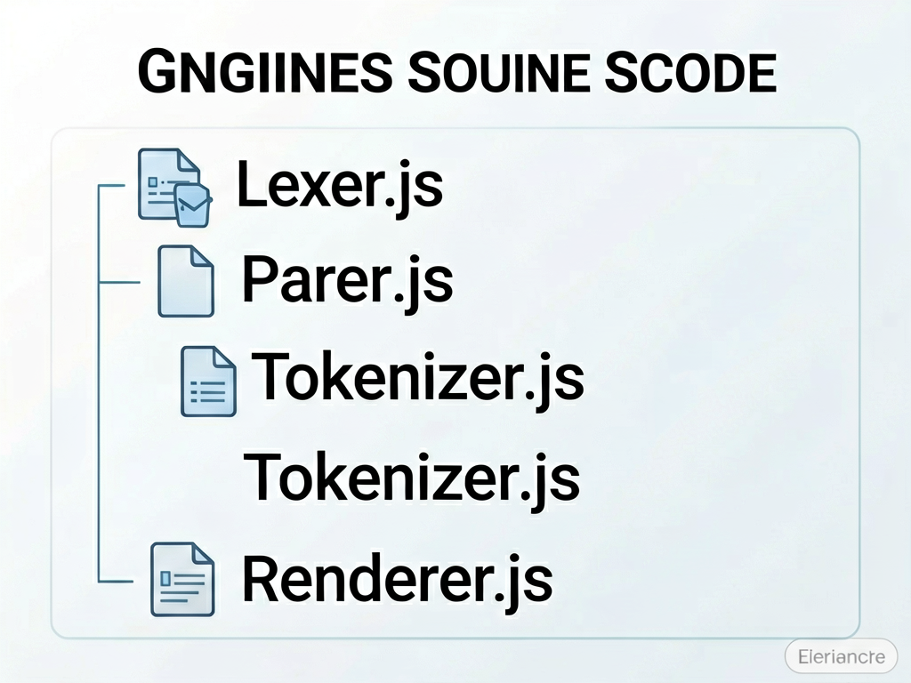

### Lexer.js 的核心逻辑

```javascript
// 源码路径：marked/src/Lexer.js（简化）
lex(src) {
  const tokens = []
  let token

  while (src.length) {
    // 顺序很重要：先匹配的优先
    token = this.lexHeading(src) ||
            this.lexCode(src) ||
            this.lexList(src) ||
            this.lexBlockquote(src) ||
            this.lexParagraph(src)

    if (token) {
      tokens.push(token)
    }
  }

  return tokens
}
```

注意 `||` 的匹配顺序——`lexHeading` 排在最前，说明 `#` 标题的优先级高于代码块、列表等。

### Renderer.js 的核心逻辑

```javascript
// 源码路径：marked/src/Renderer.js（简化）
render(tokens) {
  let html = ''
  for (const token of tokens) {
    switch (token.type) {
      case 'heading':
        html += this.renderHeading(token)
        break
      case 'paragraph':
        html += this.renderParagraph(token)
        break
      // ...
    }
  }
  return html
}
```

每个 `renderXxx` 方法对应一种 token 类型的 HTML 输出。

### 配置选项

```javascript
marked.setOptions({
  gfm: true,              // 启用 GFM（表格、删除线等）
  breaks: false,          // 段落内换行是否转为 <br>
  headerIds: true,        // 为标题添加 id 属性
  mangle: true,           // 混淆邮箱地址（防爬）
})
```

### 与 GitHub 的关系

marked 最初由 GitHub 的 Chris Wanstrath 创建（2011年），后来由 Tim Holman 接手维护。虽然现在 marked 和 GitHub 没有官方关系，但 GitHub 的 Markdown 渲染确实受到了 marked 的影响。

## remark：生态优先

### 基本用法

```javascript
import { unified } from 'unified'
import remarkParse from 'remark-parse'
import remarkGfm from 'remark-gfm'
import remarkRehype from 'remark-rehype'
import rehypeStringify from 'rehype-stringify'

const html = await unified()
  .use(remarkParse)       // Markdown → Remark AST
  .use(remarkGfm)         // 添加 GFM 支持
  .use(remarkRehype)      // Remark AST → Rehype AST
  .use(rehypeStringify)   // Rehype AST → HTML
  .process('# 标题')

console.log(String(html))
// 输出: <h1>标题</h1>
```

### 为什么这么复杂？

与 marked 的一行 `marked.parse()` 相比，remark 的流程看起来繁琐得多。但这正是它强大之处：

```
Markdown → remark-parse → Remark AST → remark-gfm → remark-rehype → Rehype AST → rehype-stringify → HTML
           ↑              ↑             ↑            ↑                ↑
         解析阶段        AST转换1     AST转换2     AST转换3         渲染阶段
```

每一环都是**可选的**——你可以插入任意多的 AST 转换步骤：

```javascript
.use(wordcount)           // 统计字数
.use(sidebar)             // 生成侧边栏目录
.use(toc)                 // 生成目录
.use(remarkImages)        // 图片优化
.use(remarkMath)          // 数学公式
```

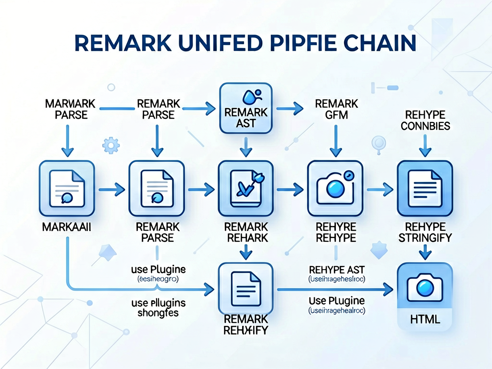

### 源码结构

```
remark/lib/
├── index.js              // unified 入口
├── preprocess/           // 预处理
├── parse/                // 解析（remark-parse）
├── stringify/            // 序列化（remark-stringify）
└── util/                 // 工具函数
```

remark 的核心设计哲学是 **"一切皆 AST"**——Markdown 解析成 AST，AST 转换成 AST，AST 序列化回 Markdown/HTML。

### 适用场景

| 场景 | 引擎 | 原因 |
|------|------|------|
| VitePress | remark | 需要在解析和渲染之间做 AST 转换（MDX、数学公式、Mermaid） |
| Docusaurus | remark | 需要丰富的插件生态 |
| MDX | remark | MDX 本质上是 remark 的 AST 扩展 |
| 快速预览 | marked | 只需要快速渲染，不需要复杂转换 |

## markdown-it：插件优先

### 基本用法

```javascript
import MarkdownIt from 'markdown-it'

const md = new MarkdownIt({
  html: true,       // 允许 HTML 标签
  linkify: true,    // 自动链接 URL
  typographer: true, // 排版优化
  highlight: function (str, lang) {
    // 集成 highlight.js
    return highlight(code, lang)
  }
})

const html = md.render('# Markdown\n\nHello, **world**!')
// 输出: <h1>Markdown</h1>\n<p>Hello, <strong>world</strong>!</p>
```

### 源码结构

```
markdown-it/lib/
├── index.js                // 入口
├── parser_block.js         // 块级解析器
├── parser_inline.js        // 行内解析器
├── renderer.js             // 渲染器
├── rules_block/            // 块级规则（标题、段落、列表...）
├── rules_inline/           // 行内规则（粗体、斜体、链接...）
├── helpers.js              // 工具函数
└── rule.js                 // 规则基类
```

markdown-it 与 marked 的最大区别：**它没有 AST**。markdown-it 的解析器直接输出 HTML，不经过 AST 中间层。

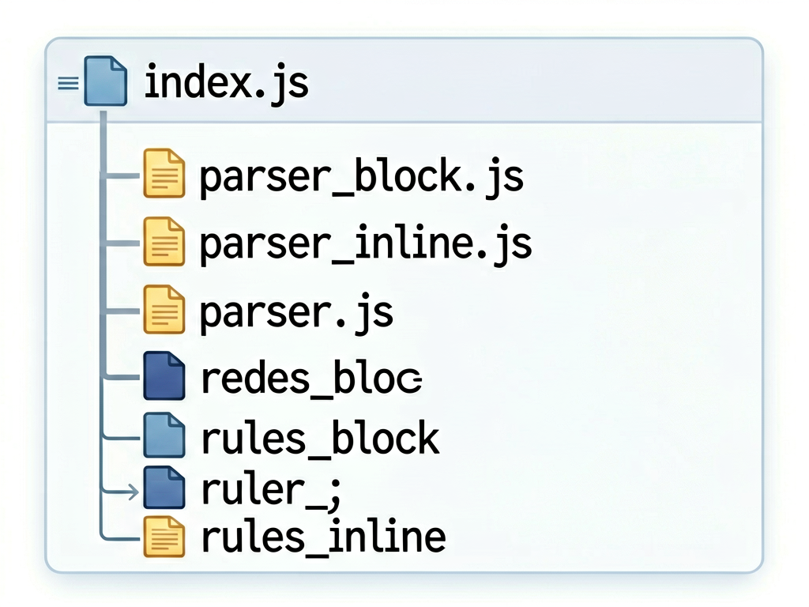

### 为什么没有 AST？

```
marked:       Markdown → Token → AST → HTML
remark:       Markdown → AST → AST → AST → HTML
markdown-it:  Markdown → HTML
```

markdown-it 选择**跳过 AST**，因为它的架构设计是**规则驱动**而非**树驱动**：

```javascript
// 源码路径：lib/parser_block.js（简化）
// 每个块级元素都是一个"规则"
const rules = {
  heading: function(state, start) {
    // 检查是否以 # 开头
    // 解析标题内容
    // 直接生成 HTML 输出
  },
  paragraph: function(state, start) {
    // 检查是否是段落
    // 解析段落内容
    // 直接生成 HTML 输出
  }
  // ...
}
```

这种设计的优势是**速度快**——没有 AST 的构建和遍历开销。劣势是**难以做 AST 级别的转换**——比如你想在渲染前修改整个文档的结构（生成目录、统计字数），在没有 AST 的情况下会困难得多。

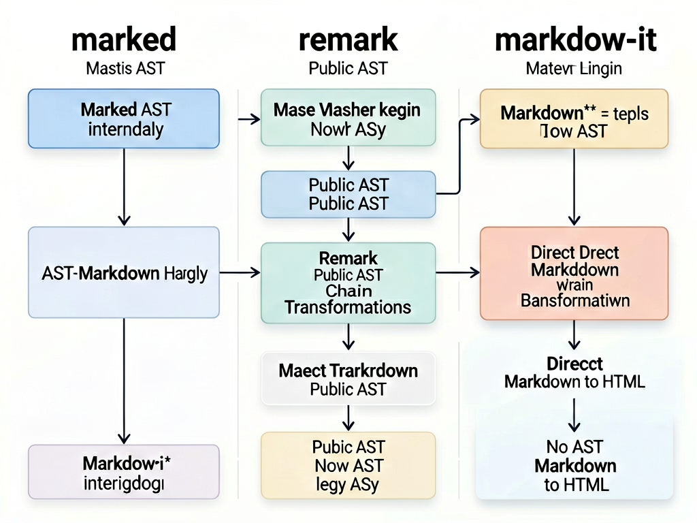

### 插件系统

markdown-it 有**超过 200 个插件**，包括：

- `markdown-it-gfm` — GFM 扩展
- `markdown-it-footnote` — 脚注
- `markdown-it-math` — 数学公式
- `markdown-it-mermaid` — Mermaid 流程图
- `markdown-it-anchor` — 标题锚链接

```javascript
const md = new MarkdownIt()
  .use(anchor)        // 标题锚链接
  .use(footnote)      // 脚注
  .use(math)          // 数学公式
  .use(mermaid)       // Mermaid
```

### 适用场景

| 场景 | 引擎 | 原因 |
|------|------|------|
| VuePress | markdown-it | 速度快，GFM 原生支持 |
| Hexo | markdown-it | 插件丰富，集成简单 |
| 博客/文档站 | markdown-it | 性能和功能平衡 |

## 三引擎对比

### 功能对比

| 维度 | marked | remark | markdown-it |
|------|--------|--------|-------------|
| 速度 | ★★★★★ | ★★☆☆☆ | ★★★★☆ |
| 规范覆盖率 | ★★★☆☆ | ★★★★★ | ★★★★☆ |
| 插件生态 | ★★★☆☆ | ★★★★★ | ★★★★☆ |
| 学习曲线 | ★★★★★（简单） | ★★☆☆☆（复杂） | ★★★☆☆（中等） |
| 体积 | ~30KB | ~100KB（含unified） | ~60KB |
| AST | 有（内部） | 有（公开） | 无 |
| GFM | 需要配置 | 需要插件 | 原生支持 |

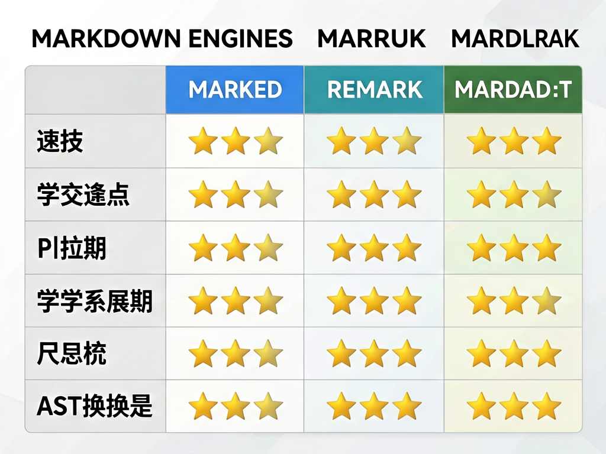

### 速度对比

```
解析 1000 篇技术文档：
marked:      ~200ms   （最快）
markdown-it: ~350ms   （次快）
remark:      ~800ms   （最慢，因为 AST 转换）
```

### 选择指南

| 你的需求 | 推荐引擎 |
|----------|----------|
| 快速渲染，不需要复杂功能 | **marked** |
| 需要在渲染流程中做 AST 转换 | **remark** |
| 博客/文档站，需要 GFM 和插件 | **markdown-it** |
| MDX 支持 | **remark**（MDX 基于 remark） |
| 静态站点生成器（VitePress/Docusaurus） | **remark** |
| 静态站点生成器（VuePress/Hexo） | **markdown-it** |

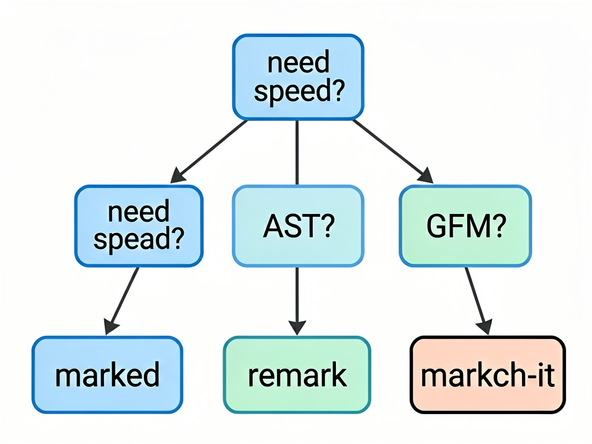

### 设计取舍

**为什么没有"最好"的引擎？**

因为**速度、功能、可扩展性**三者不可兼得。marked 追求速度，牺牲了规范覆盖率和可扩展性；remark 追求可扩展性，牺牲了速度；markdown-it 追求平衡，但在极端的任一方面都不突出。

**为什么 remark 这么复杂？**

因为它的目标不是"快速把 Markdown 变成 HTML"，而是"提供一套可扩展的 Markdown 处理框架"。每一个 `.use()` 调用都是一次 AST 转换——这种灵活性是有代价的。

**为什么 markdown-it 选择自定义规则而非 AST？**

性能和简洁。没有 AST 意味着更少的内存占用和更快的执行速度。对于大多数博客和文档站场景，"Markdown → HTML"直接转换足够了。如果需要 AST 级别的转换，开发者可以选择 remark。

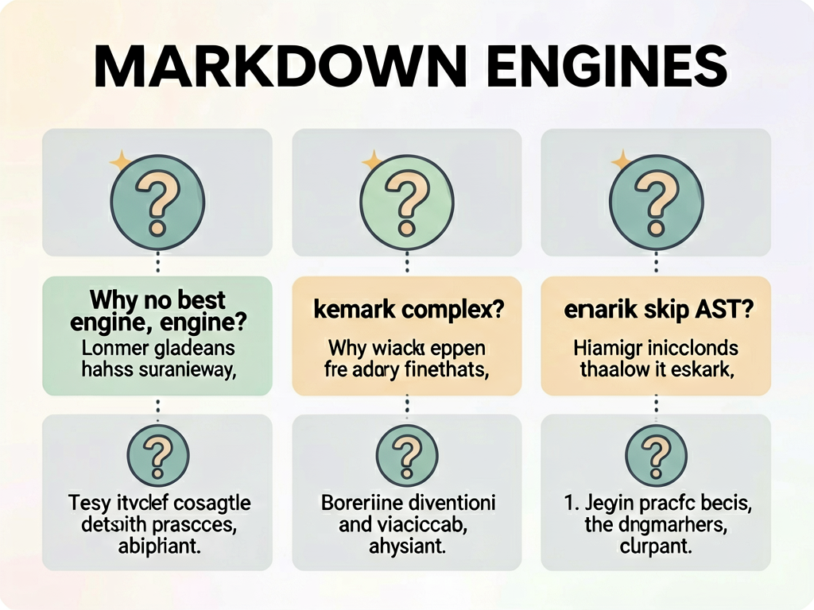

## 动手练习

1. 用三个引擎分别解析同一段 Markdown（包含标题、段落、代码块、列表），对比速度和 HTML 输出
2. 为 marked 编写一个自定义渲染器，输出 JSON 而非 HTML（重写 `Renderer.render` 方法）
3. 思考题：为什么 VitePress 选择 remark 而非 marked？（提示：考虑 MDX 支持和 AST 转换需求）

## 本章小结

这一章中我们对比了 JavaScript 生态中的三大 Markdown 引擎。首先介绍了 marked 的快速解析架构（Lexer → Parser → Renderer），然后讲解了 remark 的链式 AST 转换和插件生态，接着分析了 markdown-it 的规则驱动架构和无 AST 设计，最后给出了选择指南。

本章我们一起学习了以下概念：

| 概念 | 解释 |
|------|------|
| marked | 速度优先，Lexer → Parser → Renderer，API 简单 |
| remark | 生态优先，unified + 插件链，AST 驱动 |
| markdown-it | 插件优先，规则驱动，无 AST，GFM 原生支持 |
| 无 AST | markdown-it 直接输出 HTML，跳过 AST 中间层 |
| 链式转换 | remark 的 `.use()` 链，可插入任意 AST 转换 |

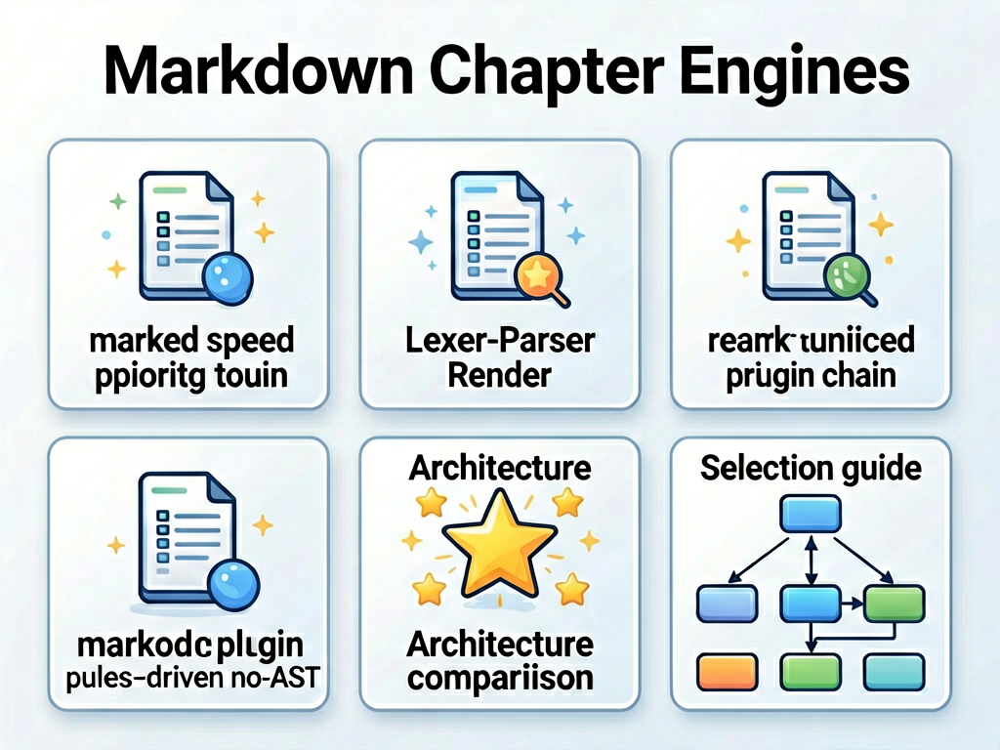

下一章我们将进入 Python 生态——markdown、mistletoe、pymdownx 三大引擎的详细对比。


============================================================

# 第10章 Python生态 —— 翻译官们的不同活法

## 学习目标

1. 掌握三大 Python Markdown 引擎（markdown、mistletoe、pymdownx）的用法
2. 理解它们与 JS 引擎的架构差异
3. 能根据 Python 项目需求选择合适的引擎

## 生活类比

Python 世界的三位翻译官：**markdown** 是标准公务员——按规矩办事，稳定可靠但不花哨；**mistletoe** 是速度狂人——用 C 扩展加速，追求极致性能；**pymdownx** 是扩展狂魔——装了十几个插件包，什么都能干。


## markdown：标准公务员

### 基本用法

```python
import markdown

text = """
# 标题

这是一段**粗体**文字。

- 列表项1
- 列表项2
"""

html = markdown.markdown(text)
print(html)
# 输出: <h1>标题</h1>\n<p>这是一段<strong>粗体</strong>文字。</p>\n<ul>\n<li>列表项1</li>\n<li>列表项2</li>\n</ul>
```

一行代码，和 JS 的 `marked.parse()` 一样简单。

### 源码结构

```
markdown/
├── __init__.py           # 入口
├── blockparser.py        # 块级解析器
├── inlineparser.py       # 行内解析器
├── postprocessors.py     # 后处理
├── unithelper.py         # 工具函数
└── extensions/           # 扩展包
    ├── codehilite.py     # 代码高亮
    ├── meta.py           # 元数据（YAML Front Matter）
    ├── tables.py         # 表格
    └── fenced_code.py    # 栅栏代码块
```

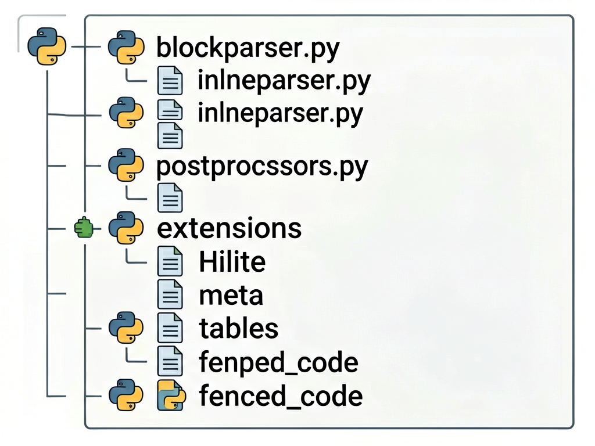

### blockparser.py 的核心逻辑

```python
# 源码路径：markdown/blockparser.py（简化）
class BlockParser:
    def parse(self, source):
        document = Element('div')
        self.parser_state = ParseState()

        for line in source.split('\n'):
            for matcher in self.matchers:
                m = matcher.match(line)
                if m:
                    block = matcher.run(m, document)
                    if block:
                        document.append(block)
                    break

        return document
```

这和 JS 引擎的 `for line in lines` 遍历模式一致——逐行扫描，匹配规则，生成元素。

### 扩展机制

markdown 的扩展机制是其最大优势：

```python
import markdown

md = markdown.Markdown(extensions=[
    'markdown.extensions.extra',   # 扩展语法（表格、脚注等）
    'markdown.extensions.codehilite',  # 代码高亮
    'markdown.extensions.tables',  # 表格
    'markdown.extensions.meta',    # 元数据
])

html = md.convert(text)
```

### 与 Django/Flask 的集成

```python
# Django 模板过滤器
# templatetags/markdown_extras.py
from markdown import markdown as md
from django import template

register = template.Library()

@register.filter(is_safe=True)
def markdown(value):
    return md(str(value))
```

在 Django 模板中直接使用：

```html
<!-- templates/article.html -->
{{ article.content|markdown }}
```

## mistletoe：速度狂人

### 基本用法

```python
import mistletoe

text = """
# 标题

这是**粗体**文字。
"""

html = mistletoe.markdown(text)
print(html)
```

和 `markdown` 引擎用法一致，但速度更快。

### 为什么快？

mistletoe 用 **C 扩展**加速核心解析逻辑：

```python
# 伪代码：mistletoe 的 C 加速
# 源码路径：mistletoe/cmodule.c（C 扩展）
// 核心分词器用 C 编写，Python 通过 ctypes 调用
static PyObject* fast_tokenize(PyObject* self, PyObject* args) {
    const char* src;
    PyArg_ParseTuple(args, "s", &src);
    // C 层面的逐字符扫描和匹配
    // 比 Python 层面的正则匹配快 5-10 倍
}
```

性能对比（解析 1000 次同一篇 5000 字文档）：

| 引擎 | 时间 | 相对速度 |
|------|------|----------|
| mistletoe | ~150ms | 1x（最快） |
| markdown | ~600ms | 0.25x |
| marked (JS) | ~200ms | 0.75x |

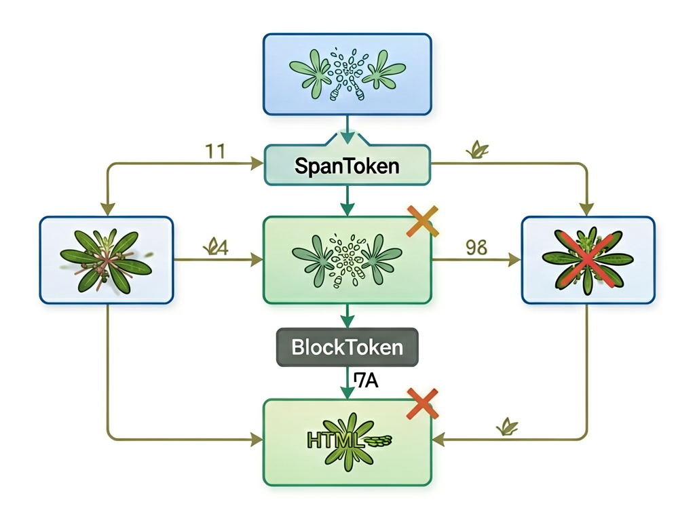

### 架构差异

mistletoe 的架构和 JS 引擎有相似之处，但更简化：

```
mistletoe: Markdown → SpanToken/BlockToken → HTML
```

它没有独立的 AST 层——Token 既是分词结果也是中间表示。这比 remark 的 AST 链简单得多，但比 markdown 的"直接输出 HTML"多了一步 Token 组织。

```python
# 源码路径：mistletoe/span.py（简化）
class SpanToken:
    delimiter = None
    children = []
    prepend = []

    @classmethod
    def parse_pattern(cls, pattern, match, inner=True):
        # 行内分词：匹配行内模式（粗体、链接、代码...）
        # 递归解析内层内容
        pass
```

### 适用场景

- **高频解析**：每秒需要解析成千上万条 Markdown（如聊天系统）
- **流式解析**：mistletoe 支持流式处理
- **资源受限**：内存有限的嵌入式场景

## pymdownx：扩展狂魔

### 基本概念

pymdownx 不是一个独立的 Markdown 引擎——它是 **markdown 引擎的扩展层**：

```python
import markdown
from pymdownx import superfences, highlight, tabs, snipscope

md = markdown.Markdown(extensions=[
    'pymdownx.superfences',   # 嵌套代码块
    'pymdownx.highlight',     # 代码高亮（基于 pygments）
    'pymdownx.tabbed',        # 标签页
    'pymdownx.snippets',      # 代码片段插入
    'pymdownx.emoji',         # Emoji 支持
    'pymdownx.caret',         # 上标
    'pymdownx.superfences',   # 嵌套代码块
    'pymdownx.details',       # 折叠面板
])

html = md.convert(text)
```

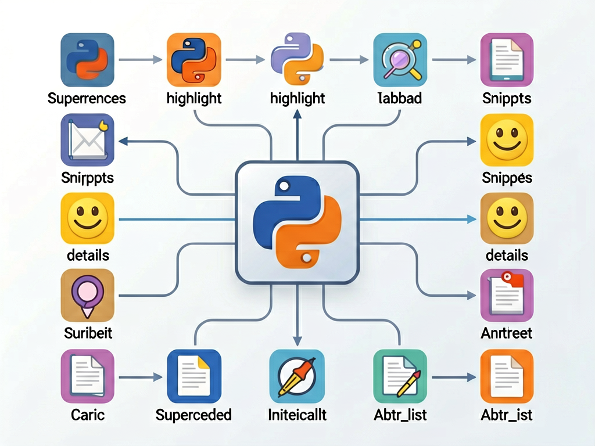

### 扩展列表

pymdownx 包含**超过 20 个扩展包**：

| 扩展 | 功能 |
|------|------|
| `superfences` | 嵌套代码块（代码块中嵌套代码块） |
| `highlight` | Pygments 代码高亮 |
| `tabbed` | 标签页 |
| `snippets` | 代码片段插入（类似 include） |
| `emoji` | Emoji 支持 |
| `details` | 折叠面板 |
| `superfenced` | 高级栅栏代码块 |
| `inlinehilite` | 行内代码高亮 |
| `critic` | 修订标记（接受/拒绝） |
| `attr_list` | 自定义属性 |

### 适用场景

| 场景 | 原因 |
|------|------|
| Sphinx 文档 | Sphinx 默认使用 markdown+pymdownx |
| MkDocs | MkDocs 的默认 Markdown 引擎 |
| 技术博客 | 丰富的扩展覆盖大多数需求 |

## Python vs JavaScript 引擎对比

### 架构对比

| 维度 | Python (markdown) | JavaScript (marked) |
|------|-------------------|---------------------|
| 解析方式 | 正则匹配 + 状态机 | 正则匹配 + 状态机 |
| AST | 有（Element 树） | 有（内部 AST） |
| 扩展机制 | extensions/ 目录 | 插件链 / 配置 |
| 输出格式 | 仅 HTML | HTML（可自定义 Renderer） |
| GFM 支持 | 需要扩展 | marked 配置 / mistletoe 原生 |

### 核心差异

**Python 生态缺少统一的 AST 框架**：

JS 生态有 remark（unified + AST 链），Python 没有对应的统一框架。这是因为：

1. **Python 的 Markdown 使用场景更集中**——主要是博客、文档站，不需要 JS 生态那样广泛的 AST 转换需求
2. **Python 的扩展方式是"插件包"而非"插件链"**——pymdownx 是一个包包含 20+ 扩展，而不是 20 个独立的 `.use()` 调用
3. **Python 生态更重视"开箱即用"**——安装一个包就搞定，不像 JS 需要手动组装 unified 链

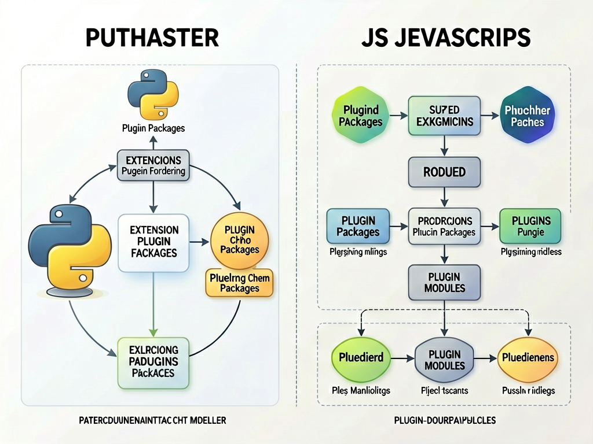

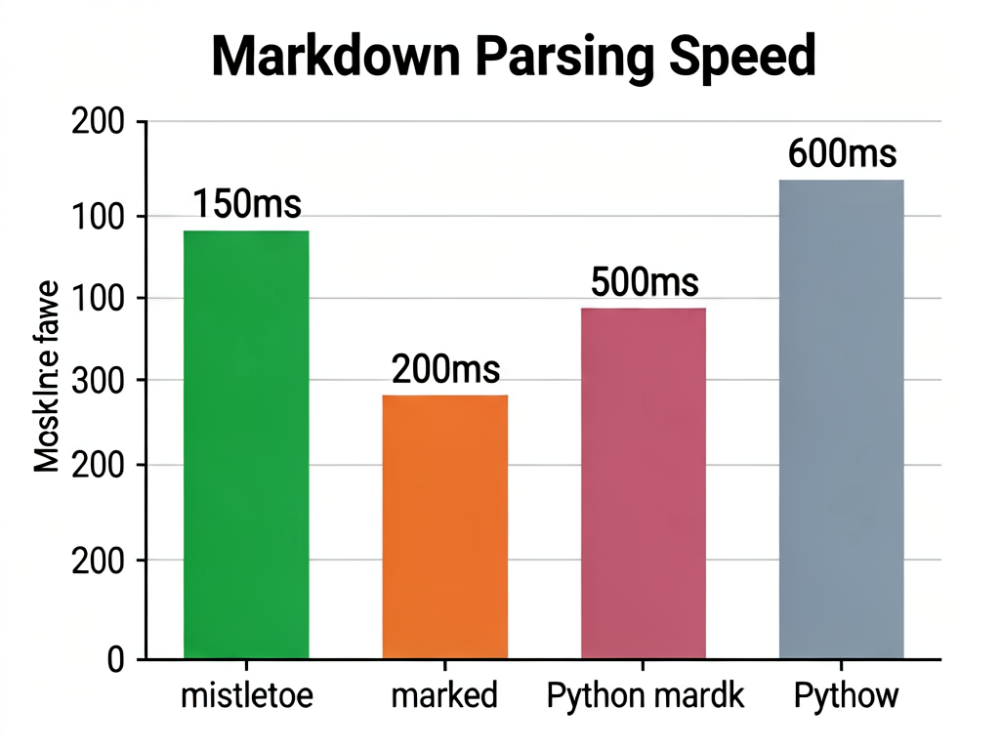

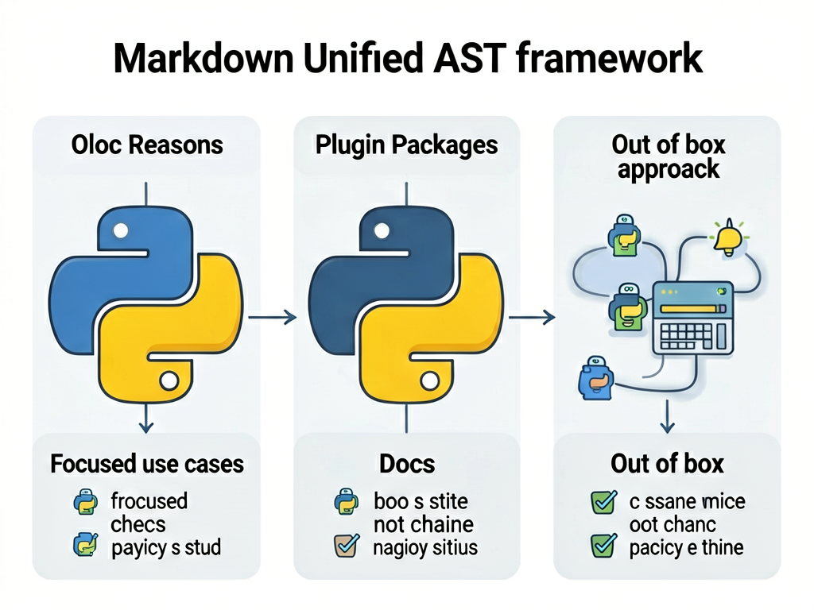

## 动手练习

1. 用 `markdown` 引擎解析同一段 Markdown，对比带/不带 GFM 扩展的输出差异
2. benchmark 三个引擎（markdown、mistletoe、pymdownx）解析同一份长文档的速度
3. 思考题：为什么 Python 生态缺少统一的 AST 框架？（提示：从语言哲学和生态成熟度角度思考）

## 本章小结

这一章中我们了解了 Python 生态的三大 Markdown 引擎。首先介绍了 markdown 的标准公务员风格（稳定可靠、扩展成熟、Django/Flask 集成），然后分析了 mistletoe 的速度狂人路线（C 扩展加速、性能最优），接着讨论了 pymdownx 的扩展狂魔策略（基于 markdown 的 20+ 扩展层），最后对比了 Python 和 JS 生态的核心差异。

本章我们一起学习了以下概念：

| 概念 | 解释 |
|------|------|
| markdown | Python 官方推荐引擎，扩展机制成熟 |
| mistletoe | C 扩展加速，速度最快 |
| pymdownx | markdown 的扩展层，20+ 扩展包 |
| 扩展 vs 插件链 | Python 用扩展包，JS 用插件链 |
| 无统一 AST | Python 生态缺乏 remark 式的 AST 框架 |

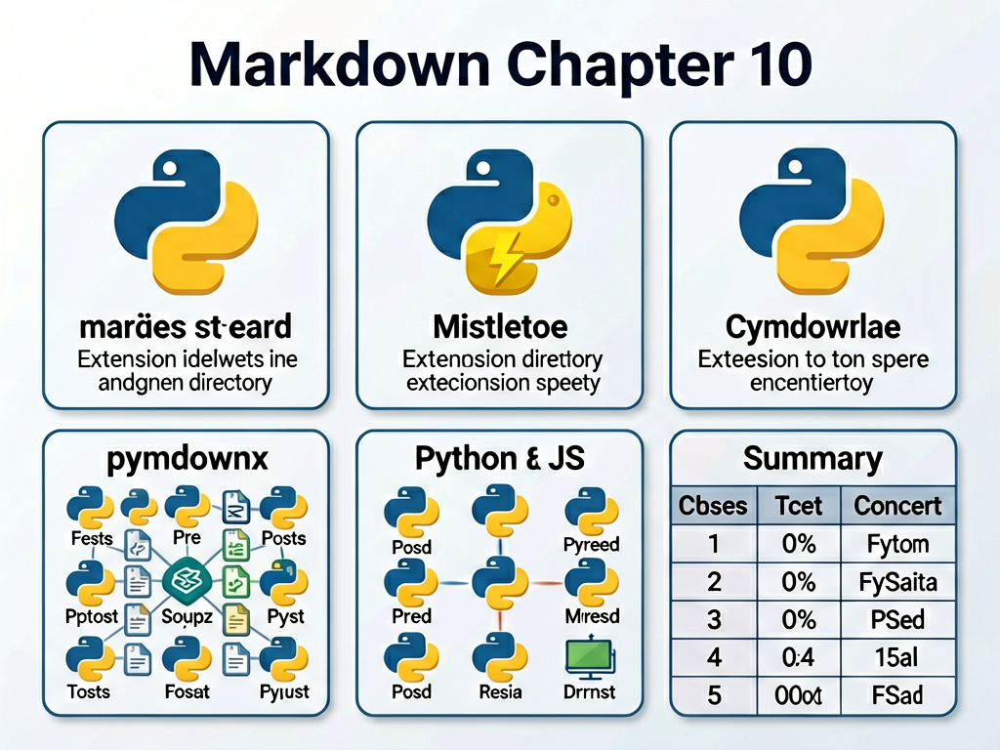

下一章我们将进入命令行工具——终端里的 Markdown 阅读器、转换器和生成器。


============================================================

# 第11章 命令行工具 —— 终端里的"阅读器"

## 学习目标

1. 掌握终端中的 Markdown 预览工具（glow、mdcat、cmark）
2. 理解 Markdown 的命令行转换流程（md → html / pdf / epub）
3. 能选择适合工作流的命令行工具

## 生活类比

终端里的 Markdown 工具就像随身听——随时随地打开，不用开浏览器。glow 是"终端里的 GitHub"，mdcat 是"终端里的预览器"，pandoc 是"万能翻译官"。

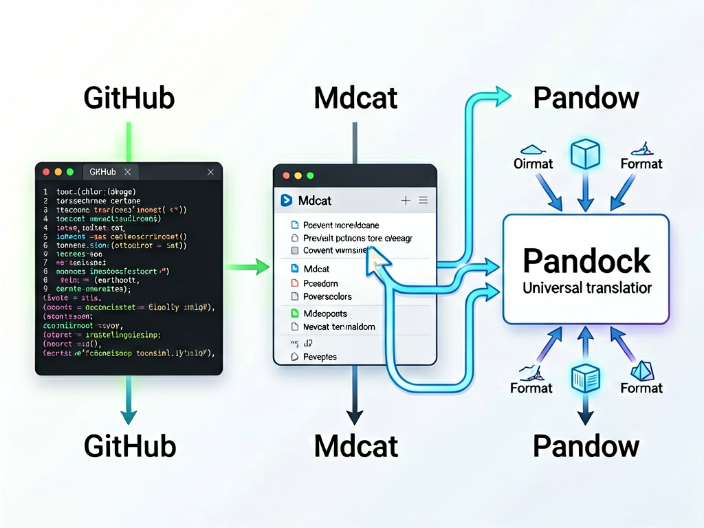

## glow：终端里的 GitHub

### 安装与使用

```bash
# 安装（macOS）
brew install glow

# 安装（Linux，下载二进制文件）
curl -fsSL https://github.com/charmbracelet/glow/releases/latest/download/glow_$(uname | awk '{print tolower($0)}')_$(uname -m).tar.gz | tar xz

# 预览 Markdown 文件
glow README.md

# 预览 URL 上的 Markdown
glow https://raw.githubusercontent.com/charmbracelet/glow/main/README.md

# 交互模式（逐页浏览）
glow --style dark
```

### 特点

glow 由 Charm（`charm.sh`）团队开发，是他们众多终端工具之一（还有 bubbletea、lip Gloss 等）。它的核心特点是**彩色渲染**：

- 标题有颜色区分（H1 红色、H2 蓝色……）
- 代码块保持等宽字体，语法高亮
- 链接显示为下划线
- 表格用边框线分隔

### 工作原理

glow 在内部使用 **cmark**（CommonMark 的 C 参考实现）解析 Markdown，然后用 **lip Gloss**（Charm 的 Go 终端 UI 库）渲染彩色输出：

```
Markdown 源码 → cmark（解析为 AST） → lip Gloss（终端 ANSI 渲染） → 彩色终端输出
```

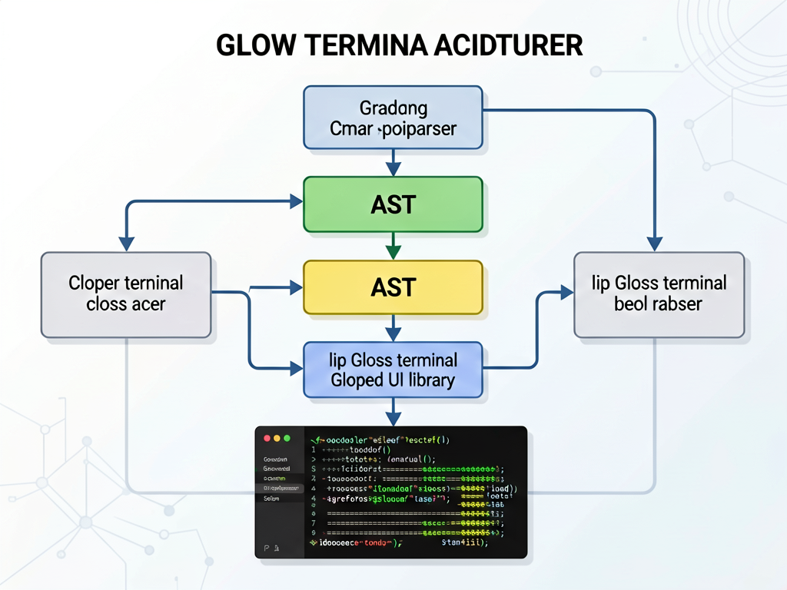

## mdcat：终端渲染器

### 安装与使用

```bash
# 安装（Rust）
cargo install mdcat

# 预览文件
mdcat file.md

# 管道输入
cat README.md | mdcat

# 与 git diff 结合
git diff | mdcat
```

### 特点

mdcat 由 Axel Erlund 开发，是 Rust 生态的终端渲染器：

- 支持 ANSI 彩色输出
- 支持图片渲染（在支持图片的终端中）
- 支持代码语法高亮
- 支持管道输入（`cat file.md | mdcat`）

### 与 glow 的对比

| 维度 | glow | mdcat |
|------|------|-------|
| 语言 | Go | Rust |
| 彩色输出 | 是 | 是 |
| 图片渲染 | 否 | 是（特定终端） |
| 代码高亮 | 是 | 是（基于 pygments/external） |
| 包管理 | brew | cargo |
| 生态 | Charm 全家桶 | Rust 生态 |

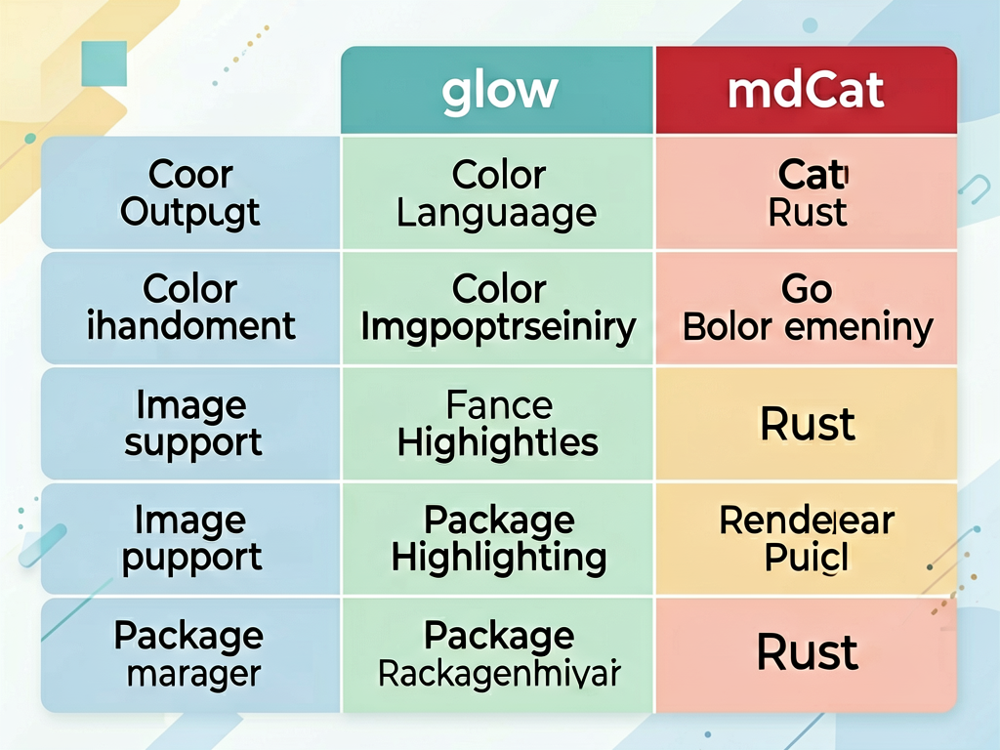

## cmark：通用参考实现

### 安装与使用

```bash
# 安装
apt install cmark
brew install cmark

# 转换为 HTML
cmark README.md -o README.html

# 转换为 CommonMark AST 表示
cmark README.md --to commonmark

# 转换为 GitHub Flavored Markdown
cmark README.md --to gfm
```

### 特点

cmark 是 **CommonMark 规范的 C 参考实现**——它不追求功能多，而是追求**规范的正确性**。

如果你在开发 Markdown 引擎或需要验证某个 Markdown 文件是否符合规范，cmark 是最可靠的工具。

## pandoc：万能转换器

### 安装与使用

```bash
# 安装（Linux）
apt install pandoc

# 安装（macOS）
brew install pandoc

# Markdown → HTML
pandoc input.md -o output.html

# Markdown → PDF
pandoc input.md -o output.pdf --pdf-engine=xelatex

# Markdown → EPUB
pandoc input.md -o output.epub

# Markdown → Word (docx)
pandoc input.md -o output.docx

# Markdown → LaTeX
pandoc input.md -o output.tex

# Markdown → RTF
pandoc input.md -o output.rtf
```

### 支持的格式

pandoc 支持**超过 50 种格式**之间的转换：

| 输入 | 输出 | 示例 |
|------|------|------|
| Markdown | HTML | `pandoc in.md -o out.html` |
| Markdown | PDF | `pandoc in.md -o out.pdf` |
| Markdown | EPUB | `pandoc in.md -o out.epub` |
| Markdown | docx | `pandoc in.md -o out.docx` |
| Markdown | LaTeX | `pandoc in.md -o out.tex` |
| docx | Markdown | `pandoc doc.docx -o doc.md` |
| HTML | Markdown | `pandoc doc.html -o doc.md` |

### 为什么 pandoc 能转这么多格式？

pandoc 的核心秘密是 **通用 AST**：

```
输入格式 → [解析器] → 通用 AST → [渲染器] → 输出格式
```

无论输入是 Markdown、docx、HTML 还是 LaTeX，都被解析为同一个"通用 AST"。然后从这个通用 AST 可以输出到任意格式。

这就好比一个通用插座——任何国家的插头都能插进去，然后转换成你需要的电压输出。

```
Markdown  ─┐
HTML      ─┼─→ 解析器 → 通用 AST → 渲染器 → docx
docx      ─┘                   ↑
LaTeX ────┘                    │
                               └→ 输出格式：HTML / PDF / EPUB / ...
```

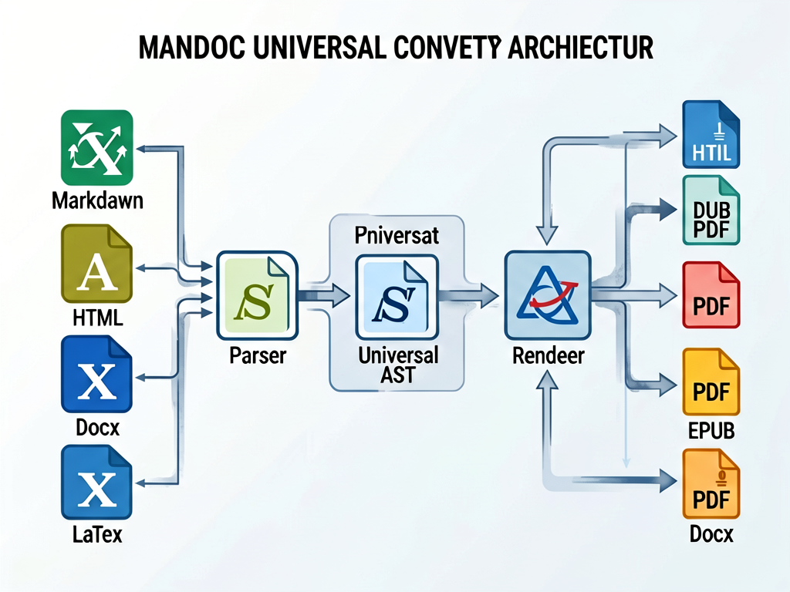

### pandoc  vs 其他转换工具

| 工具 | pandoc | markdown-to-pdf | markdown-to-epub |
|------|--------|-----------------|------------------|
| 支持格式 | 50+ | 仅 PDF | 仅 EPUB |
| 输入格式 | Markdown/docx/HTML/LaTeX | 仅 Markdown | 仅 Markdown |
| 配置灵活性 | 高（模板、CSS） | 低 | 中 |
| 适用场景 | 通用转换 | 快速 PDF | 电子书 |

## 工作流：命令行工具的选择

### 日常预览

| 工具 | 命令 | 适用场景 |
|------|------|----------|
| glow | `glow file.md` | 日常快速预览 |
| mdcat | `cat file.md \| mdcat` | 管道中输入 |
| cmark | `cmark file.md` | 规范验证 |

### 格式转换

| 工具 | 命令 | 输出格式 |
|------|------|----------|
| pandoc | `pandoc in.md -o out.html` | HTML/PDF/EPUB/docx/LaTeX... |
| glow | `glow file.md --to html` | HTML |

### 最佳实践

1. **日常预览用 glow**——彩色渲染，终端中阅读体验好
2. **格式转换用 pandoc**——万能转换，支持 50+ 格式
3. **规范验证用 cmark**——CommonMark 参考实现
4. **管道集成用 mdcat**——支持 `cat file \| mdcat`

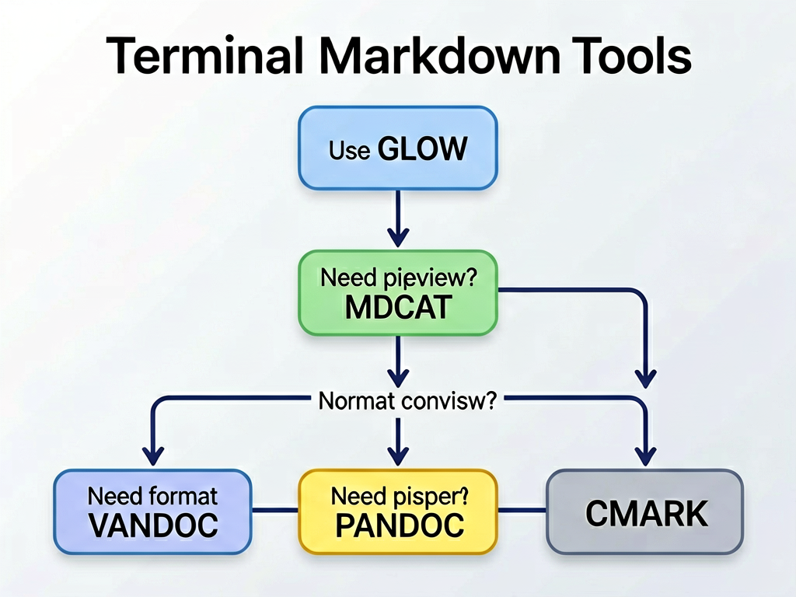

## 设计取舍

**为什么需要多个终端预览器？**

因为终端兼容性差异。不同终端模拟器（xterm、gnome-terminal、Windows Terminal）支持的 ANSI 颜色和图形协议不同。glow 用 Go 开发，跨平台但功能有限；mdcat 用 Rust 开发，更灵活但依赖 Rust 工具链。

**为什么 pandoc 支持这么多格式？**

因为它的通用 AST 架构。一旦有了统一的中间表示，输出格式只是"换个渲染器"的事。这个架构和 remark → rehype 的链式转换异曲同工——中间表示决定了可扩展性。

**命令行 vs GUI？**

命令行工具的优势是**可组合性**——`cat file.md | glow | wc -l` 可以把 Markdown 预览和字数统计组合成一条命令。GUI 工具的优势是**可视化**——拖拽、实时预览、图形化配置。两者不冲突，适合不同场景。


## 动手练习

1. 安装 glow，用 `glow` 预览一个 GitHub README
2. 用 pandoc 将 Markdown 转为 PDF（需要安装 LaTeX）
3. 思考题：为什么 pandoc 支持这么多格式？（提示：从通用 AST 架构角度思考）

## 本章小结

这一章中我们了解了 Markdown 的命令行工具生态。首先介绍了终端预览器（glow 的彩色渲染、mdcat 的管道支持、cmark 的规范验证），然后深入讲解了 pandoc 的万能转换能力和通用 AST 架构，最后给出了工作流选择指南。

本章我们一起学习了以下概念：

| 概念 | 解释 |
|------|------|
| glow | Charm 开发的终端 Markdown 预览器，彩色渲染 |
| mdcat | Rust 开发的终端渲染器，支持管道和 ANSI |
| cmark | CommonMark 规范的 C 参考实现，规范验证 |
| pandoc | 万能转换器，通用 AST 架构支持 50+ 格式 |
| 通用 AST | 中间表示，让跨格式转换成为可能 |


第三篇（生态篇）到此结束。下一章开始第四篇——Markdown 在生产环境中的实战应用。


============================================================

# 第12章 从 Markdown 到博客 —— 从食材到成品菜

## 学习目标

1. 理解 MDX 的概念和使用场景
2. 掌握静态站点生成器（Hugo、VitePress）的基本工作流
3. 了解从 Markdown 到可发布博客的完整流水线

## 生活类比

Markdown 是食材，静态站点生成器是厨房，HTML 是成品菜。你只负责准备食材（写 Markdown），厨房负责洗切炒（解析、主题渲染、构建），最后端出来的菜（HTML 站点）可以直接上桌（部署）。

这个流水线的好处是：**你只需要关注食材的质量，不用管厨房的装修**。

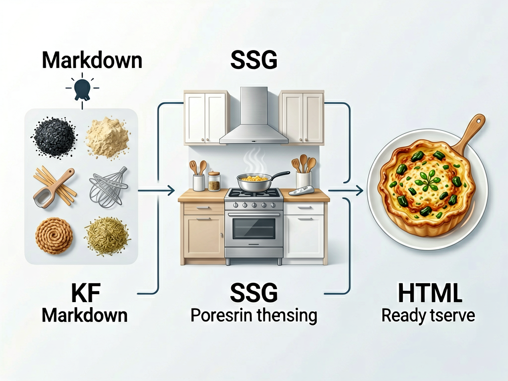

## MDX：Markdown + React

### 什么是 MDX？

MDX 是 **Markdown + JSX** 的混合语法。你可以在 Markdown 中直接嵌入 React 组件：

```mdx
# 我的博客

这是一段普通 Markdown 文字。

<Counter initial={0} />

更多 Markdown 内容。
```

其中 `<Counter>` 是一个 React 组件。

### 与普通 Markdown 的差异

| 特性 | Markdown | MDX |
|------|----------|-----|
| 标题、段落、列表 | 支持 | 支持 |
| 代码块 | 支持 | 支持 |
| 嵌入 React 组件 | 不支持 | 支持 |
| 导入/导出 | 不支持 | 支持 `import Component from './Component'` |
| 动态数据 | 不支持 | 支持 |

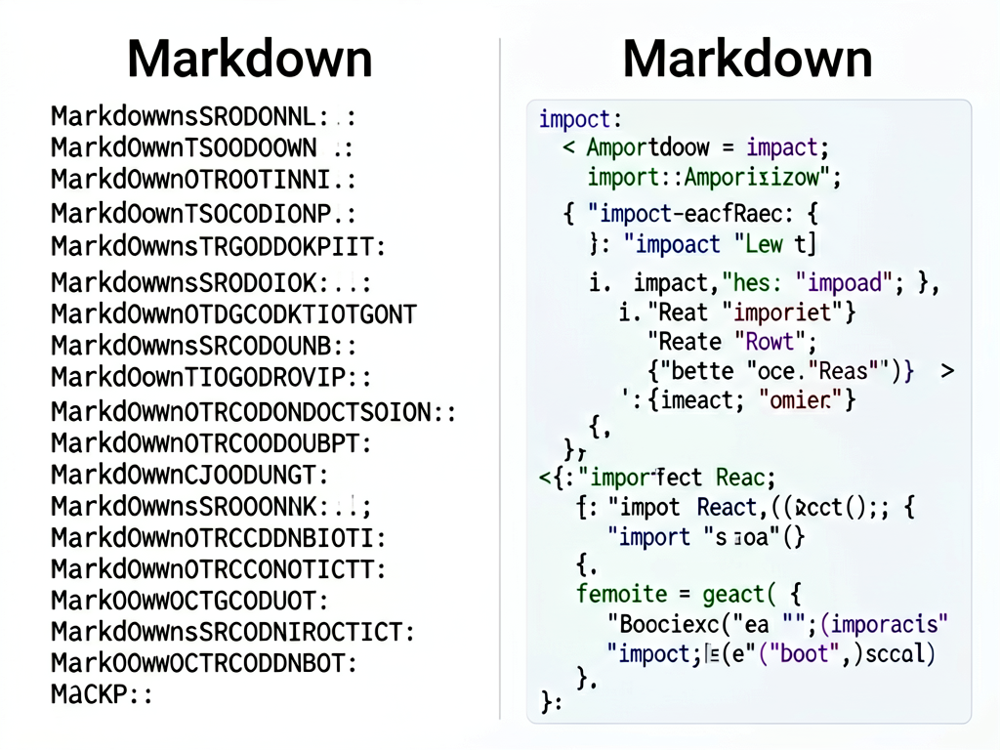

### 适用场景

- 博客中需要交互式内容（图表、代码编辑器、动画）
- 文档站中需要可交互的示例
- 产品页面中需要自定义组件

### 不适用场景

- 纯文字博客（MDX 增加了构建复杂度）
- 需要在非 JS 环境中渲染的文档
- 追求极致简单的写作体验

## Hugo：Go 编写的静态站生成器

### 项目初始化

```bash
# 创建项目
hugo new site myblog
cd myblog

# 安装主题
git init
git submodule add https://github.com/theNewDynamic/gohugo-theme-ananke.git themes/ananke

# 创建文章
hugo new posts/first-post.md
```

### 目录结构

```
myblog/
├── content/
│   ├── posts/
│   │   ├── first-post.md
│   │   └── second-post.md
│   └── _index.md
├── themes/
│   └── ananke/
├── config.toml        # 配置文件
└── layouts/            # 自定义模板（可选）
```

核心原则：**目录即路由**——`content/posts/first-post.md` 映射到 URL `/posts/first-post/`。

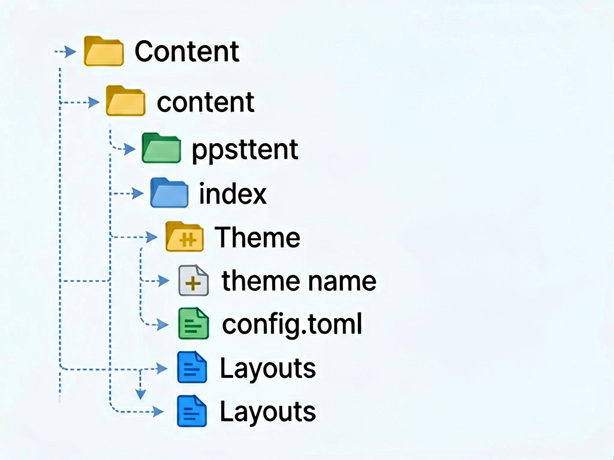

### 文章Front Matter

```yaml
---
title: "第一篇文章"
date: 2026-06-08
draft: false
tags:
  - markdown
  - 博客
---

正文从这里开始。
```

`draft: true` 的文章不会构建到输出目录——这是 Hugo 的草稿机制。

### 主题系统

Hugo 的主题本质上是 **Go 模板 + CSS + JavaScript**：

```
themes/ananke/
├── layouts/
│   ├── _default/
│   │   ├── baseof.html     # 基础布局（所有页面继承）
│   │   ├── list.html       # 列表页（文章列表）
│   │   └── single.html     # 单页（文章页面）
│   └── partials/           # 可复用组件
│       ├── header.html
│       └── footer.html
├── static/                 # 静态资源
└── assets/                 # CSS/JS 源文件
```

### 构建

```bash
# 本地预览
hugo server -D   # -D 显示草稿文章

# 构建静态站
hugo             # 输出到 public/ 目录
```

构建后，`public/` 目录就是完整的静态网站——所有 Markdown 都转换为了 HTML。

## VitePress：Vue 驱动的文档+博客

### 初始化

```bash
# 初始化项目
npm init vite@latest my-docs -- --template vue

cd my-docs
npm install
npx vitepress init

# 创建文章
mkdir docs
echo '# 欢迎\n\n这是我的 VitePress 站点。' > docs/index.md
echo '## 文章\n\nHello Markdown!' > docs/guide.md
```

### 配置文件

```javascript
// .vitepress/config.js
import { defineConfig } from 'vitepress'

export default defineConfig({
  title: '我的文档站',
  description: '一个基于 VitePress 的文档站点',
  
  themeConfig: {
    nav: [
      { text: '首页', link: '/' },
      { text: '指南', link: '/guide' },
    ],
    sidebar: [
      {
        text: '指南',
        items: [
          { text: '开始', link: '/' },
          { text: '文章', link: '/guide' },
        ],
      },
    ],
  },
})
```

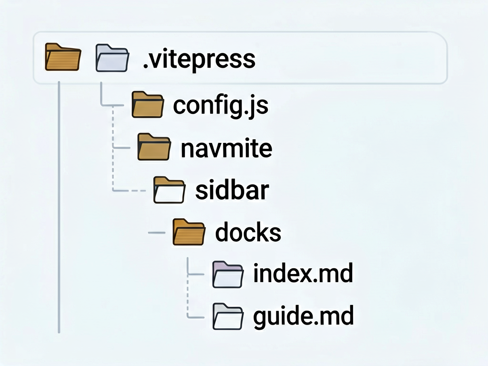

### 主题定制

VitePress 内置了三种主题：

| 主题 | 适用场景 | 特点 |
|------|----------|------|
| Default | 通用 | 简洁、响应式 |
| Team | 团队介绍 | 卡片布局 |
| Home | 首页 | Hero + Features |

### 构建与部署

```bash
# 本地预览
npx vitepress dev

# 构建
npx vitepress build   # 输出到 .vitepress/dist

# 部署到 GitHub Pages
npx vitepress build
git push -f dist origingh-pages
```

## 部署：让站点上线

### GitHub Pages

```yaml
# .github/workflows/deploy.yml
name: Deploy to GitHub Pages

on:
  push:
    branches: [main]

jobs:
  build:
    runs-on: ubuntu-latest
    steps:
      - uses: actions/checkout@v4
      - uses: actions/setup-node@v4
        with:
          node-version: 20
      - run: npm ci
      - run: npm run build
      - uses: peaceiris/actions-gh-pages@v3
        with:
          github_token: ${{ secrets.GITHUB_TOKEN }}
          publish_dir: ./dist  # Hugo: ./public
```

**优点**：免费、与代码仓库集成、自动部署
**缺点**：自定义域名需要额外配置、CDN 速度有限

### Vercel / Netlify

```yaml
# Vercel 配置（vercel.json，可选）
{
  "buildCommand": "hugo",
  "outputDirectory": "public",
  "framework": "static"
}
```

**Vercel/Netlify** 的优势：

1. **零配置部署**——连接 GitHub 仓库，自动识别 Hugo/VitePress 项目
2. **自动 HTTPS**——每次推送自动构建和部署
3. **全球 CDN**——比 GitHub Pages 快
4. **自定义域名**——免费支持

### 部署流程总结

```
你写 Markdown → Git Push → CI/CD 触发
  → Hugo/VitePress 构建
  → 上传到 CDN
  → 站点更新
```

整个流程大约 1-3 分钟，你不需要手动操作任何构建命令。


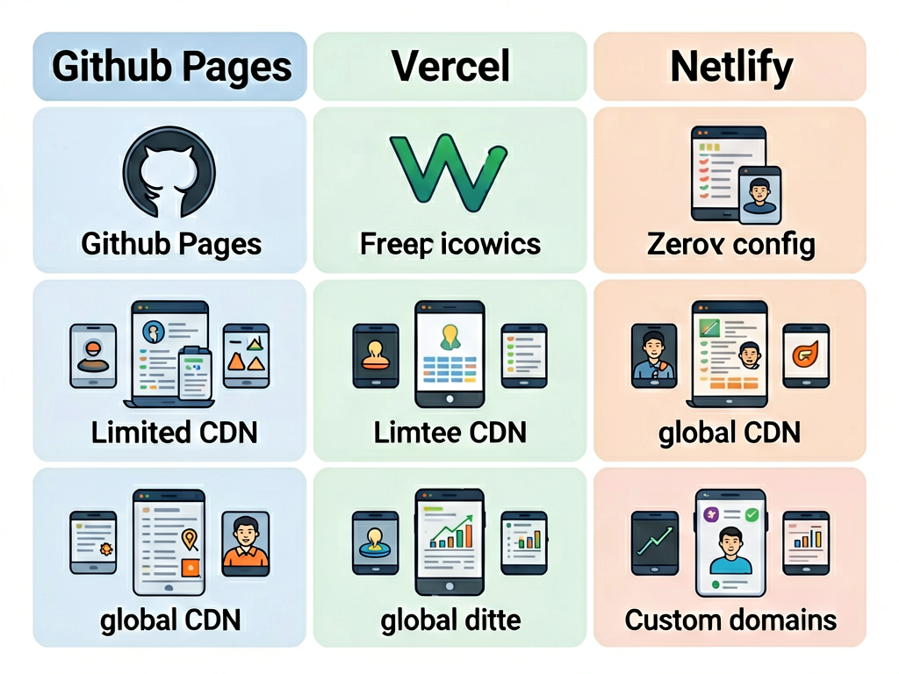

## 设计取舍

**为什么用静态站点而非 CMS？**

CMS（如 WordPress）需要在服务器上运行数据库和 PHP，增加了维护成本和攻击面。静态站点生成器的好处是：

- **速度快**——HTML 是预构建的，服务器只返回静态文件
- **安全**——没有数据库，没有注入攻击
- **便宜**——GitHub Pages 免费，Vercel 免费额度足够
- **版本控制**——Markdown 文件可以直接 Git 管理

**MDX vs 纯 Markdown？**

MDX 增加了交互能力，但牺牲了**简洁性**和**工具兼容性**。不是所有 Markdown 工具都支持 MDX（如 `glow`、`mdcat` 不解析 JSX）。选择 MDX 意味着你承诺使用支持它的工具链。

**Hugo vs VitePress？**

- Hugo 用 Go 编写，构建速度极快（数万篇文章秒级构建），但主题需要 Go 模板知识
- VitePress 用 Vue 编写，主题可以用 Vue 组件定制，但构建速度较慢

对于小中型站点（< 1000 篇文章），两者差异不大。对于大型站点（> 10000 篇文章），Hugo 的速度优势明显。


## 动手练习

1. 用 Hugo 初始化一个博客项目，写一篇 Markdown 文章并发布到 GitHub Pages
2. 用 VitePress 搭建一个文档+博客站点，自定义导航栏
3. 思考题：为什么静态站点生成器比 CMS 更快？（提示：从预构建和 CDN 角度思考）

## 本章小结

这一章中我们了解了从 Markdown 到博客的完整流水线。首先介绍了 MDX（Markdown + JSX，适合交互式内容），然后分别讲解了 Hugo（Go 编写、速度快、目录即路由）和 VitePress（Vue 编写、主题灵活、生态丰富）的工作流，最后讨论了 GitHub Pages、Vercel/Netlify 三种部署方案。

本章我们一起学习了以下概念：

| 概念 | 解释 |
|------|------|
| MDX | Markdown + JSX，可在 Markdown 中嵌入 React 组件 |
| Hugo | Go 编写的静态站生成器，目录即路由，构建速度快 |
| VitePress | Vue 驱动的文档+博客生成器，主题可定制 |
| 静态部署 | 预构建 HTML，上传 CDN，零服务器运维 |
| CI/CD | Git Push 自动构建和部署 |

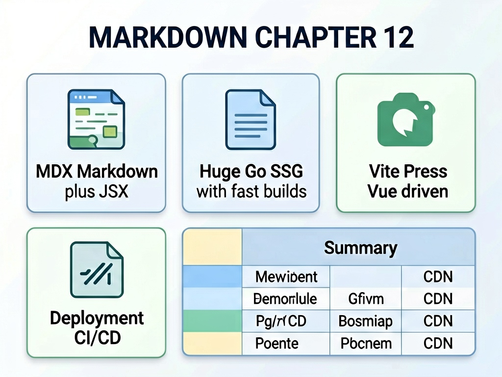

下一篇（实战篇最后一篇）我们将学习：从 Markdown 到文档站点、Markdown 的极限扩展、以及如何制定生产级 Markdown 规范。


============================================================

# 第13章 从 Markdown 到文档站点 —— 从单篇到文库

## 学习目标

1. 掌握 MkDocs、Docusaurus 两大文档站工具
2. 理解文档站与博客的结构差异
3. 能选择适合项目的文档工具

## 生活类比

博客像日记本——按时间倒序排列，个人化强。文档站像图书馆——按主题分类，结构化强。MkDocs 是社区图书馆（简单、免费、材料主题精美）；Docusaurus 是大学图书馆（功能全、可定制、React 生态）。

## 文档站 vs 博客

在开始之前，先明确文档站和博客的核心差异：

| 维度 | 文档站 | 博客 |
|------|--------|------|
| 导航 | 侧边栏（分类导向） | 按时间（倒序列表） |
| 内容 | 静态为主，长期有效 | 动态更新，有时效性 |
| 搜索 | 全站搜索 | 简单搜索 |
| 版本管理 | 有（多版本文档） | 无 |
| SEO | 功能性强 | 简单 |
| 示例 | Python 文档、React 文档 | 技术博客、个人日志 |


### 为什么文档站用侧边栏？

因为读者搜索的是"功能 A 怎么用"，而不是"最新发布了什么"。侧边栏按功能分类，让读者能快速定位到需要的文档。

## MkDocs：Python 编写的文档站

### 安装与初始化

```bash
# 安装 MkDocs 和 Material 主题
pip install mkdocs mkdocs-material

# 初始化项目
mkdocs new my-docs
cd my-docs
```

### 目录结构

```
my-docs/
├── docs/
│   ├── index.md           # 首页
│   ├── getting-started.md # 入门指南
│   ├── api-reference.md   # API 参考
│   └── extras/
│       └── diagram.md     # 补充材料
├── mkdocs.yml             # 配置文件
└── site/                  # 构建输出（自动创建）
```

核心原则：**`docs/` 目录下的每个 `.md` 文件就是一个页面**。文件名自动映射为 URL：

```
docs/index.md        → /
docs/getting-started.md  → /getting-started/
docs/api-reference.md    → /api-reference/
```

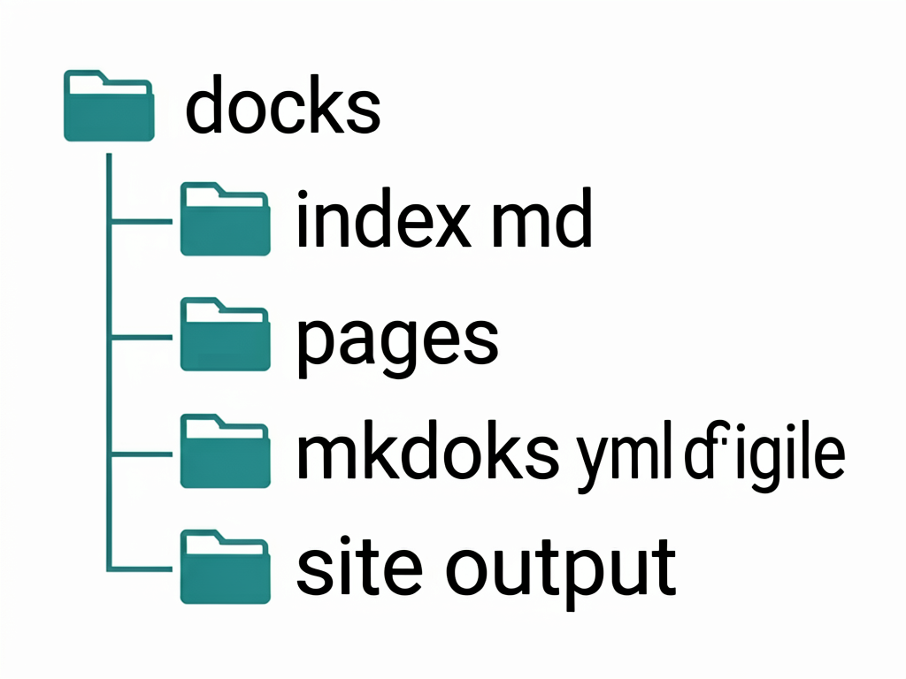

### 配置文件

```yaml
# mkdocs.yml
site_name: 我的文档
theme:
  name: material

nav:
  - 首页: index.md
  - 入门指南:
    - 安装: getting-started.md
    - 配置: getting-started/configuration.md
  - API 参考: api-reference.md
  - 补充材料: extras/diagram.md
```

`nav` 定义了侧边栏的结构——这是一个**树形导航**，支持多级嵌套。

### 构建与预览

```bash
# 本地预览（热更新）
mkdocs serve

# 构建静态站
mkdocs build
```

`mkdocs serve` 启动一个本地服务器，修改 Markdown 文件后自动刷新页面。

### Material 主题的特性

Material for MkDocs 是 MkDocs 最流行的主题：

| 特性 | 说明 |
|------|------|
| 深色模式 | 自动跟随系统或手动切换 |
| 搜索 | 全站全文搜索 |
| 锚链接 | 每个标题自动生成锚链接 |
| 复制按钮 | 代码块自带复制按钮 |
| 多语言 | 支持 i18n |
| 插件 | 丰富的插件生态 |

## Docusaurus：React 编写的文档站

### 初始化

```bash
# 初始化项目
npx create-docusaurus@latest my-docs classic

cd my-docs

# 本地预览
npm run start

# 构建
npm run build
```

### 目录结构

```
my-docs/
├── docs/
│   ├── index.md              # 首页
│   ├── intro.md              # 入门指南
│   └── versioned_docs/
│       └── version-1.0/
│           └── api.md        # v1.0 的 API 文档
├── src/
│   ├── pages/                # 自定义 React 页面
│   └── components/           # 自定义 React 组件
├── versioned_docs/           # 版本化文档
├── versions.json             # 版本列表
├── docusaurus.config.js      # 配置文件
└── sidebars.js               # 侧边栏配置
```

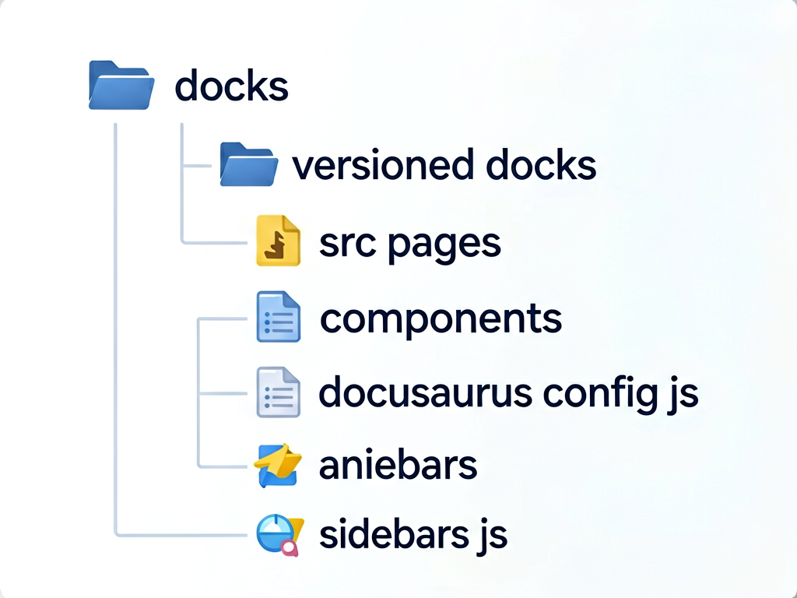

### 配置文件

```javascript
// docusaurus.config.js
export default {
  title: '我的文档',
  tagline: '一个基于 Docusaurus 的文档站',
  favicon: 'img/favicon.ico',
  url: 'https://mydocs.io',
  baseUrl: '/',
  themeConfig: {
    navbar: {
      title: '我的文档',
      items: [
        { to: '/docs/intro', label: '文档', position: 'left' },
        { to: '/blog', label: '博客', position: 'left' },
      ],
    },
    sidebar: {
      autoCollapseCategories: true,
    },
  },
  presets: [
    [
      'classic',
      {
        docs: {
          sidebarPath: './sidebars.js',
          routeBasePath: 'docs',
        },
        blog: {
          routeBasePath: 'blog',
        },
      },
    ],
  ],
}
```

### 版本管理

Docusaurus 最强大的功能是**版本管理**——为不同版本的软件维护不同的文档：

````bash
# 创建版本
docusaurus docs:version 1.0

# 版本目录结构
docs/                 # 最新版本文档
versioned_docs/
  version-1.0/        # v1.0 的文档
  version-2.0/        # v2.0 的文档
versions.json         # 版本列表
````

用户访问 `mydocs.io/docs/` 时看到最新版本文档，访问 `mydocs.io/docs/1.0/` 时看到 v1.0 的文档。

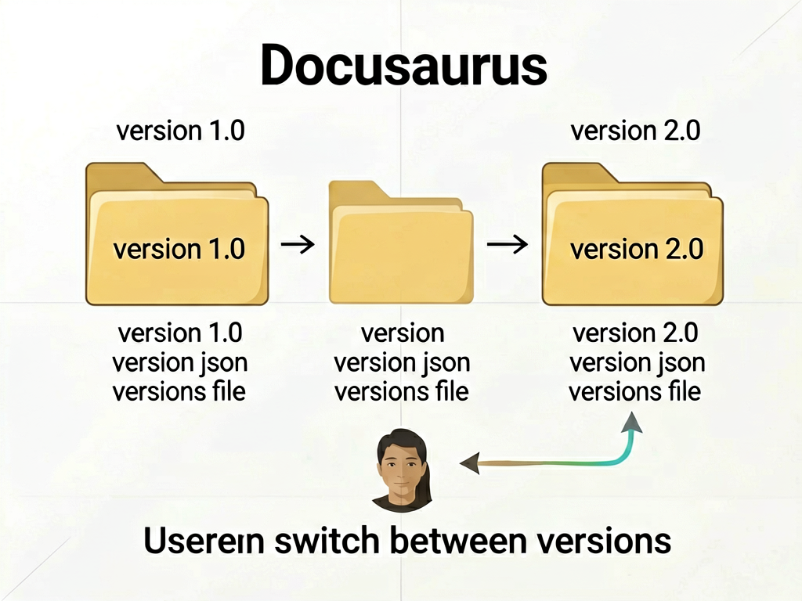

### 与博客的集成

Docusaurus 同时支持文档和博客：

```javascript
// docusaurus.config.js
presets: [
  ['classic', {
    docs: { /* 文档配置 */ },
    blog: { /* 博客配置 */ },  // 同时启用博客
  }],
]
```

这意味着一个 Docusaurus 项目可以同时是文档站+博客，共享同一个基础设施。

### 自定义 React 页面

```javascript
// src/pages/custom.js
import Layout from '@theme/Layout'

export default function CustomPage() {
  return (
    <Layout title="自定义页面">
      <h1>这是一个自定义 React 页面</h1>
      <p>不是 Markdown，是纯 JSX。</p>
    </Layout>
  )
}
```

这允许你在 Markdown 之外，用 React 构建自定义页面（如首页、404 页面、 landing page）。

## MkDocs vs Docusaurus

### 功能对比

| 维度 | MkDocs | Docusaurus |
|------|--------|------------|
| 语言 | Python | Node.js (React) |
| 安装 | `pip install mkdocs` | `npm install` |
| 配置 | YAML（mkdocs.yml） | JavaScript（docusaurus.config.js） |
| 主题 | 丰富（Material 等） | 有限（默认 + 自定义） |
| 版本管理 | 需要插件 | 内置 |
| 博客 | 需要插件 | 内置 |
| 自定义页面 | 有限 | React 组件 |
| 构建速度 | 快 | 中等 |
| 学习曲线 | 低 | 中 |

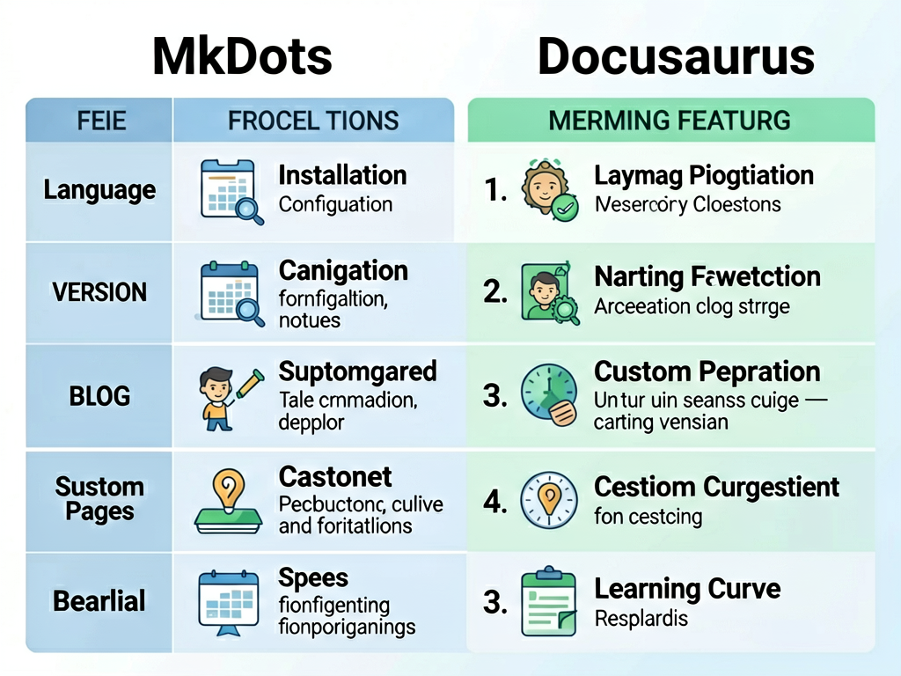

### 选择指南

| 你的场景 | 推荐 | 原因 |
|----------|------|------|
| Python 项目文档 | **MkDocs** | Python 生态，安装简单 |
| API 文档 | **MkDocs** | Material 主题自带 API 文档样式 |
| React 项目文档 | **Docusaurus** | React 生态，与项目技术栈一致 |
| 多版本文档 | **Docusaurus** | 内置版本管理 |
| 快速搭建 | **MkDocs** | 安装即用，配置最少 |
| 需要自定义页面 | **Docusaurus** | React 组件，灵活性高 |

## 文档站的核心设计原则

### 1. 导航效率

文档站的第一原则是**让读者最快找到需要的信息**。侧边栏 + 搜索是最佳组合：

```
侧边栏（分类导航） + 搜索（关键词定位）
```

### 2. 一致性

所有文档页面应共享相同的：

- 主题（颜色、字体、间距）
- 导航结构（侧边栏、页脚）
- 写作风格（术语、语气）
- 代码示例格式

### 3. 可发现性

- **目录自动生成**——从 Markdown 的标题生成 TOC
- **交叉链接**——文档之间互相引用
- **搜索**——全文搜索是文档站的标配
- **面包屑**——显示当前页面在文档树中的位置

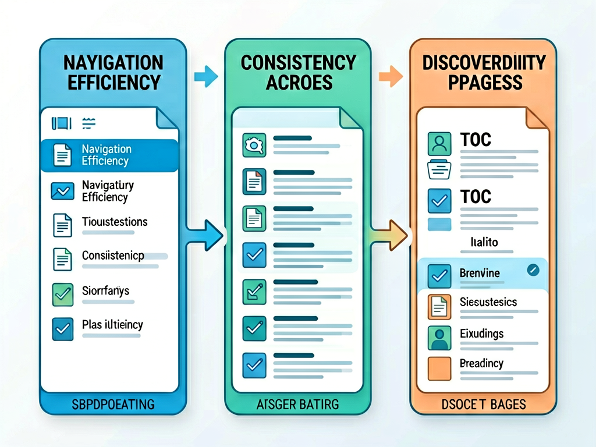

## 动手练习

1. 用 MkDocs + Material 搭建一个文档站点，配置侧边栏和搜索
2. 用 Docusaurus 初始化一个项目，添加版本管理
3. 思考题：为什么文档站不需要分页功能？（提示：文档是按需查找，不是按时间浏览）

## 本章小结

这一章中我们对比了 MkDocs 和 Docusaurus 两大文档站工具。首先介绍了 MkDocs 的 YAML 配置方式和 Material 主题的丰富功能，然后讲解了 Docusaurus 的版本管理、React 集成和博客功能，最后给出了选择指南。

本章我们一起学习了以下概念：

| 概念 | 解释 |
|------|------|
| MkDocs | Python 编写的文档站生成器，YAML 配置，Material 主题 |
| Docusaurus | React 编写的文档站生成器，内置版本管理 |
| 版本管理 | 为不同软件版本维护不同文档 |
| 文档站 vs 博客 | 分类导航 vs 时间导航 |
| 导航效率 | 侧边栏 + 搜索是文档站的核心 |

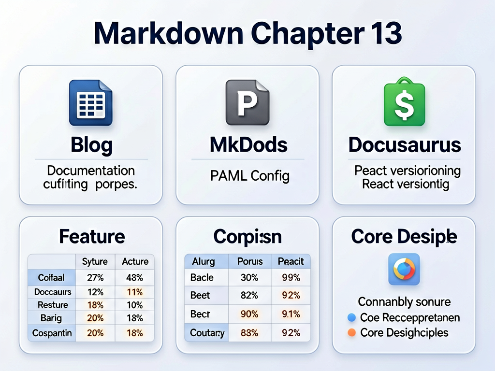

下一章我们将进入 Markdown 的极限扩展——数学公式、Mermaid 图表、PlantUML 等。


============================================================

# 第14章 Markdown 的极限 —— 知道刀能切什么、不能切什么

## 学习目标

1. 理解 Markdown 语法能力的边界
2. 掌握在 Markdown 极限之外使用的扩展方案
3. 能在数学公式、图表、自定义 HTML 之间做选择

## 生活类比

Markdown 的极限就像一把瑞士军刀——切水果、开瓶盖、拧螺丝都很好用。但如果你需要锯木头、钻洞、焊接，那就得换工具了。Mermaid、KaTeX、PlantUML 就是那把"锯木头"的电动工具，而 HTML 是你工具箱里的电焊枪——万能但别随便用。


## Markdown 的能力边界

### Markdown 能做什么

| 能力 | 语法 | 覆盖率 |
|------|------|--------|
| 标题 | `# H1` | 100% |
| 段落 | 空行分隔 | 100% |
| 粗体/斜体 | `**` / `*` | 100% |
| 链接/图片 | `[text](url)` / `` | 100% |
| 列表 | `- item` / `1. item` | 100% |
| 引用 | `> quote` | 100% |
| 代码块 | ``` 代码 ``` | 100% |
| 表格 | `| a | b |` | GFM 95% |

### Markdown 不能做什么

| 能力 | 原因 | 替代方案 |
|------|------|----------|
| 合并单元格 | 纯文本无法表达二维结构 | HTML `<table>` |
| 居中对齐 | 规范未定义 | HTML `<div align="center">` |
| 上标/下标 | 规范未定义 | `<sup>` / `<sub>` |
| 数学公式 | 规范未定义 | KaTeX / MathJax |
| 流程图 | 规范未定义 | Mermaid / PlantUML |
| 音频/视频 | 规范未定义 | HTML `<video>` / `<audio>` |
| 自定义样式 | 规范未定义 | HTML + CSS |

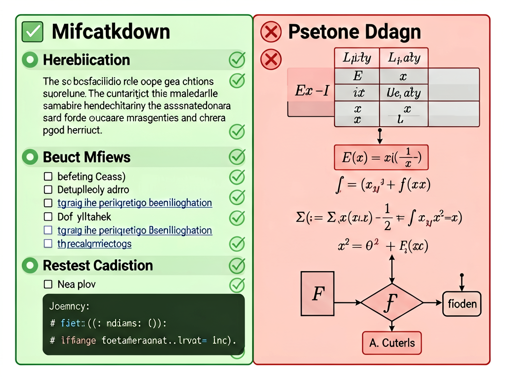

## 数学公式：KaTeX 与 MathJax

### KaTeX

KaTeX 是由 Khan Academy 开发的数学公式渲染库，特点是**速度快**：

````markdown
行内公式：$E = mc^2$

块级公式：
$$
\int_{0}^{\infty} e^{-x^2} dx = \frac{\sqrt{\pi}}{2}
$$
````

渲染效果：

- 行内公式：$E = mc^2$
- 块级公式：

$$
\int_{0}^{\infty} e^{-x^2} dx = \frac{\sqrt{\pi}}{2}
$$

### MathJax

MathJax 是另一个成熟的数学公式渲染库，特点是**兼容性更好**：

| 维度 | KaTeX | MathJax |
|------|-------|---------|
| 速度 | 快（DOM 渲染） | 慢（SVG/Canvas 渲染） |
| 兼容性 | 现代浏览器 | 所有浏览器（含 IE） |
| 大小 | ~600KB | ~2MB |
| 功能 | 基础 LaTeX 语法 | 完整 LaTeX 语法 |

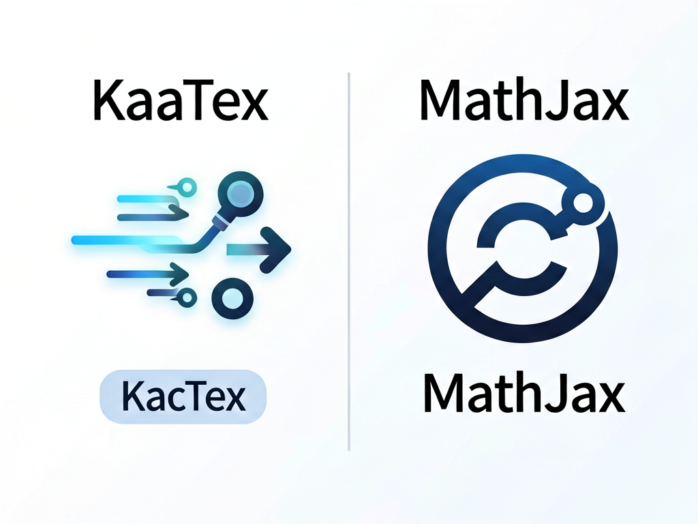

### 在 Markdown 中使用

大多数静态站点生成器内置了 KaTeX 支持：

```yaml
# VitePress 配置
themeConfig:
  math:
    engine: 'katex'
```

```yaml
# Hugo 配置
params:
  katex: true
```

### LaTeX 语法速查

| 功能 | 语法 | 渲染 |
|------|------|------|
| 上标 | `x^2` | x² |
| 下标 | `x_2` | x₂ |
| 分数 | `\frac{a}{b}` | a/b 分数形式 |
| 积分 | `\int_{a}^{b}` | ∫ |
| 求和 | `\sum_{i=0}^{n}` | Σ |
| 希腊字母 | `\alpha`, `\beta`, `\gamma` | α β γ |
| 括号 | `\left( \right)` | 自适应大小括号 |

## 流程图：Mermaid

### Mermaid 语法

Mermaid 是一种用文本描述图表的语法：

````markdown
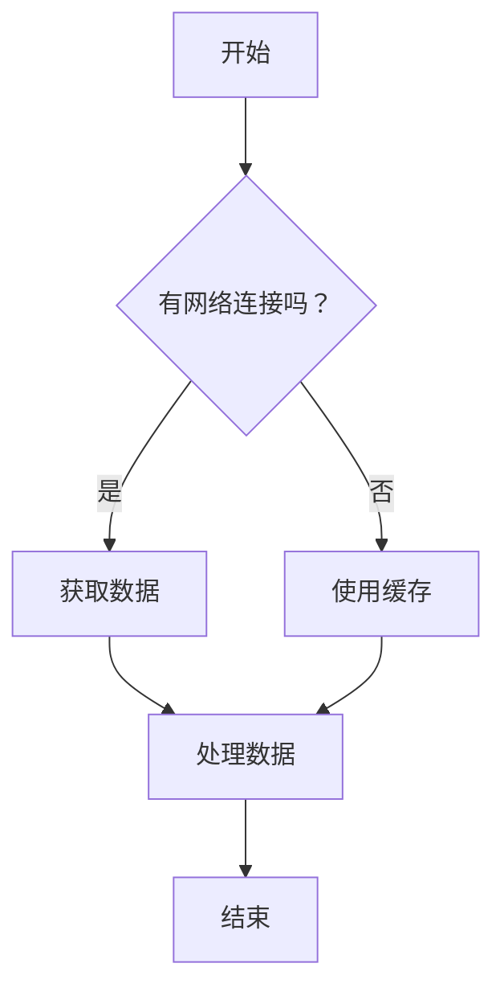
```mermaid
graph TD
    A[开始] --> B{有网络连接吗？}
    B -->|是| C[获取数据]
    B -->|否| D[使用缓存]
    C --> E[处理数据]
    D --> E
    E --> F[结束]
```
````

渲染为：


```mermaid
graph TD
    A[开始] --> B{有网络连接吗？}
    B -->|是| C[获取数据]
    B -->|否| D[使用缓存]
    C --> E[处理数据]
    D --> E
    E --> F[结束]
```

### Mermaid 的图表类型

| 类型 | 用途 | 示例 |
|------|------|------|
| `graph` | 流程图 | `graph TD` |
| `sequenceDiagram` | 时序图 | `sequenceDiagram` |
| `classDiagram` | 类图 | `classDiagram` |
| `stateDiagram` | 状态图 | `stateDiagram` |
| `pie` | 饼图 | `pie` |
| `gantt` | 甘特图 | `gantt` |
| `erDiagram` | ER 图 | `erDiagram` |

### 时序图示例

````markdown
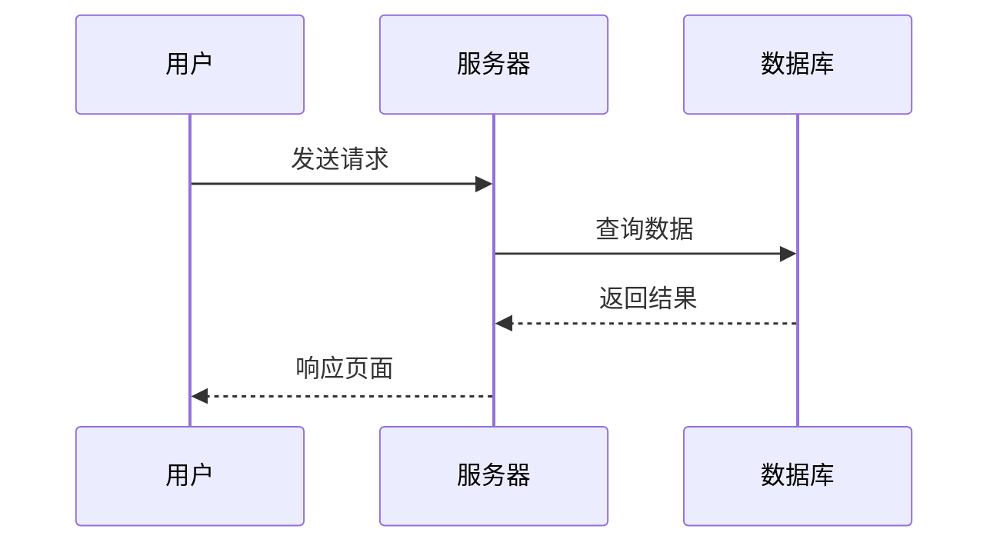
```mermaid
sequenceDiagram
    用户->>服务器: 发送请求
    服务器->>数据库: 查询数据
    数据库-->>服务器: 返回结果
    服务器-->>用户: 响应页面
```
````

渲染为：


```mermaid
sequenceDiagram
    用户->>服务器: 发送请求
    服务器->>数据库: 查询数据
    数据库-->>服务器: 返回结果
    服务器-->>用户: 响应页面
```

### 为什么 Mermaid 适合 Markdown？

1. **纯文本**——可以版本控制、可以 diff
2. **自解释**——`A --> B` 直观地表示"A 流向 B"
3. **不需要图形工具**——写完就能看到效果
4. **与 Markdown 天然兼容**——代码块语法，直接嵌入

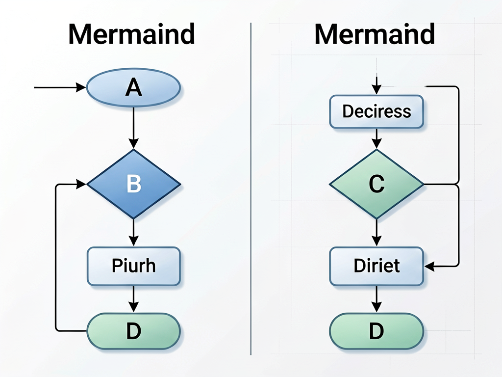

## PlantUML：另一个图表方案

### 基本语法

````markdown
```plantuml
[startuml]
[A] --> [B]
[B] --> [C]
[enduml]
```
````

### Mermaid vs PlantUML

| 维度 | Mermaid | PlantUML |
|------|---------|----------|
| 语言 | JavaScript（浏览器渲染） | Java（服务端渲染） |
| 安装 | 零配置（前端库） | 需要 Java / 服务端 |
| 图表类型 | 7 种 | 30+ 种 |
| 样式定制 | CSS 控制 | 内置主题 |
| 社区活跃度 | 高（GitHub 原生支持） | 中 |
| 适用场景 | 大多数文档站 | 复杂 UML / 架构图 |

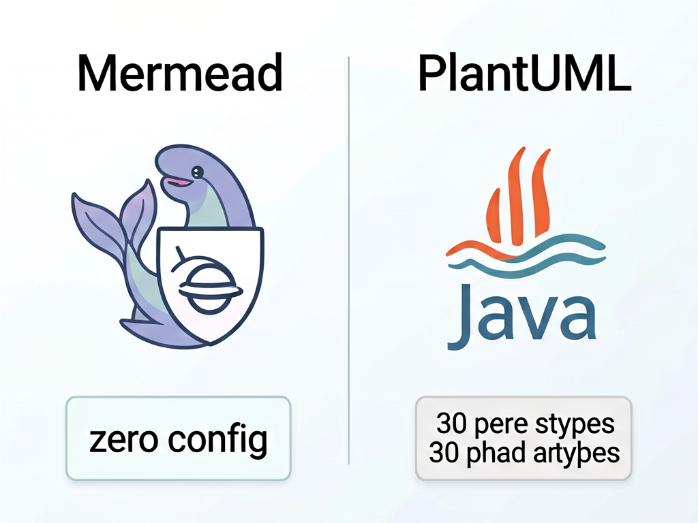

### 选择指南

- **简单流程图/时序图** → Mermaid（零配置，GitHub 原生支持）
- **复杂 UML / 企业架构图** → PlantUML（更多图表类型，样式更精细）

## HTML 兜底：最后的工具箱

当 Markdown 的扩展语法都不够用时，HTML 是终极方案：

````markdown
<!-- 视频嵌入 -->
<video controls>
  <source src="demo.mp4" type="video/mp4">
  你的浏览器不支持视频标签
</video>

<!-- 音频嵌入 -->
<audio controls>
  <source src="audio.mp3" type="audio/mpeg">
</audio>

<!-- 自定义样式 -->
<div style="background: #f0f0f0; padding: 1em; border-left: 4px solid #007bff;">
  <strong>提示：</strong>这是自定义样式的提示框。
</div>

<!-- 内嵌 iframe -->
<iframe src="https://example.com" width="100%" height="400"></iframe>
````

### 何时使用 HTML 兜底？

使用 HTML 兜底的**唯一条件**：没有更好的方案。

| 场景 | 推荐方案 |
|------|----------|
| 流程图 | Mermaid |
| 数学公式 | KaTeX |
| UML 图 | PlantUML |
| 视频/音频 | HTML `<video>` / `<audio>` |
| 自定义样式 | HTML + CSS（仅当无替代方案时） |

### 为什么"少用 HTML"？

1. **可读性**——HTML 标签混在 Markdown 中，源码变丑
2. **可移植性**——不是所有渲染器都支持内联 HTML
3. **可维护性**——HTML 没有版本控制的语义，diff 不可读

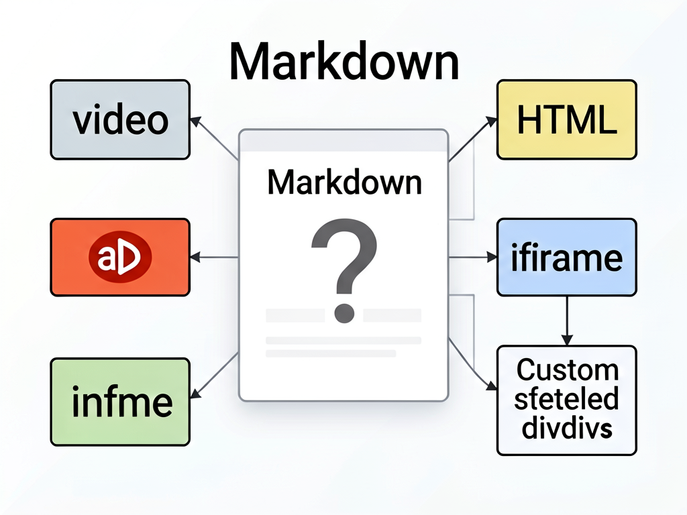

## 设计取舍

**为什么 Markdown 不直接支持数学公式？**

数学公式的语法太复杂，与 Markdown 的"简单"哲学冲突。LaTeX 语法的 `$$\int_{0}^{\infty}$$` 对于"只是想写点文字"的用户来说太沉重了。所以 Markdown 选择不内置公式——让 KaTeX 等工具在需要时提供。

**为什么 Mermaid 比 PlantUML 更流行？**

因为**零配置**。Mermaid 是纯 JavaScript 库，浏览器直接加载就能用。PlantUML 需要 Java 环境或服务端支持。对于大多数文档站来说，零配置意味着更低的门槛和更好的体验。

**HTML 兜底的原则是什么？**

"少用"。HTML 是工具箱里的电焊枪——关键时刻救命，但别天天用。每次在 Markdown 中混写 HTML，都要问自己："有没有更简洁的方案？"

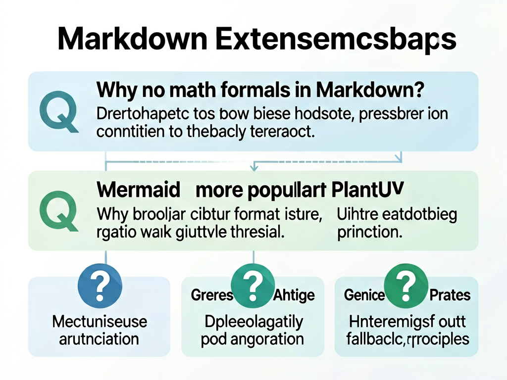

## 动手练习

1. 用 KaTeX 在 Markdown 中写一个二次方程求根公式
2. 用 Mermaid 画一个产品流程图（至少 5 个节点）
3. 思考题：为什么 Markdown 不直接支持流程图？（提示：从规范简洁性和工具兼容性角度思考）

## 本章小结

这一章中我们讨论了 Markdown 的能力边界。首先列举了 Markdown 能做什么、不能做什么，然后介绍了数学公式（KaTeX / MathJax）和流程图（Mermaid / PlantUML）两种主流扩展方案，最后讨论了 HTML 兜底的原则和使用场景。

本章我们一起学习了以下概念：

| 概念 | 解释 |
|------|------|
| KaTeX | 数学公式渲染库，速度快，适合 Web |
| Mermaid | 文本描述图表的语法，零配置，GitHub 原生支持 |
| PlantUML | Java 编写的图表工具，30+ 种图表类型 |
| HTML 兜底 | Markdown 不擅长的场景用 HTML 补充 |
| 设计原则 | "少用 HTML"——每次混写 HTML 都要问"有没有更简洁的方案？" |

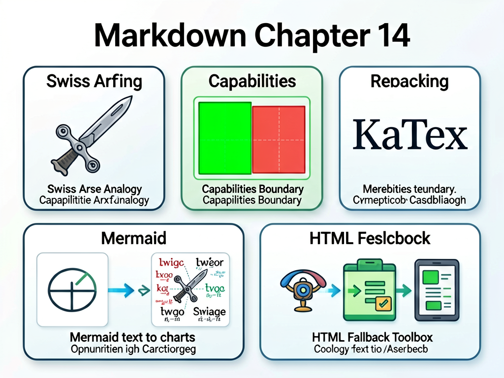

下一篇是最后一篇——生产级 Markdown 规范的制定。


============================================================

# 第15章 编写生产级 Markdown —— 团队规范与工程化

## 学习目标

1. 掌握生产级 Markdown 的核心规范
2. 了解 Markdown Linter 的使用
3. 能将 Markdown 集成到 CI/CD 流程中

## 生活类比

生产级 Markdown 就像餐厅的后厨规范——每个厨师（作者）写的菜（文章）都必须遵循同样的标准：食材命名（文件命名）、刀工大小（缩进格式）、摆盘规则（标题层级）、出餐检查（Lint 和 CI）。这样不管是哪个厨师做的菜，顾客（读者）都能吃到一致的品质。


## 团队 Markdown 规范

### 文件命名

```yaml
# 推荐：kebab-case
getting-started.md
api-reference.md
troubleshooting.md

# 不推荐：空格或大驼峰
getting started.md    # 空格在 URL 中编码为 %20
GettingStarted.md    # 不直观，不易排序
```

**规则**：使用小写 kebab-case（短横线分隔），无空格，无大写字母。

### 标题层级

```yaml
# 推荐：严格遵循 H1 → H2 → H3 层级
# H1：页面标题（每篇文章只有一个）
# H2：章节
# H3：子节
# H4：小节（必要时）

# 不推荐：跳级
# H1
# H3  ← 跳过 H2
# H1  ← 另一个 H1
```

**规则**：每篇文章一个 H1，H 层级不得跳级。

### 图片规范

```yaml
# 推荐：
- 图片路径使用相对路径
- 所有图片都有 alt 文本
- 图片命名使用 kebab-case
- 图片放在 assets/ 目录下

# 不推荐：
- 绝对路径引用图片
- alt 文本缺失
- 中文命名图片（如 截图.png）
- 图片散落在各处
```

### 链接规范

```yaml
# 推荐：
- 使用相对链接（站内链接）
- 外部链接使用完整 URL
- 定期检查死链

# 不推荐：
- 使用站根路径（如 /docs/getting-started）
- 手动维护链接列表
- 长链接不折叠
```

### 代码块规范

```yaml
# 推荐：
- 所有代码块标注语言
- 代码示例可运行（测试通过）
- 代码行不超过 80 字符

# 不推荐：
- 不带语言标识的代码块
- 截图代替代码
- 伪代码不说明
```

## Markdown Linter：markdownlint

### 安装

```bash
# 全局安装
npm install -g markdownlint-cli

# 或在项目中
npm install markdownlint-cli --save-dev
```

### 配置

```json
// .markdownlint.json
{
  "MD013": { "line_length": 120 },
  "MD024": false,
  "MD033": false,
  "default": true
}
```

### 常见规则

| 规则 | 检查项 | 说明 |
|------|--------|------|
| MD001 | 标题层级 | 确保标题层级正确 |
| MD003 | 标题风格 | 确保标题风格一致 |
| MD007 | 列表缩进 | 列表缩进 2 空格 |
| MD013 | 行长度 | 每行不超过指定字符数 |
| MD024 | 重复标题 | 标题不重复 |
| MD025 | 单 H1 | 每个文件一个 H1 |
| MD026 | 尾部分隔符 | 标题后不能有分隔符 |
| MD029 | 有序列表序号 | 有序列表序号连续 |
| MD033 | 内联 HTML | 禁止内联 HTML（可选） |
| MD041 | 首行 H1 | 首行必须是 H1 |

### 使用

```bash
# 检查所有 Markdown 文件
markdownlint "*.md"

# 检查特定文件
markdownlint docs/README.md

# 自动修复（部分规则）
markdownlint --fix "*.md"

# 输出 JSON 格式（CI 友好）
markdownlint --json "*.md"
```

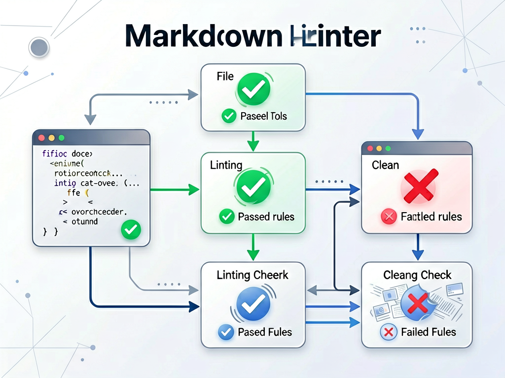

## CI/CD 集成

### GitHub Actions

```yaml
# .github/workflows/lint-markdown.yml
name: Lint Markdown

on:
  pull_request:
    branches: [main]
    paths:
      - '**.md'

jobs:
  lint:
    runs-on: ubuntu-latest
    steps:
      - uses: actions/checkout@v4
      - uses: actions/setup-node@v4
        with:
          node-version: 20
      - run: npm ci
      - run: npx markdownlint-cli2 "**/*.md"
```

### 检查流程

```
开发者提交 PR
  → CI 触发
  → markdownlint 检查所有 .md 文件
  → 有错误？→ PR 被拒绝，提示修复
  → 通过？→ PR 合并
```

### 完整的 CI/CD 流水线

```yaml
# .github/workflows/deploy-docs.yml
name: Deploy Docs

on:
  push:
    branches: [main]

jobs:
  lint:
    runs-on: ubuntu-latest
    steps:
      - uses: actions/checkout@v4
      - uses: actions/setup-node@v4
        with:
          node-version: 20
      - run: npm ci
      - run: npx markdownlint-cli2 "**/*.md"

  build:
    needs: lint
    runs-on: ubuntu-latest
    steps:
      - uses: actions/checkout@v4
      - uses: actions/setup-node@v4
        with:
          node-version: 20
      - run: npm ci
      - run: npm run build
      - uses: actions/upload-pages-artifact@v3
        with:
          path: .vitepress/dist

  deploy:
    needs: build
    runs-on: ubuntu-latest
    permissions:
      pages: write
      id-token: write
    steps:
      - uses: actions/deploy-pages@v4
```

这是一个**三阶段流水线**：

```
lint（检查） → build（构建） → deploy（部署）
  串行           串行
```

每个阶段有明确的职责：lint 确保代码质量，build 生成静态站，deploy 发布上线。任何一个阶段失败，后续步骤都不会执行。

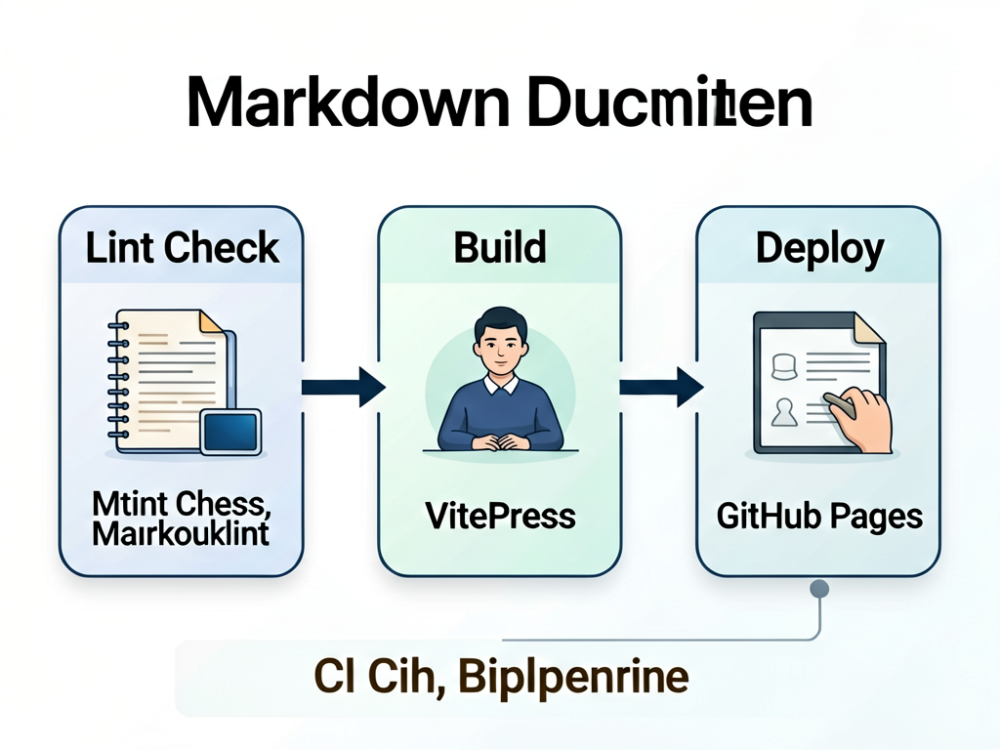

## 生产级 Markdown 规范清单

以下是团队 Markdown 规范的完整清单，可直接作为团队的 CONTRIBUTING.md：

### 必选规范

1. **文件命名**：kebab-case，无空格
2. **标题层级**：每篇文章一个 H1，H1 → H2 → H3，不跳级
3. **代码块**：所有代码块标注语言，不超过 80 字符
4. **图片**：使用相对路径，所有图片有 alt 文本
5. **链接**：站内使用相对链接，外部使用完整 URL
6. **Lint**：使用 markdownlint，配置在 CI 中强制执行

### 可选规范

1. **Front Matter**：所有文章使用 YAML Front Matter
2. **章节长度**：每个章节不超过 1000 字
3. **语言风格**：使用"你"称呼读者，不缩写
4. **日期格式**：YYYY-MM-DD
5. **引用规范**：引用块使用 `>`，不嵌套超过 3 层

### 建议规范

1. **表格**：每列不超过 10 行
2. **链接文字**：使用有意义的文字，不使用"点击这里"
3. **代码示例**：确保可运行，定期更新
4. **图片格式**：WebP / SVG 优先，PNG 其次，JPEG 用于照片
5. **目录**：超过 5 个章节的文章自动生成 TOC


## 设计取舍

**为什么要有 Markdown 规范？**

因为 Markdown 的灵活性是一把双刃剑——同样的内容可以用不同的格式写出来，导致文档风格不统一、可读性不一致。规范不是限制创作自由，而是让团队协作更高效。

**为什么用 Lint 而不是人工审查？**

人工审查 Markdown 格式容易遗漏（比如漏掉一个缺 alt 的图片），且疲劳后会下降。Lint 是**自动的、一致的、零成本的**——它只检查格式，不检查内容质量。

**规范越多越好吗？**

不是。规范的**复杂度应该与团队规模成正比**：

| 团队规模 | 规范数量 |
|----------|----------|
| 1-2 人 | 5 条核心规范 |
| 3-10 人 | 10 条核心 + 5 条可选 |
| 10+ 人 | 全部规范 + Lint 强制执行 |

规范的核心原则是：**越少越好，但不可少**。

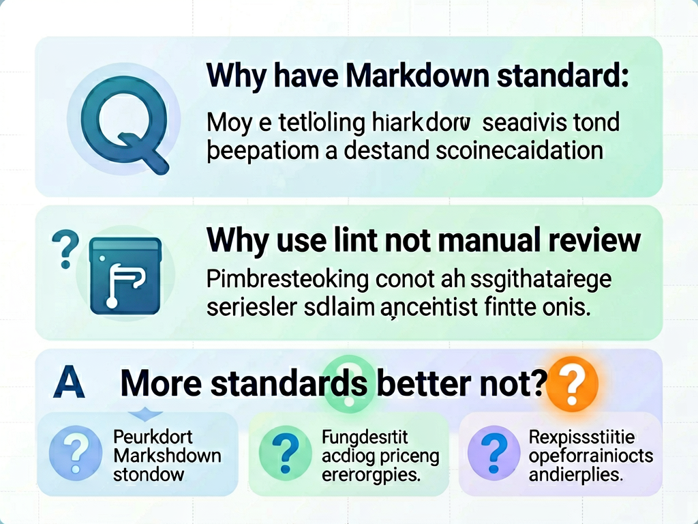

## 动手练习

1. 在项目中安装 markdownlint，运行 `markdownlint-cli2 "**/*.md"` 检查你的文档
2. 在 GitHub Actions 中配置 markdownlint 检查，提交一个违反规范的 Markdown 文件观察 CI 反应
3. 思考题：为什么规范要有"必选"和"可选"之分？

## 本章小结

这一章中我们学习了生产级 Markdown 的规范化和工程化。首先介绍了文件命名、标题层级、图片、链接、代码块五大核心规范，然后讲解了 markdownlint 的安装配置和常见规则，接着设计了完整的 CI/CD 流水线（lint → build → deploy），最后给出了完整的团队 Markdown 规范清单。

本章我们一起学习了以下概念：

| 概念 | 解释 |
|------|------|
| 文件命名 | kebab-case，无空格，无大写字母 |
| markdownlint | Markdown Linter，自动检查格式规范 |
| CI/CD 集成 | 在 GitHub Actions 中自动化检查 |
| 规范清单 | 必选 + 可选 + 建议，与团队规模匹配 |
| 设计规范 | 越少越好，但不可少 |

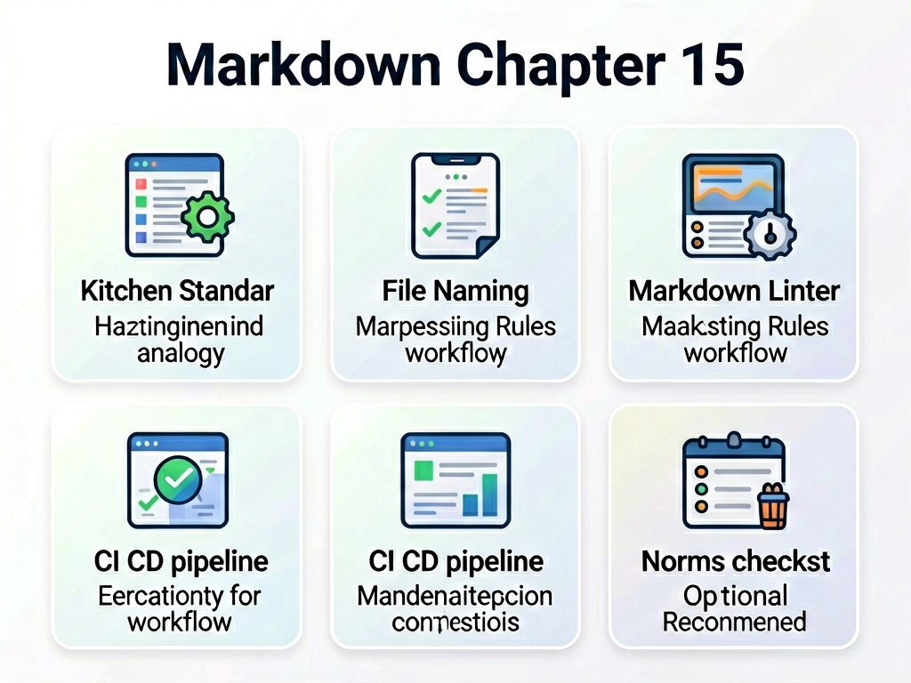

## 全书总结

这本《Markdown 完全指南》从直觉到进阶，从生态到实战，系统地讲解了 Markdown 的方方面面：

- **篇一（第1-3章）**：Markdown 的基础语法——行内元素和块级元素
- **篇二（第4-7章）**：Markdown 的进阶语法——代码块、表格、图片、脚注
- **篇三（第8-11章）**：Markdown 的生态——引擎架构、JS/Python 工具链、命令行工具
- **篇四（第12-15章）**：Markdown 的实战——博客、文档站、极限扩展、生产规范

感谢阅读。愿你写出的每一篇 Markdown，都能被优雅地渲染。
